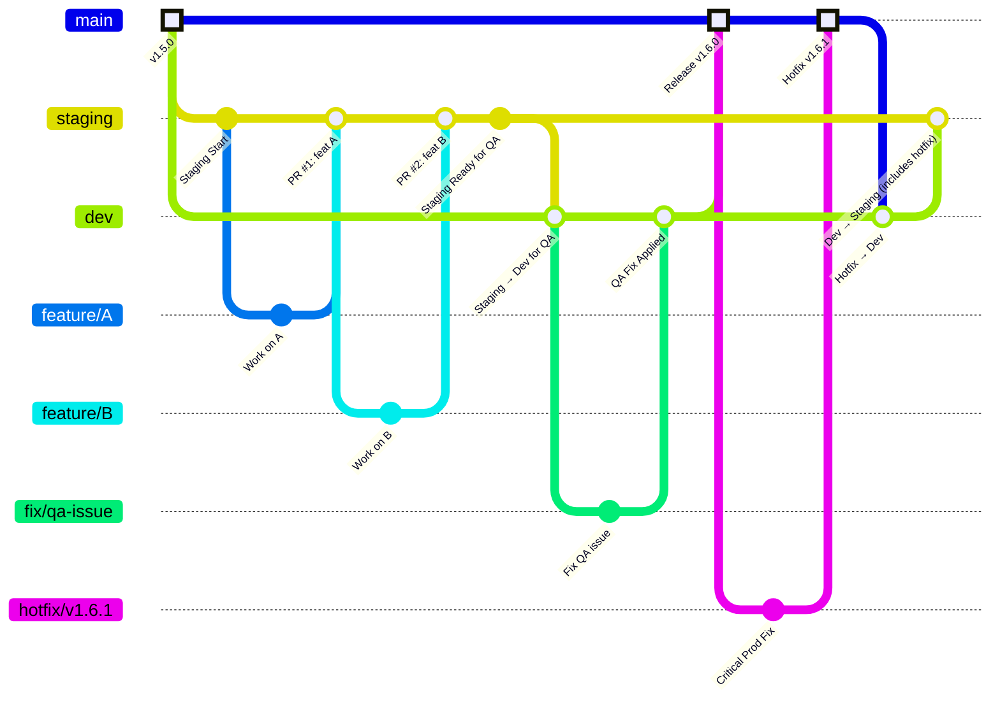

# Contributing to BHTikTok++

## 📋 Table of Contents

- [Getting Started](#getting-started)
- [Development Environment Setup](#development-environment-setup)
- [Git Workflow and Branching Strategy](#git-workflow-and-branching-strategy)
- [Code Standards](#code-standards)
- [Documentation Standards](#documentation-standards)
- [Pull Request Process](#pull-request-process)
- [Code Review Guidelines](#code-review-guidelines)
- [Release Management](#release-management)
- [Issue Reporting](#issue-reporting)
- [Security Guidelines](#security-guidelines)

## 🚀 Getting Started

Thank you for your interest in contributing to BHTikTok++! This document outlines our development practices, git workflow, and contribution guidelines to ensure high-quality collaborative development.

### Prerequisites

- **macOS** with **full Xcode** installed (not just Command Line Tools)
- **Theos** development framework (installed via official script)
- **Git** with proper SSH key configuration
- **Jailbroken iOS device** or **iOS Simulator** for testing
- Understanding of **Objective-C** and **Logos syntax**

### Quick Start

1. Fork the repository on GitHub
2. Clone your fork locally
3. Set up the development environment
4. Create a feature branch
5. Make your changes
6. Submit a pull request

## 🛠️ Development Environment Setup

### 1. Prerequisites

```bash
# Install full Xcode from App Store (required - Command Line Tools alone are insufficient)
# After installation, accept the license:
sudo xcodebuild -license accept

# Verify Xcode installation
xcode-select --print-path
```

### 2. Theos Installation

```bash
# Install Theos using the official installation script
bash -c "$(curl -fsSL https://raw.githubusercontent.com/theos/theos/master/bin/install-theos)"

# The script will automatically:
# - Install Theos to /opt/theos
# - Set up environment variables
# - Configure your shell profile

# Verify installation
echo $THEOS
# Should output: /opt/theos

# Restart your terminal or source your shell profile
source ~/.zshrc  # or ~/.bash_profile for bash users
```

### 3. Project Setup

```bash
# Clone the main repository
git clone https://github.com/kunihir0/BHTikTokPlusPlusPlus.git
cd BHTikTokPlusPlusPlus

# Create your own fork on GitHub (via web interface or GitHub CLI)
# If using GitHub CLI:
gh repo fork --remote

# If forked manually via web interface, add your fork as origin:
# git remote rename origin upstream
# git remote add origin git@github.com:YOUR_USERNAME/BHTikTokPlusPlusPlus.git

# Fetch latest changes
git fetch --all

# Install dependencies and build
make clean && make
```

### 4. Device Configuration

```bash
# Configure your test device
export THEOS_DEVICE_IP=YOUR_DEVICE_IP
export THEOS_DEVICE_USER=root

# Test connection
ssh root@$THEOS_DEVICE_IP "echo 'Connection successful'"
```

Now heres where you choose to make a .deb package or have it auto-install on your device via theos

```bash
# Build and install the tweak to your device
make install

# Alternatively, create a deb package first
make package
```
restart your tiktok then check for your features.. Profit~~

## 🔄 Git Workflow and Branching Strategy

We use a **GitFlow-inspired** branching strategy with four main branches and feature branches for isolated development.

### Branch Structure



### Main Branches

#### 1. `main` Branch
- **Purpose**: Stable production releases
- **Protection**: Protected branch, no direct commits
- **Merge Source**: Only from `staging` branch
- **Triggers**: Release builds and distribution packages
- **Version**: Always tagged with semantic versioning

#### 2. `dev` Branch  
- **Purpose**: Active development and integration
- **Protection**: Semi-protected, requires PR approval
- **Merge Source**: Feature branches and hotfixes
- **Testing**: Continuous integration and automated testing
- **Stability**: Should always be buildable

#### 3. `staging` Branch
- **Purpose**: Pre-production testing and validation
- **Protection**: Protected branch, requires comprehensive testing
- **Merge Source**: Only from `dev` branch
- **Testing**: Full QA testing, compatibility validation
- **Approval**: Requires maintainer approval for `main` merge

#### 4. Feature Branches
- **Naming**: `feature/description` or `feature/issue-number`
- **Source**: Always branch from `dev`
- **Scope**: Single feature or related changes
- **Lifetime**: Short-lived, deleted after merge

### Workflow Process

#### 1. Feature Development

```bash
# Start from latest dev branch
git checkout dev
git pull upstream dev

# Create feature branch
git checkout -b feature/advanced-download-queue

# Work on your feature
# ... make changes ...

# Commit with conventional commits
git add .
git commit -m "feat(download): add download queue management system

- Implement priority-based download queue
- Add pause/resume functionality for downloads
- Include batch download progress tracking
- Add download speed throttling options

Closes #123"

# Push to your fork
git push origin feature/advanced-download-queue
```

#### 2. Pull Request Creation

```bash
# Create PR against dev branch
# Use GitHub CLI or web interface
gh pr create --base dev --title "feat(download): advanced download queue system" \
  --body "## Description
This PR implements a comprehensive download queue management system...

## Changes
- [ ] Download queue with priority system
- [ ] Pause/resume functionality
- [ ] Progress tracking improvements
- [ ] Speed throttling controls

## Device Testing
- [x] Manual testing on iOS 16.5
- [x] Compatibility testing with TikTok v28.x

## Breaking Changes
None

## Related Issues
Closes #123"
```

#### 3. Integration to Staging

```bash
# After feature PR is merged to dev
git checkout staging
git pull upstream staging

# Merge dev into staging
git merge upstream/dev
git push upstream staging

# Trigger staging deployment and testing
```

#### 4. Production Release

```bash
# After staging validation
git checkout main
git pull upstream main

# Merge staging into main
git merge upstream/staging

# Tag the release
git tag -a v1.5.0 -m "Release v1.5.0

Features:
- Advanced download queue system
- Enhanced region spoofing
- Performance improvements

Bug Fixes:
- Fixed memory leak in download system
- Resolved UI glitches on iOS 17

Breaking Changes:
None"

# Push with tags
git push upstream main --tags
```

## 📏 Code Standards

All code must follow our comprehensive coding style guide. Please review the following document before contributing:

**📖 [Coding Style Guide](CODING_STYLE.md)**

This includes:
- **Objective-C Style Guidelines**: Naming conventions, file organization, memory management
- **Logos Hook Best Practices**: Safe hooking practices, organization, and performance considerations
- **Error Handling Standards**: Defensive programming and graceful error recovery
- **Code Documentation**: Comment standards and documentation requirements

### Quick Style Checklist

- [ ] All classes use `BH` prefix
- [ ] Methods follow camelCase naming
- [ ] Proper memory management (strong/weak attributes)
- [ ] Hooks include feature flag checks
- [ ] Error handling with proper NSError usage
- [ ] Code is well-documented with comments
- [ ] Follows formatting guidelines (4 spaces, 120 char limit)


## 📚 Documentation Standards

### 1. Code Documentation

```objective-c
/**
 * Downloads a file from the specified URL with progress tracking and completion handling.
 *
 * @param url The URL of the file to download. Must be a valid HTTP/HTTPS URL.
 * @param progressBlock Called periodically with download progress (0.0 to 1.0).
 * @param completion Called when download completes or fails.
 *
 * @return YES if download started successfully, NO otherwise.
 *
 * @note This method performs the download asynchronously on a background queue.
 * @warning Ensure the URL is valid before calling this method.
 *
 * @since 1.5.0
 */
- (BOOL)downloadFileWithURL:(NSURL *)url 
                   progress:(void(^)(float progress))progressBlock
                 completion:(void(^)(BOOL success, NSError *error))completion;
```

### 2. README Updates

When adding new features, update the README.md:

```markdown
### 🆕 New Feature: Advanced Download Queue

- **Queue Management**: Priority-based download queue system
- **Batch Operations**: Download multiple files simultaneously
- **Progress Tracking**: Real-time progress for individual and batch downloads
- **Speed Control**: Configurable download speed throttling
```

### 3. Documentation Files

Update relevant documentation files in the `docs/` directory:

```markdown
<!-- In docs/download/download-queue.md -->
# Download Queue System

## Overview
The download queue system provides...

## Usage
```objective-c
BHDownloadQueue *queue = [[BHDownloadQueue alloc] init];
[queue addDownloadWithURL:url priority:BHDownloadPriorityHigh];
```

## Configuration
- Queue size limit: 50 downloads
- Concurrent downloads: 3 simultaneous
```

## 🔍 Pull Request Process

### 1. Pre-submission Checklist

- [ ] Code follows [style guidelines](CODING_STYLE.md)
- [ ] Documentation is updated
- [ ] Commit messages follow conventional commits
- [ ] No merge conflicts with target branch
- [ ] Feature is fully implemented
- [ ] Performance impact is acceptable

### 2. PR Template

```markdown
## Description
Brief description of changes and motivation.

## Type of Change
- [ ] Bug fix (non-breaking change)
- [ ] New feature (non-breaking change)
- [ ] Breaking change (fix or feature causing existing functionality to change)
- [ ] Documentation update

## Changes Made
- Detailed list of changes
- Technical implementation details
- Any architectural decisions


## Screenshots/Videos
Include visual evidence of UI changes.

## Breaking Changes
List any breaking changes and migration steps.

## Related Issues
Closes #123
References #456
```

### 3. Review Process

1. **Automated Checks**: CI/CD pipeline runs automatically
2. **Peer Review**: At least one team member reviews
3. **Maintainer Review**: Core maintainer approves
4. **Validation**: QA validation on staging branch
5. **Merge**: Squash and merge to target branch

## 👀 Code Review Guidelines

### For Authors

- **Small PRs**: Keep changes focused and reviewable
- **Clear Description**: Explain what, why, and how
- **Self-Review**: Review your own code before submission
- **Responsive**: Address feedback promptly and professionally

### For Reviewers

#### 1. Review Checklist

- [ ] **Functionality**: Does the code do what it claims?
- [ ] **Style**: Follows project coding standards?
- [ ] **Performance**: No obvious performance issues?
- [ ] **Security**: No security vulnerabilities introduced?
- [ ] **Documentation**: Is code self-documenting or well-commented?

#### 2. Feedback Guidelines

```markdown
<!-- Good feedback -->
**Suggestion**: Consider using a constant for this magic number to improve maintainability.

```objective-c
// Instead of
if (downloadCount > 50) {

// Consider
static const NSInteger kMaxDownloadCount = 50;
if (downloadCount > kMaxDownloadCount) {
```

**Question**: What happens if this URL is nil? Should we add a guard clause?

**Praise**: Great use of defensive programming here!
```

#### 3. Review Priorities

1. **Correctness**: Does it work as intended?
2. **Security**: Are there any security implications?
3. **Performance**: Will this impact app performance?
4. **Maintainability**: Is the code readable and maintainable?
5. **Style**: Does it follow project conventions?

## 🚀 Release Management

### Semantic Versioning

We follow [Semantic Versioning](https://semver.org/):

- **MAJOR** (X.0.0): Breaking changes
- **MINOR** (1.X.0): New features, backward compatible
- **PATCH** (1.1.X): Bug fixes, backward compatible

### Release Process

#### 1. Feature Freeze

```bash
# Create release branch from dev
git checkout dev
git pull upstream dev
git checkout -b release/v1.6.0

# Update version numbers
# Update CHANGELOG.md
# Final testing and bug fixes only
```

#### 2. Release Preparation

```bash
# Update control file version
echo "Version: 1.6.0" > control

# Update documentation
# Generate release notes
# Create final builds
```

#### 3. Release Deployment

```bash
# First merge release branch to dev
git checkout dev
git merge release/v1.6.0
git push upstream dev

# Then merge dev to staging for final validation
git checkout staging
git merge dev
git push upstream staging

# After validation, merge staging to main
git checkout main
git merge staging

# Tag and publish
git tag -a v1.6.0 -m "Release v1.6.0"
git push upstream main --tags

# Clean up release branch
git branch -d release/v1.6.0
```

### Hotfix Process

```bash
# For critical bugs in production
git checkout main
git checkout -b hotfix/critical-crash-fix

# Implement fix
# Test thoroughly
# Merge to main and dev
git checkout main
git merge hotfix/critical-crash-fix
git checkout dev
git merge hotfix/critical-crash-fix

# Tag hotfix release
git tag v1.5.1
git push upstream main dev --tags
```

## 🐛 Issue Reporting

### Bug Report Template

```markdown
## Bug Description
Clear and concise description of the bug.

## Steps to Reproduce
1. Go to '...'
2. Click on '...'
3. Scroll down to '...'
4. See error

## Expected Behavior
What you expected to happen.

## Actual Behavior
What actually happened.

## Environment
- iOS Version: [e.g. 16.5]
- TikTok Version: [e.g. 28.1.0]
- BHTikTok++ Version: [e.g. 1.5.0]
- Device: [e.g. iPhone 14 Pro]
- Jailbreak: [e.g. checkra1n, unc0ver]

## Additional Context
Any additional information, logs, or screenshots.

## Possible Solution
If you have ideas for fixing the issue.
```

### Feature Request Template

```markdown
## Feature Description
Clear description of the requested feature.

## Motivation
Why is this feature needed? What problem does it solve?

## Proposed Solution
Describe your ideal solution.

## Alternative Solutions
Any alternative approaches you've considered.

## Additional Context
Mockups, examples, or related features.
```

## 🔐 Security Guidelines

### 1. Code Security

- **Input Validation**: Always validate user inputs
- **Memory Safety**: Use ARC and avoid manual memory management
- **API Security**: Don't expose internal APIs unnecessarily
- **Permissions**: Request minimal required permissions

### 2. Jailbreak Detection Bypass

```objective-c
// Responsible jailbreak detection bypass
%hook SecurityClass
+ (BOOL)isJailbroken {
    // Only bypass for educational/research purposes
    // Document why bypass is necessary
    return NO;
}
%end
```

### 3. Privacy Considerations

- **Data Collection**: Minimize data collection
- **Local Storage**: Store sensitive data securely
- **Network Requests**: Use HTTPS where possible
- **User Consent**: Respect user privacy preferences

### 4. Vulnerability Reporting

For security vulnerabilities, please make a issue

## 🤝 Community Guidelines

### Code of Conduct

- **Be Respectful**: Treat all contributors with respect
- **Be Constructive**: Provide helpful, actionable feedback
- **Be Patient**: Remember that everyone is learning
- **Be Inclusive**: Welcome contributors of all skill levels

### Communication Channels

- **GitHub Issues**: Bug reports and feature requests
- **GitHub Discussions**: General questions and community chat
- **Pull Requests**: Code review and technical discussion

### Recognition

Contributors will be recognized in:
- `CONTRIBUTORS.md` file
- Release notes for significant contributions
- Special mentions for outstanding contributions

## 📞 Getting Help

### Resources

- **Documentation**: Check the `docs/` directory first
- **Examples**: Look at existing code for patterns
- **Theos Documentation**: [theos.dev](https://theos.dev)
- **iOS Development**: Apple's official documentation

### Support Channels

1. **GitHub Discussions**: General questions and community support
2. **GitHub Issues**: Report bugs or request features
3. **Pull Requests**: For code contributions and fixes

## 📝 License

By contributing, you agree that your contributions will be licensed under the same license as the project (see `LICENSE` file).
