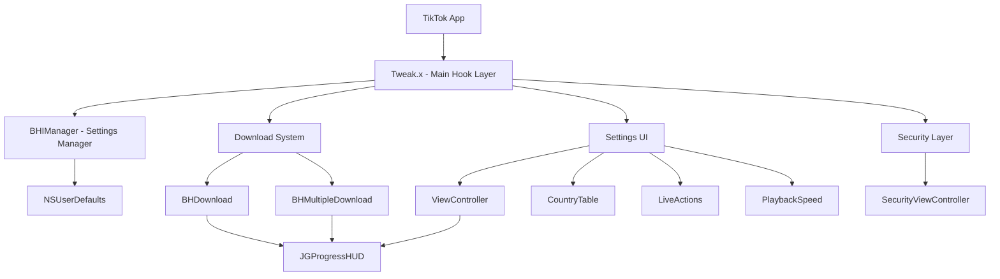

# BHTikTok++ Documentation

## Overview

BHTikTok++ is a comprehensive iOS tweak for TikTok that enhances the user experience by providing additional features such as ad blocking, video downloading, UI customization, and various privacy and convenience features.

## Project Structure

```
├── Core Components/
│   ├── Main Tweak (Tweak.x)
│   ├── Manager (BHIManager)
│   ├── Headers (TikTokHeaders.h)
│   └── Security (SecurityViewController)
├── Download System/
│   ├── Single Downloads (BHDownload)
│   └── Multiple Downloads (BHMultipleDownload)
├── Settings Interface/
│   ├── Main Settings (ViewController)
│   ├── Country Selection (CountryTable)
│   ├── Live Actions (LiveActions)
│   └── Playback Speed (PlaybackSpeed)
├── Third-Party Libraries/
│   └── JGProgressHUD (Progress indicators)
└── Configuration Files/
    ├── Build Configuration (Makefile, control)
    └── Bundle Filter (BHTikTok.plist)
```

## Documentation Index

### Core Components
- [**Main Tweak Implementation**](core/tweak.md) - The primary hook implementation
- [**Manager System**](core/bhi-manager.md) - Centralized settings and utility management
- [**TikTok Headers**](core/tiktok-headers.md) - Interface declarations for TikTok classes
- [**Security System**](core/security.md) - App lock and authentication features

### Download System
- [**Single File Downloads**](download/bh-download.md) - Individual file download handling
- [**Multiple File Downloads**](download/bh-multiple-download.md) - Batch download operations

### Settings Interface
- [**Main Settings Controller**](settings/main-settings.md) - Primary settings interface
- [**Region Selection**](settings/country-table.md) - Country/region picker interface
- [**Live Button Actions**](settings/live-actions.md) - Live button customization
- [**Playback Speed Control**](settings/playback-speed.md) - Video speed adjustment

### Third-Party Libraries
- [**JGProgressHUD Integration**](libraries/jgprogresshud.md) - Progress indication system

### Configuration
- [**Build System**](configuration/build-system.md) - Makefile and packaging configuration
- [**Bundle Configuration**](configuration/bundle-config.md) - App targeting and filtering

## Architecture Overview



## Key Features

| Category | Features |
|----------|----------|
| **Ad Blocking** | Complete ad removal from feed and UI |
| **Download System** | Video, photo, and music downloads with HD support |
| **UI Customization** | Element hiding, transparency effects, progress bars |
| **Privacy & Security** | App lock, jailbreak detection bypass |
| **Content Enhancement** | Username display, upload regions, like counts |
| **Interaction Control** | Confirmation dialogs, auto-play settings |
| **Region Spoofing** | Complete region/country changing system |
| **Profile Modifications** | Fake verification, follower counts, extended bio |

## Development Notes

- **Language**: Objective-C with Logos syntax
- **Framework**: Theos for iOS tweak development  
- **Target**: iOS TikTok app (com.zhiliaoapp.musically, com.ss.iphone.ugc.Ame)
- **Dependencies**: MobileSubstrate, various iOS frameworks

## Getting Started

1. Review the [Main Tweak Implementation](core/tweak.md) to understand the hook system
2. Explore the [Manager System](core/bhi-manager.md) for settings management
3. Check the [Settings Interface](settings/main-settings.md) for UI customization
4. Examine the [Download System](download/bh-download.md) for media handling

---

*This documentation provides comprehensive technical details for developers working with or extending BHTikTok++.*