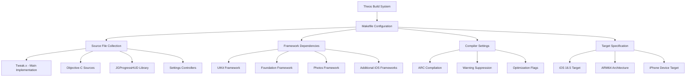
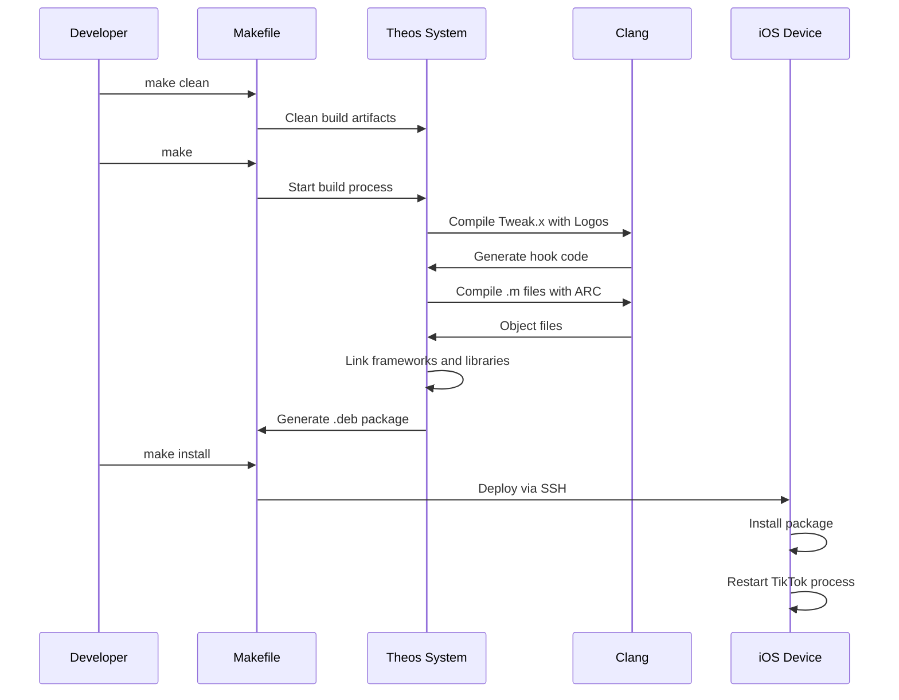

# Build System Configuration

## Overview

The BHTikTok++ build system uses Theos, a cross-platform suite of development tools for building and deploying iOS tweaks. The build configuration is managed through the [`Makefile`](../../Makefile) and project control files that define compilation settings, dependencies, and deployment parameters.

## Purpose and Functionality

The build system serves as:
- **Compilation Management**: Defines how source files are compiled and linked
- **Dependency Resolution**: Manages framework and library dependencies
- **Target Configuration**: Specifies iOS version and architecture targets
- **Deployment Automation**: Handles installation and device deployment
- **Build Optimization**: Compiler flags and optimization settings

## File Structure

| File | Purpose |
|------|---------|
| [`Makefile`](../../Makefile) | Primary build configuration and settings |
| [`control`](../../control) | Package metadata and dependency information |
| [`BHTikTok.plist`](../../BHTikTok.plist) | Application targeting and bundle filtering |
| [`.gitignore`](../../.gitignore) | Version control exclusion patterns |

## Architecture Overview



## Makefile Configuration

### Target and Device Settings
**Location**: [Lines 1-4](../../Makefile#L1)

```makefile
TARGET := iphone:clang:16.5
INSTALL_TARGET_PROCESSES = TikTok
THEOS_DEVICE_IP = 192.168.100.246
THEOS_DEVICE_USER = root
```

**Configuration Parameters**:
| Parameter | Value | Purpose |
|-----------|-------|---------|
| `TARGET` | `iphone:clang:16.5` | iOS 16.5 SDK with Clang compiler |
| `INSTALL_TARGET_PROCESSES` | `TikTok` | Process to restart after installation |
| `THEOS_DEVICE_IP` | `192.168.100.246` | Development device IP address |
| `THEOS_DEVICE_USER` | `root` | SSH user for device deployment |

### Theos Framework Integration
**Location**: [Line 5](../../Makefile#L5)

```makefile
include $(THEOS)/makefiles/common.mk
```

**Framework Integration**:
- Imports Theos common build definitions
- Provides standard build targets and rules
- Enables cross-compilation for iOS devices
- Sets up proper toolchain configuration

### Tweak Configuration
**Location**: [Lines 7-11](../../Makefile#L7)

```makefile
TWEAK_NAME = BHTikTok

BHTikTok_FILES = Tweak.x $(wildcard *.m JGProgressHUD/*.m Settings/*.m)
BHTikTok_FRAMEWORKS = UIKit Foundation CoreGraphics Photos CoreServices SystemConfiguration SafariServices Security QuartzCore
BHTikTok_CFLAGS = -fobjc-arc -Wno-unused-variable -Wno-unused-value -Wno-deprecated-declarations -Wno-nullability-completeness -Wno-unused-function -Wno-incompatible-pointer-types
```

**Tweak Parameters**:
| Parameter | Value | Purpose |
|-----------|-------|---------|
| `TWEAK_NAME` | `BHTikTok` | Primary tweak identifier |
| `BHTikTok_FILES` | Source file wildcards | Automatic source file discovery |
| `BHTikTok_FRAMEWORKS` | Framework list | Required iOS framework linking |
| `BHTikTok_CFLAGS` | Compiler flags | Compilation options and warnings |

### Source File Management
```makefile
BHTikTok_FILES = Tweak.x $(wildcard *.m JGProgressHUD/*.m Settings/*.m)
```

**File Discovery Pattern**:
- **`Tweak.x`**: Primary Logos implementation file
- **`*.m`**: All Objective-C implementation files in root directory
- **`JGProgressHUD/*.m`**: All files in JGProgressHUD library
- **`Settings/*.m`**: All settings controller implementations

**Automatic Discovery Benefits**:
- No manual file list maintenance
- Automatic inclusion of new source files
- Simplified project structure management
- Reduced build configuration complexity

### Framework Dependencies
```makefile
BHTikTok_FRAMEWORKS = UIKit Foundation CoreGraphics Photos CoreServices SystemConfiguration SafariServices Security QuartzCore
```

**Framework Usage**:
| Framework | Purpose in BHTikTok++ |
|-----------|----------------------|
| **UIKit** | User interface components and view controllers |
| **Foundation** | Core data types, collections, and system services |
| **CoreGraphics** | Graphics rendering and drawing operations |
| **Photos** | Photo library access for saving downloaded media |
| **CoreServices** | File system operations and data management |
| **SystemConfiguration** | Network and system configuration access |
| **SafariServices** | Safari view controller integration |
| **Security** | Biometric authentication and security services |
| **QuartzCore** | Core Animation and visual effects |

### Compiler Configuration
```makefile
BHTikTok_CFLAGS = -fobjc-arc -Wno-unused-variable -Wno-unused-value -Wno-deprecated-declarations -Wno-nullability-completeness -Wno-unused-function -Wno-incompatible-pointer-types
```

**Compiler Flags Breakdown**:
| Flag | Purpose |
|------|---------|
| `-fobjc-arc` | Enable Automatic Reference Counting |
| `-Wno-unused-variable` | Suppress unused variable warnings |
| `-Wno-unused-value` | Suppress unused value warnings |
| `-Wno-deprecated-declarations` | Suppress deprecation warnings |
| `-Wno-nullability-completeness` | Suppress nullability annotation warnings |
| `-Wno-unused-function` | Suppress unused function warnings |
| `-Wno-incompatible-pointer-types` | Suppress pointer type warnings |

**Flag Rationale**:
- **ARC Enablement**: Modern memory management for all Objective-C code
- **Warning Suppression**: Reduces noise from TikTok headers and legacy code
- **Development Efficiency**: Focuses on actual errors rather than style warnings

### Build Target Integration
**Location**: [Line 13](../../Makefile#L13)

```makefile
include $(THEOS_MAKE_PATH)/tweak.mk
```

**Build Integration**:
- Imports Theos tweak-specific build rules
- Provides standard targets: `clean`, `build`, `install`, `reinstall`
- Enables device deployment and package creation
- Sets up proper code signing and entitlements

## Package Configuration

### Control File Structure
**Location**: [`control`](../../control)

```
Package: com.kunihir0.bhtiktok++
Name: BHTikTok++
Version: 1.5
Architecture: iphoneos-arm
Description: An awesome tweak for TikTok!
Maintainer: kunihir0
Author: kunihir0
Section: Tweaks
Depends: mobilesubstrate
```

**Package Metadata**:
| Field | Value | Purpose |
|-------|-------|---------|
| `Package` | `com.kunihir0.bhtiktok++` | Unique package identifier |
| `Name` | `BHTikTok++` | Display name in package managers |
| `Version` | `1.5` | Current version number |
| `Architecture` | `iphoneos-arm` | Target device architecture |
| `Description` | `An awesome tweak for TikTok!` | Package description |
| `Maintainer` | `kunihir0` | Package maintainer |
| `Author` | `kunihir0` | Original author |
| `Section` | `Tweaks` | Package category |
| `Depends` | `mobilesubstrate` | Required dependencies |

### Dependency Management
```
Depends: mobilesubstrate
```

**Core Dependency**:
- **MobileSubstrate**: Essential for iOS tweak functionality
- Provides method hooking and code injection capabilities
- Required for Logos syntax compilation and runtime support

## Application Targeting

### Bundle Filter Configuration
**Location**: [`BHTikTok.plist`](../../BHTikTok.plist)

```xml
{ Filter = { Bundles = ( 
    "com.zhiliaoapp.musically",
    "com.ss.iphone.ugc.Ame",
         ); }; }
```

**Target Applications**:
| Bundle ID | Application | Region |
|-----------|-------------|--------|
| `com.zhiliaoapp.musically` | TikTok International | Global markets |
| `com.ss.iphone.ugc.Ame` | TikTok (Alternative) | Specific regions/versions |

**Targeting Benefits**:
- **Precise Injection**: Only loads into intended applications
- **Performance**: Avoids unnecessary loading in other apps
- **Compatibility**: Supports multiple TikTok variants
- **Safety**: Reduces potential conflicts with other apps

## Version Control Configuration

### Git Ignore Patterns
**Location**: [`.gitignore`](../../.gitignore)

```
.theos/
.vscode/
packages/
.DS_Store
.kilocodemodes
.kilocode
```

**Exclusion Categories**:
| Pattern | Type | Purpose |
|---------|------|---------|
| `.theos/` | Build artifacts | Theos build cache and temporary files |
| `.vscode/` | IDE settings | Visual Studio Code configuration |
| `packages/` | Build output | Compiled packages and distribution files |
| `.DS_Store` | System files | macOS system metadata files |
| `.kilocodemodes` | Editor config | Development environment settings |
| `.kilocode` | Editor config | Additional editor configuration |

## Build Process Flow

### Complete Build Sequence



### Build Commands

#### Development Build
```bash
make clean && make
```

**Process**:
1. Clean previous build artifacts
2. Compile all source files with specified flags
3. Link required frameworks
4. Generate tweak binary

#### Device Installation
```bash
make install
```

**Process**:
1. Build if necessary
2. Create .deb package
3. SSH to device using configured credentials
4. Install package via dpkg
5. Restart target process (TikTok)

#### Package Creation
```bash
make package
```

**Process**:
1. Complete build
2. Generate .deb file for distribution
3. Include all necessary metadata and dependencies

## Optimization and Performance

### Compilation Optimizations
- **ARC Integration**: Automatic memory management reduces runtime overhead
- **Framework Linking**: Only necessary frameworks included
- **Warning Suppression**: Faster compilation by reducing warning processing
- **Wildcard Expansion**: Efficient source file discovery

### Deployment Optimizations
- **Process Targeting**: Only TikTok restarted after installation
- **SSH Configuration**: Pre-configured device connection
- **Selective Installation**: Only modified files transferred

### Development Workflow
- **Incremental Builds**: Only changed files recompiled
- **Automatic Discovery**: New files automatically included
- **Clean Rebuilds**: Easy complete rebuild capability

## Troubleshooting and Development

### Common Build Issues

#### Missing Dependencies
```bash
# Ensure Theos is properly installed
export THEOS=/opt/theos
```

#### Device Connection Issues
```bash
# Verify device SSH connectivity
ssh root@192.168.100.246
```

#### Build Errors
```bash
# Clean build for fresh compilation
make clean
make
```

### Development Tips

#### Quick Iteration
```bash
# Fast rebuild and install
make clean install
```

#### Debug Builds
```bash
# Add debug flags temporarily
make DEBUG=1
```

#### Package Testing
```bash
# Create package without installing
make package
```

## Future Configuration Enhancements

### Build System Improvements
1. **Multi-Architecture Support**: Add arm64e and x86_64 targets
2. **Debug Configuration**: Separate debug and release builds
3. **Automated Testing**: Integration with testing frameworks
4. **CI/CD Integration**: Automated build and deployment pipelines

### Dependency Management
1. **Version Pinning**: Specific framework version requirements
2. **Optional Dependencies**: Feature-based dependency inclusion
3. **External Libraries**: Better third-party library management
4. **Update Automation**: Automatic dependency updates

### Development Workflow
1. **Hot Reloading**: Runtime code updates without restart
2. **Remote Debugging**: Advanced debugging capabilities
3. **Performance Profiling**: Build-time performance analysis
4. **Documentation Generation**: Automatic documentation from code

---

**Related Documentation**:
- [Bundle Configuration](bundle-config.md) - Application targeting details
- [Main Tweak Implementation](../core/tweak.md) - Source code organization
- [Settings System](../settings/main-settings.md) - Component structure understanding
- [TikTok Headers](../core/tiktok-headers.md) - Framework usage and dependencies