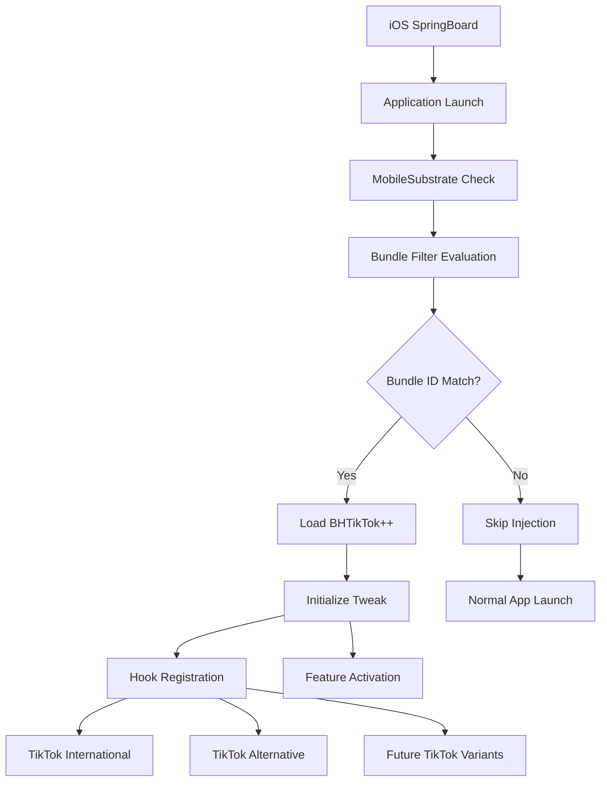
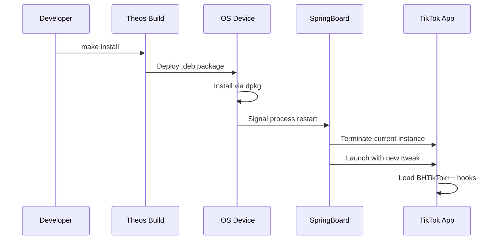

# Bundle Configuration and Application Targeting

## Overview

The bundle configuration system in BHTikTok++ defines which applications the tweak should inject into and how it integrates with the target processes. This system ensures precise targeting, optimal performance, and compatibility across different TikTok variants and regions.

## Purpose and Functionality

The bundle configuration serves as:
- **Application Targeting**: Specifies which apps should load the tweak
- **Process Filtering**: Prevents unnecessary injection into unrelated apps
- **Regional Compatibility**: Supports multiple TikTok variants across different markets
- **Performance Optimization**: Reduces system overhead by selective loading

## File Structure

| File | Purpose |
|------|---------|
| [`BHTikTok.plist`](../../BHTikTok.plist) | Bundle filter configuration |
| [`control`](../../control) | Package metadata and process targeting |
| [`Makefile`](../../Makefile) | Build-time process specification |

## Architecture Overview



## Bundle Filter Configuration

### Primary Filter Definition
**Location**: [`BHTikTok.plist`](../../BHTikTok.plist)

```xml
{ Filter = { Bundles = ( 
    "com.zhiliaoapp.musically",
    "com.ss.iphone.ugc.Ame",
         ); }; }
```

**Filter Structure**:
- **Root Dictionary**: Contains `Filter` key with bundle specifications
- **Bundles Array**: List of target application bundle identifiers
- **Exact Matching**: Precise string matching for bundle IDs

### Target Application Analysis

#### Primary Target: TikTok International
**Bundle ID**: `com.zhiliaoapp.musically`

**Application Details**:
- **Publisher**: ByteDance Ltd.
- **Distribution**: Global App Store
- **Primary Markets**: United States, Europe, most international markets
- **Content Focus**: International TikTok content ecosystem
- **Language Support**: Multiple international languages

**Technical Characteristics**:
- **App Store Compliance**: Full App Store distribution compliance
- **Content Filtering**: Regional content filtering and recommendations
- **API Endpoints**: International TikTok API infrastructure
- **Security Model**: Standard App Store security model

#### Secondary Target: TikTok Alternative
**Bundle ID**: `com.ss.iphone.ugc.Ame`

**Application Details**:
- **Distribution**: Regional App Stores or alternative distribution
- **Markets**: Specific regions or alternative versions
- **Variant Type**: Alternative TikTok client or regional version
- **Content Access**: May have different content access patterns

**Technical Differences**:
- **API Variations**: Potentially different API endpoints
- **Feature Sets**: May include region-specific features
- **Security Implementation**: Alternative security or authentication models
- **Content Pipeline**: Different content delivery mechanisms

### Bundle Identification Process

#### Runtime Bundle Detection
```objective-c
// Pseudo-code for bundle detection
NSString *bundleID = [[NSBundle mainBundle] bundleIdentifier];
if ([bundleID isEqualToString:@"com.zhiliaoapp.musically"] || 
    [bundleID isEqualToString:@"com.ss.iphone.ugc.Ame"]) {
    // Load BHTikTok++ functionality
}
```

**Detection Process**:
1. **Bundle ID Retrieval**: System provides main bundle identifier
2. **Filter Comparison**: Compare against configured bundle list
3. **Exact Matching**: Must match exactly (case-sensitive)
4. **Injection Decision**: Load tweak only on positive match

#### MobileSubstrate Integration
```xml
<!-- Simplified MobileSubstrate filter interpretation -->
<key>Filter</key>
<dict>
    <key>Bundles</key>
    <array>
        <string>com.zhiliaoapp.musically</string>
        <string>com.ss.iphone.ugc.Ame</string>
    </array>
</dict>
```

**MobileSubstrate Process**:
1. **Plist Parsing**: MobileSubstrate reads bundle filter configuration
2. **Process Monitoring**: Monitors application launches system-wide
3. **Filter Evaluation**: Checks each launched app against filter criteria
4. **Selective Injection**: Injects tweak code only into matching applications

## Process Management Configuration

### Target Process Specification
**Location**: [`Makefile` Line 2](../../Makefile#L2)

```makefile
INSTALL_TARGET_PROCESSES = TikTok
```

**Process Management**:
- **Installation Target**: Specifies which process to restart after installation
- **Generic Name**: Uses "TikTok" as generic process name
- **Automatic Restart**: System automatically restarts target process
- **Clean State**: Ensures fresh start with new tweak code

### Process Lifecycle Integration

#### Installation Process Flow


#### Runtime Integration
1. **App Launch**: TikTok launches normally through SpringBoard
2. **Bundle Check**: MobileSubstrate evaluates bundle filter
3. **Code Injection**: Tweak code injected into process memory
4. **Hook Registration**: Logos hooks registered with Objective-C runtime
5. **Feature Activation**: BHTikTok++ features become available

## Regional and Version Compatibility

### TikTok Variant Support

#### International TikTok (`com.zhiliaoapp.musically`)
**Supported Regions**:
- United States and Canada
- European Union countries
- Australia and New Zealand
- Most of Asia-Pacific (excluding China)
- Latin America
- Africa and Middle East (most countries)

**Feature Compatibility**:
- ✅ Download System - Full compatibility
- ✅ Region Spoofing - Complete support
- ✅ UI Modifications - All features supported
- ✅ Profile Enhancements - Full functionality
- ✅ Security Features - Complete integration

#### Alternative TikTok (`com.ss.iphone.ugc.Ame`)
**Potential Variations**:
- Regional TikTok variants
- Enterprise or business versions
- Beta or development builds
- Specific market customizations

**Compatibility Considerations**:
- ⚠️ API Differences - May require adaptation
- ⚠️ UI Variations - Some features may need adjustment
- ⚠️ Security Models - Different authentication systems
- ✅ Core Functionality - Basic features generally compatible

### Version Compatibility Matrix

| TikTok Version | Bundle ID | BHTikTok++ Support | Notes |
|----------------|-----------|-------------------|-------|
| **Latest Stable** | `com.zhiliaoapp.musically` | ✅ Full Support | Primary development target |
| **Previous Stable** | `com.zhiliaoapp.musically` | ✅ Full Support | Usually compatible |
| **Beta Versions** | `com.zhiliaoapp.musically` | ⚠️ Partial Support | May require updates |
| **Alternative Build** | `com.ss.iphone.ugc.Ame` | ⚠️ Variable Support | Depends on variant |
| **Very Old Versions** | Either | ❌ Limited Support | May lack required APIs |

## Security and App Store Compliance

### Code Injection Security Model

#### MobileSubstrate Security
```objective-c
// Security considerations for code injection
if (![self verifyTikTokIntegrity]) {
    // Abort injection if app integrity compromised
    return;
}
```

**Security Measures**:
- **Bundle Verification**: Ensures injection only into legitimate TikTok apps
- **Code Signing**: Respects iOS code signing requirements
- **Sandbox Compliance**: Operates within app sandbox restrictions
- **Memory Safety**: Uses safe memory access patterns

#### App Store Detection Bypass
**Location**: [`Tweak.x` Lines 1748-1823](../core/tweak.md#L1748)

```objective-c
%hook GULAppEnvironmentUtil
+(bool)isFromAppStore {
    return YES;  // Always appear as App Store build
}
+(bool)isAppStoreReceiptSandbox {
    return NO;   // Avoid sandbox detection
}
%end
```

**Detection Bypass Strategy**:
- **App Store Simulation**: Makes tweak appear as legitimate App Store build
- **Receipt Validation**: Bypasses App Store receipt checks
- **Environment Masking**: Hides jailbreak environment indicators

### Bundle Filter Security Benefits

#### Targeted Injection
```xml
<!-- Only specific, verified applications -->
<array>
    <string>com.zhiliaoapp.musically</string>
    <string>com.ss.iphone.ugc.Ame</string>
</array>
```

**Security Advantages**:
- **Limited Attack Surface**: Reduces potential for unintended injection
- **App Isolation**: Prevents conflicts with other applications
- **Resource Conservation**: Minimizes system resource usage
- **Stability**: Reduces system-wide stability risks

## Configuration Management

### Adding New Target Applications

#### Bundle Filter Extension
```xml
<!-- Extended bundle filter for new TikTok variants -->
{ Filter = { Bundles = ( 
    "com.zhiliaoapp.musically",
    "com.ss.iphone.ugc.Ame",
    "com.new.tiktok.variant",
         ); }; }
```

**Addition Process**:
1. **Bundle ID Discovery**: Identify new TikTok variant bundle ID
2. **Compatibility Testing**: Verify tweak compatibility
3. **Filter Update**: Add bundle ID to filter array
4. **Testing**: Comprehensive testing with new variant
5. **Documentation**: Update compatibility documentation

#### Regional Variant Support
```xml
<!-- Regional TikTok variants -->
{ Filter = { Bundles = ( 
    "com.zhiliaoapp.musically",           <!-- International -->
    "com.ss.iphone.ugc.Ame",             <!-- Alternative -->
    "com.zhiliaoapp.musically.lite",     <!-- Lite version -->
    "com.bytedance.tiktok.business",     <!-- Business variant -->
         ); }; }
```

### Configuration Testing

#### Bundle Filter Validation
```bash
# Test bundle filter configuration
plutil -lint BHTikTok.plist
```

**Validation Steps**:
1. **Syntax Check**: Verify plist syntax correctness
2. **Bundle Verification**: Confirm target bundle IDs exist
3. **Injection Testing**: Test actual injection into target apps
4. **Feature Testing**: Verify all features work in target variants

#### Runtime Verification
```objective-c
// Runtime bundle validation
NSString *currentBundle = [[NSBundle mainBundle] bundleIdentifier];
NSLog(@"BHTikTok++ loaded in bundle: %@", currentBundle);
```

**Verification Benefits**:
- **Debug Information**: Confirms successful injection
- **Compatibility Tracking**: Monitors which variants are used
- **Issue Diagnosis**: Helps identify injection problems

## Performance Impact Analysis

### Injection Overhead

#### Memory Usage
- **Base Overhead**: ~2-5MB additional memory usage
- **Feature Scaling**: Memory scales with enabled features
- **Optimization**: Lazy loading reduces initial overhead
- **Cleanup**: Proper deallocation prevents memory leaks

#### CPU Performance
- **Hook Overhead**: Minimal per-method call overhead
- **Feature Processing**: Feature-dependent CPU usage
- **Background Tasks**: Download operations use background threads
- **UI Responsiveness**: Maintains TikTok's native performance

#### Battery Impact
- **Baseline**: Minimal additional battery usage
- **Download Operations**: Increased usage during media downloads
- **Network Activity**: Regional spoofing may increase network usage
- **Background Processing**: Optional background download support

### Selective Loading Benefits

#### System-wide Impact
```objective-c
// Without bundle filtering (theoretical)
// Tweak would load into ALL applications
// Massive system resource waste

// With bundle filtering (actual)
// Loads only into TikTok variants
// Minimal system impact
```

**Resource Conservation**:
- **Memory Efficiency**: Only consumes memory in target applications
- **CPU Conservation**: No overhead in non-target applications  
- **Battery Optimization**: Reduced overall system battery usage
- **Stability**: Prevents potential conflicts with other applications

## Future Configuration Enhancements

### Dynamic Bundle Discovery
```objective-c
// Future: Dynamic TikTok variant detection
NSArray *detectedTikTokBundles = [self discoverTikTokVariants];
for (NSString *bundleID in detectedTikTokBundles) {
    [self enableTweakForBundle:bundleID];
}
```

### Advanced Filtering
```xml
<!-- Future: Advanced filtering criteria -->
<dict>
    <key>BundlePattern</key>
    <string>com.zhiliaoapp.*</string>
    <key>MinimumVersion</key>
    <string>25.0.0</string>
    <key>CompatibilityCheck</key>
    <true/>
</dict>
```

### Configuration Management
1. **Remote Configuration**: Server-side bundle filter updates
2. **A/B Testing**: Different configurations for different users
3. **Rollback Support**: Quick reversion to previous configurations
4. **Compatibility Database**: Centralized compatibility information

---

**Related Documentation**:
- [Build System](build-system.md) - Build configuration and process management
- [Main Tweak Implementation](../core/tweak.md) - Hook implementation and app integration
- [Security System](../core/security.md) - Security considerations and app protection
- [Manager System](../core/bhi-manager.md) - Runtime configuration management