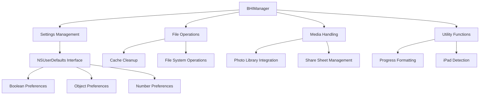

# Manager System (BHIManager)

## Overview

[`BHIManager`](../../BHIManager.h) is the centralized settings and utility management system for BHTikTok++. It provides a clean interface for accessing user preferences, managing file operations, and handling media saving functionality.

## Purpose and Functionality

The BHIManager serves as:
- **Settings Repository**: Centralized access to all user preferences stored in NSUserDefaults
- **Utility Provider**: Common functionality like file cleanup, media saving, and progress formatting
- **Configuration Manager**: Feature flag management and state checking

## File Structure

| File | Purpose |
|------|---------|
| [`BHIManager.h`](../../BHIManager.h) | Interface declarations and method signatures |
| [`BHIManager.m`](../../BHIManager.m) | Implementation of all manager functionality |

## Architecture Overview



## Settings Management Interface

### Boolean Setting Methods

The manager provides consistent access to boolean preferences through standardized getter methods:

#### Feed and UI Settings
**Location**: [Lines 5-30](../../BHIManager.m#L5)

```objective-c
+ (BOOL)hideAds {
    return [[NSUserDefaults standardUserDefaults] boolForKey:@"hide_ads"];
}

+ (BOOL)downloadButton {
    return [[NSUserDefaults standardUserDefaults] boolForKey:@"download_button"];
}

+ (BOOL)progressBar {
    return [[NSUserDefaults standardUserDefaults] boolForKey:@"show_porgress_bar"];
}
```

**Available Feed Settings**:
| Method | Key | Purpose |
|--------|-----|---------|
| [`hideAds`](../../BHIManager.m#L5) | `hide_ads` | Remove advertisements from feed |
| [`downloadButton`](../../BHIManager.m#L8) | `download_button` | Show download button on videos |
| [`shareSheet`](../../BHIManager.m#L11) | `share_sheet` | Enable share sheet for downloads |
| [`removeWatermark`](../../BHIManager.m#L14) | `remove_watermark` | Remove TikTok watermarks |
| [`hideElementButton`](../../BHIManager.m#L17) | `remove_elements_button` | Show UI element toggle button |
| [`progressBar`](../../BHIManager.m#L29) | `show_porgress_bar` | Display video progress bar |
| [`autoPlay`](../../BHIManager.m#L23) | `auto_play` | Auto-advance to next video |
| [`stopPlay`](../../BHIManager.m#L26) | `stop_play` | Disable video looping |

[`transparentCommnet`](../../BHIManager.m#L32) | `transparent_commnet` | Make the comment section transparent |

#### Content and Privacy Settings
**Location**: [Lines 32-52](../../BHIManager.m#L32)

```objective-c
+ (BOOL)showUsername {
    return [[NSUserDefaults standardUserDefaults] boolForKey:@"show_username"];
}

+ (BOOL)disableUnsensitive {
    return [[NSUserDefaults standardUserDefaults] boolForKey:@"disable_unsensitive"];
}
```

**Available Content Settings**:
| Method | Key | Purpose |
|--------|-----|---------|
| [`showUsername`](../../BHIManager.m#L35) | `show_username` | Display usernames instead of display names |
| [`disablePullToRefresh`](../../BHIManager.m#L38) | `pull_to_refresh` | Disable pull-to-refresh gesture |
| [`disableUnsensitive`](../../BHIManager.m#L41) | `disable_unsensitive` | Bypass sensitive content warnings |
| [`disableWarnings`](../../BHIManager.m#L44) | `disable_warnings` | Hide TikTok warning messages |
| [`disableLive`](../../BHIManager.m#L47) | `disable_live` | Filter out live streaming content |
| [`skipRecommendations`](../../BHIManager.m#L50) | `skip_recommnedations` | Auto-skip recommendation cards |

#### Interaction Control Settings
**Location**: [Lines 53-64](../../BHIManager.m#L53)

```objective-c
+ (BOOL)likeConfirmation {
    return [[NSUserDefaults standardUserDefaults] boolForKey:@"like_confirm"];
}

+ (BOOL)followConfirmation {
    return [[NSUserDefaults standardUserDefaults] boolForKey:@"follow_confirm"];
}
```

**Available Confirmation Settings**:
| Method | Key | Purpose |
|--------|-----|---------|
| [`likeConfirmation`](../../BHIManager.m#L53) | `like_confirm` | Confirm before liking videos |
| [`likeCommentConfirmation`](../../BHIManager.m#L56) | `like_comment_confirm` | Confirm before liking comments |
| [`dislikeCommentConfirmation`](../../BHIManager.m#L59) | `dislike_comment_confirm` | Confirm before disliking comments |
| [`followConfirmation`](../../BHIManager.m#L62) | `follow_confirm` | Confirm before following users |

### Object and Number Settings

#### Region and Speed Settings
**Location**: [Lines 86-100](../../BHIManager.m#L86)

```objective-c
+ (NSNumber *)selectedLiveAction {
    return [[NSUserDefaults standardUserDefaults] objectForKey:@"live_action"];
}

+ (NSDictionary *)selectedRegion {
    return [[NSUserDefaults standardUserDefaults] dictionaryForKey:@"region"];
}
```

**Complex Settings Methods**:
| Method | Return Type | Key | Purpose |
|--------|-------------|-----|---------|
| [`selectedLiveAction`](../../BHIManager.m#L86) | `NSNumber *` | `live_action` | Selected live button action |
| [`selectedSpeed`](../../BHIManager.m#L89) | `NSNumber *` | `playback_speed` | Video playback speed multiplier |
| [`selectedRegion`](../../BHIManager.m#L98) | `NSDictionary *` | `region` | Region spoofing configuration |

#### Profile Enhancement Settings
**Location**: [Lines 65-73](../../BHIManager.m#L65)

```objective-c
+ (BOOL)profileSave {
    return [[NSUserDefaults standardUserDefaults] boolForKey:@"save_profile"];
}

+ (BOOL)videoLikeCount {
    return [[NSUserDefaults standardUserDefaults] boolForKey:@"video_like_count"];
}
```

**Profile Settings**:
| Method | Key | Purpose |
|--------|-----|---------|
| [`profileSave`](../../BHIManager.m#L65) | `save_profile` | Enable profile image saving |
| [`profileCopy`](../../BHIManager.m#L68) | `copy_profile_information` | Enable profile info copying |
| [`profileVideoCount`](../../BHIManager.m#L71) | `uploaded_videos` | Show video count on profiles |
| [`videoLikeCount`](../../BHIManager.m#L92) | `video_like_count` | Display like counts on videos |
| [`videoUploadDate`](../../BHIManager.m#L95) | `video_upload_date` | Show upload dates on videos |

## File Management System

### Cache Cleanup Implementation
**Location**: [Lines 119-170](../../BHIManager.m#L119)

```objective-c
+ (void)cleanCache {
    NSArray <NSURL *> *DocumentFiles = [[NSFileManager defaultManager] 
        contentsOfDirectoryAtURL:[NSURL fileURLWithPath:NSSearchPathForDirectoriesInDomains(NSDocumentDirectory, NSUserDomainMask, true).firstObject] 
        includingPropertiesForKeys:@[] 
        options:NSDirectoryEnumerationSkipsHiddenFiles 
        error:nil];
    
    for (NSURL *file in DocumentFiles) {
        if ([file.pathExtension.lowercaseString isEqualToString:@"mp4"]) {
            [[NSFileManager defaultManager] removeItemAtURL:file error:nil];
        }
        // ... additional file type cleanup
    }
}
```

**Cleanup Targets**:

**Document Directory**:
- Video files (`.mp4`)
- Image files (`.png`, `.jpeg`)
- Audio files (`.mp3`, `.m4a`)

**Temporary Directory**:
- Video files (`.mp4`, `.mov`)
- Temporary files (`.tmp`)
- Image files (`.png`, `.jpeg`)
- Audio files (`.mp3`, `.m4a`)
- Empty directories

**Helper Method**:
```objective-c
+ (BOOL)isEmpty:(NSURL *)url {
    NSArray *FolderFiles = [[NSFileManager defaultManager] 
        contentsOfDirectoryAtURL:url 
        includingPropertiesForKeys:@[] 
        options:NSDirectoryEnumerationSkipsHiddenFiles 
        error:nil];
    return FolderFiles.count == 0;
}
```

## Media Handling System

### Share Sheet Integration
**Location**: [Lines 179-186](../../BHIManager.m#L179)

```objective-c
+ (void)showSaveVC:(id)item {
    UIActivityViewController *acVC = [[UIActivityViewController alloc] 
        initWithActivityItems:item 
        applicationActivities:nil];
    
    if (is_iPad()) {
        acVC.popoverPresentationController.sourceView = topMostController().view;
        acVC.popoverPresentationController.sourceRect = CGRectMake(
            topMostController().view.bounds.size.width / 2.0, 
            topMostController().view.bounds.size.height / 2.0, 
            1.0, 1.0);
    }
    [topMostController() presentViewController:acVC animated:true completion:nil];
}
```

**Features**:
- iPad popover positioning
- Universal share sheet presentation
- Automatic controller detection

### Photo Library Integration
**Location**: [Lines 187-206](../../BHIManager.m#L187)

```objective-c
+ (void)saveMedia:(id)newFilePath fileExtension:(id)fileextension {
    NSArray *imageExtensions = @[@"png", @"jpg", @"jpeg", @"gif", @"tiff", @"bmp", @"heif", @"heic", @"svg"];
    NSArray *videoExtensions = @[@"mp4", @"mov", @"avi", @"mkv", @"wmv", @"flv", @"webm"];
    
    [[PHPhotoLibrary sharedPhotoLibrary] performChanges:^{
        PHAssetResourceCreationOptions *options = [[PHAssetResourceCreationOptions alloc] init];
        if ([videoExtensions containsObject:fileextension]) {
            [[PHAssetCreationRequest creationRequestForAsset] 
                addResourceWithType:PHAssetResourceTypeVideo 
                fileURL:newFilePath 
                options:options];
        } else if ([imageExtensions containsObject:fileextension]) {
            [[PHAssetCreationRequest creationRequestForAsset] 
                addResourceWithType:PHAssetResourceTypePhoto 
                fileURL:newFilePath 
                options:options];
        }
    } completionHandler:^(BOOL success, NSError * _Nullable error) {
        // Handle completion
    }];
}
```

**Supported File Types**:

**Images**: png, jpg, jpeg, gif, tiff, bmp, heif, heic, svg
**Videos**: mp4, mov, avi, mkv, wmv, flv, webm

**Features**:
- Automatic file type detection
- Photos framework integration
- Proper asset creation handling
- Error handling and logging

## Utility Functions

### Progress Formatting
**Location**: [Lines 208-214](../../BHIManager.m#L208)

```objective-c
+ (NSString *)getDownloadingPersent:(float)per {
    NSNumberFormatter *numberFormatter = [[NSNumberFormatter alloc] init];
    [numberFormatter setNumberStyle:NSNumberFormatterPercentStyle];
    NSNumber *number = [NSNumber numberWithFloat:per];
    return [numberFormatter stringFromNumber:number];
}
```

**Purpose**: Converts float progress values (0.0-1.0) to formatted percentage strings for UI display.

### Device Detection
**Location**: [TikTokHeaders.h Lines 385-390](../../TikTokHeaders.h#L385)

```objective-c
static BOOL is_iPad() {
    if ([(NSString *)[UIDevice currentDevice].model hasPrefix:@"iPad"]) {
        return YES;
    }
    return NO;
}
```

**Usage**: Used throughout the system for iPad-specific UI adaptations.

## Integration with Main Tweak

### Setting Access Pattern
The manager provides a consistent interface used throughout [`Tweak.x`](tweak.md):

```objective-c
// Example usage in Tweak.x
if ([BHIManager hideAds] && self.isAds) {
    return nil; // Filter out ads
}

if ([BHIManager downloadButton]) {
    [self addDownloadButton]; // Add download functionality
}
```

### Feature Flag Pattern
```objective-c
// Conditional feature execution
if ([BHIManager likeConfirmation] && [self.currentTitle isEqualToString:@"Follow"]) {
    showConfirmation(^(void) { %orig; });
} else {
    %orig;
}
```

## Error Handling and Validation

### Safe Default Values
All boolean methods return `NO` by default if the key doesn't exist:

```objective-c
+ (BOOL)hideAds {
    return [[NSUserDefaults standardUserDefaults] boolForKey:@"hide_ads"];
    // Returns NO if key doesn't exist
}
```

### Null Safety for Objects
```objective-c
+ (NSDictionary *)selectedRegion {
    return [[NSUserDefaults standardUserDefaults] dictionaryForKey:@"region"];
    // Returns nil if key doesn't exist
}
```

## Performance Considerations

- **Lazy Loading**: Settings are only read when accessed
- **Caching**: NSUserDefaults provides automatic caching
- **Minimal Overhead**: Simple boolean checks have negligible performance impact
- **Batch Operations**: File cleanup operates in batches for efficiency

## Thread Safety

- **Main Thread**: All UI-related operations execute on main thread
- **Background Operations**: File operations can be performed on background threads
- **NSUserDefaults**: Thread-safe for read operations

## Dependencies

### Framework Dependencies
- `Foundation` - Core functionality
- `UIKit` - UI operations and device detection
- `Photos` - Photo library integration

### Internal Dependencies
- [`TikTokHeaders.h`](tiktok-headers.md) - For `topMostController()` and `is_iPad()` functions

## Usage Examples

### Basic Setting Check
```objective-c
if ([BHIManager hideAds]) {
    // Hide advertisement content
}
```

### Complex Configuration
```objective-c
if ([BHIManager regionChangingEnabled]) {
    NSDictionary *region = [BHIManager selectedRegion];
    NSString *countryCode = region[@"code"];
    // Apply region spoofing
}
```

### File Operations
```objective-c
// Clean up cached files
[BHIManager cleanCache];

// Save media to photo library
[BHIManager saveMedia:fileURL fileExtension:@"mp4"];

// Show share sheet
[BHIManager showSaveVC:@[fileURL]];
```

---

**Related Documentation**:
- [Main Tweak Implementation](tweak.md) - Primary hook system
- [Settings Interface](../settings/main-settings.md) - User configuration interface
- [TikTok Headers](tiktok-headers.md) - Interface declarations