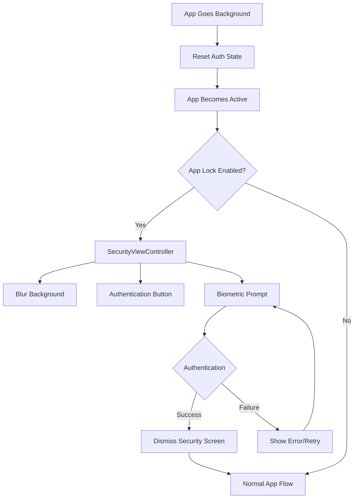
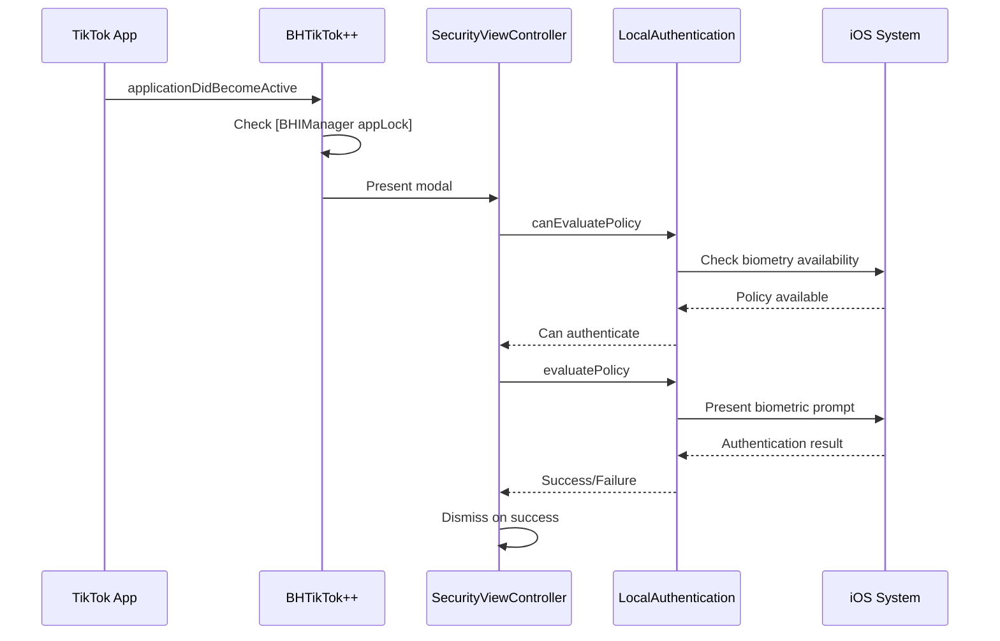

# Security System (SecurityViewController)

## Overview

The [`SecurityViewController`](../../SecurityViewController.h) provides biometric and passcode authentication functionality for BHTikTok++, implementing an app lock feature that secures access to the enhanced TikTok application.

## Purpose and Functionality

The security system serves as:
- **App Lock Implementation**: Prevents unauthorized access to the modified TikTok app
- **Biometric Authentication**: Utilizes Face ID, Touch ID, or device passcode
- **Privacy Protection**: Ensures user data and tweak functionality remain secure
- **Session Management**: Controls authentication state during app lifecycle

## File Structure

| File | Purpose |
|------|---------|
| [`SecurityViewController.h`](../../SecurityViewController.h) | Interface declaration and imports |
| [`SecurityViewController.m`](../../SecurityViewController.m) | Authentication implementation |

## Architecture Overview



## Implementation Details

### Interface Declaration
**Location**: [`SecurityViewController.h`](../../SecurityViewController.h)

```objective-c
#import <UIKit/UIKit.h>
#import <LocalAuthentication/LocalAuthentication.h>

@interface SecurityViewController : UIViewController
@end
```

**Dependencies**:
- `UIKit` - For view controller functionality
- `LocalAuthentication` - For biometric authentication services

### Core Implementation

#### View Setup and Initialization
**Location**: [Lines 5-20](../../SecurityViewController.m#L5)

```objective-c
- (void)viewDidLoad {
    [super viewDidLoad];
    
    // Create blur effect background
    UIBlurEffect *blurEffect = [UIBlurEffect effectWithStyle:UIBlurEffectStyleDark];
    UIVisualEffectView *blurView = [[UIVisualEffectView alloc] initWithEffect:blurEffect];
    blurView.frame = self.view.bounds;
    [self.view addSubview:blurView];
    
    // Create authentication button
    UIButton *authenticateButton = [[UIButton alloc] initWithFrame:CGRectMake(20, 20, 200, 60)];
    [authenticateButton setTitle:@"Authenticate" forState:UIControlStateNormal];
    authenticateButton.center = self.view.center;
    [authenticateButton addTarget:self action:@selector(authenticateButtonTapped:) forControlEvents:UIControlEventTouchUpInside];
    [self.view addSubview:authenticateButton];
    
    // Automatically trigger authentication
    [self authenticate];
}
```

**UI Components**:
1. **Blur Background**: Dark blur effect covering the entire screen
2. **Authentication Button**: Manual trigger for authentication retry
3. **Automatic Authentication**: Immediate authentication attempt on load

#### Authentication Logic
**Location**: [Lines 26-45](../../SecurityViewController.m#L26)

```objective-c
- (void)authenticate {
    LAContext *context = [[LAContext alloc] init];
    NSError *error = nil;
    
    if ([context canEvaluatePolicy:LAPolicyDeviceOwnerAuthentication error:&error]) {
        NSString *reason = @"Identify yourself!";
        
        [context evaluatePolicy:LAPolicyDeviceOwnerAuthentication 
                 localizedReason:reason 
                           reply:^(BOOL success, NSError *authenticationError) {
            dispatch_async(dispatch_get_main_queue(), ^{
                if (success) {
                    [self dismissViewControllerAnimated:YES completion:nil];
                } else {
                    // Authentication failed - stay on screen
                }
            });
        }];
    } else {
        // Biometry not available - should handle fallback
    }
}
```

**Authentication Flow**:

1. **Context Creation**: Initialize `LAContext` for biometric operations
2. **Policy Check**: Verify device supports owner authentication
3. **Authentication Request**: Present biometric prompt to user
4. **Result Handling**: Process success/failure on main queue
5. **UI Response**: Dismiss on success, remain visible on failure

#### Button Event Handling
**Location**: [Lines 22-24](../../SecurityViewController.m#L22)

```objective-c
- (void)authenticateButtonTapped:(id)sender {
    [self authenticate];
}
```

**Purpose**: Allows users to manually retry authentication if initial attempt fails.

## Integration with Main Application

### App Lifecycle Integration
**Location**: [`Tweak.x` Lines 32-48](../core/tweak.md#L32)

```objective-c
%hook AppDelegate
- (void)applicationDidBecomeActive:(id)arg1 {
    %orig;
    
    if ([BHIManager appLock] && !isAuthenticationShowed) {
        UIViewController *rootController = [[self window] rootViewController];
        SecurityViewController *securityViewController = [SecurityViewController new];
        securityViewController.modalPresentationStyle = UIModalPresentationOverFullScreen;
        [rootController presentViewController:securityViewController animated:YES completion:nil];
        isAuthenticationShowed = TRUE;
    }
}

- (void)applicationWillEnterForeground:(id)arg1 {
    %orig;
    isAuthenticationShowed = FALSE;
}
%end
```

**Integration Points**:
1. **Activation Trigger**: Security screen shown when app becomes active
2. **Setting Check**: Only triggers if [`[BHIManager appLock]`](bhi-manager.md#L116) is enabled
3. **State Management**: Prevents multiple security screens
4. **Modal Presentation**: Full-screen overlay for security

### State Management Variables
**Location**: [`Tweak.x` Line 32](../core/tweak.md#L32)

```objective-c
static BOOL isAuthenticationShowed = FALSE;
```

**Purpose**: Tracks whether security screen is currently displayed to prevent duplicate presentations.

## Authentication Policies

### Local Authentication Policy
The system uses `LAPolicyDeviceOwnerAuthentication` which provides:

**Supported Authentication Methods**:
- **Face ID** (iPhone X and later)
- **Touch ID** (supported iPhone/iPad models)  
- **Device Passcode** (fallback for all devices)

**Policy Benefits**:
- Automatic fallback to passcode if biometry fails
- Consistent behavior across all device types
- System-level security integration

### Security Characteristics

#### Authentication Flow


#### Error Handling
The current implementation has basic error handling:

```objective-c
if ([context canEvaluatePolicy:LAPolicyDeviceOwnerAuthentication error:&error]) {
    // Proceed with authentication
} else {
    // Biometry not available - no current fallback
}
```

**Potential Improvements**:
- Custom passcode fallback UI
- Error message display for authentication failures  
- Retry attempt limiting
- Graceful degradation for unsupported devices

## UI Design and User Experience

### Visual Design
**Background**: Dark blur effect (`UIBlurEffectStyleDark`)
- Provides privacy by obscuring app content
- Maintains iOS design consistency
- Creates focused authentication context

**Authentication Button**: 
- Central positioning for easy access
- Clear "Authenticate" label
- Manual retry capability

### Accessibility Considerations
- Uses system authentication which includes VoiceOver support
- Standard iOS accessibility features apply
- Button provides alternative trigger method

### User Flow
1. **App Activation**: User opens or returns to TikTok
2. **Security Check**: Tweak checks if app lock is enabled
3. **Screen Presentation**: Security overlay appears immediately
4. **Authentication Prompt**: System biometric prompt appears
5. **Success**: Security screen dismisses, normal app usage resumes
6. **Failure**: Security screen remains, user can retry

## Configuration and Settings

### Enable/Disable App Lock
**Setting Location**: [`BHIManager`](bhi-manager.md#L116)

```objective-c
+ (BOOL)appLock {
    return [[NSUserDefaults standardUserDefaults] boolForKey:@"padlock"];
}
```

**Settings UI**: Configured via main settings interface at:
[`Settings/ViewController.m` Lines 308-310](../settings/main-settings.md)

### Default State
- **Default**: Disabled (OFF)
- **Key**: `"padlock"`
- **Storage**: NSUserDefaults

## Security Benefits

### Privacy Protection
- Prevents unauthorized access to modified TikTok features
- Protects downloaded content and saved data
- Maintains user privacy when device is shared

### Tweak Protection  
- Secures access to BHTikTok++ functionality
- Prevents casual discovery of modifications
- Protects against unauthorized usage

### Data Security
- Downloaded videos and photos remain protected
- Settings and configurations stay secure
- User preferences protected from tampering

## Technical Considerations

### Performance Impact
- **Minimal Overhead**: Only active when feature is enabled
- **Fast Presentation**: Immediate modal display
- **System Integration**: Leverages efficient iOS APIs

### Memory Management
- **Automatic Cleanup**: View controller properly deallocated after dismissal
- **Resource Efficiency**: Minimal memory footprint
- **System Resources**: Uses system authentication services

### Thread Safety
- **Main Queue Operations**: UI updates properly dispatched
- **Callback Handling**: Authentication results handled on main thread
- **State Management**: Thread-safe boolean flag usage

## Limitations and Future Enhancements

### Current Limitations
1. **Basic Error Handling**: Limited feedback for authentication failures
2. **No Custom Passcode**: Relies entirely on system authentication
3. **Single Attempt Context**: No retry limiting or timeout handling
4. **No Biometry Customization**: Uses default system prompts

### Potential Enhancements
1. **Custom Authentication UI**: Enhanced visual design and branding
2. **Attempt Limiting**: Security measures for multiple failed attempts
3. **Time-based Locking**: Automatic re-authentication after time periods
4. **Settings Integration**: More granular authentication options
5. **Emergency Access**: Alternative authentication methods
6. **Analytics**: Usage tracking and security event logging

## Debugging and Development

### Testing Authentication
```objective-c
// Enable app lock for testing
[[NSUserDefaults standardUserDefaults] setBool:YES forKey:@"padlock"];

// Trigger authentication manually
SecurityViewController *security = [SecurityViewController new];
[topMostController() presentViewController:security animated:YES completion:nil];
```

### Simulator Considerations
- Face ID/Touch ID simulation available in iOS Simulator
- Passcode authentication testing requires device passcode setup
- System authentication policies work in simulator environment

## Integration Example

### Complete Authentication Flow
```objective-c
// 1. Check if authentication is needed
if ([BHIManager appLock] && !isAuthenticationShowed) {
    
    // 2. Create and configure security controller
    SecurityViewController *securityVC = [SecurityViewController new];
    securityVC.modalPresentationStyle = UIModalPresentationOverFullScreen;
    
    // 3. Present over current content
    UIViewController *rootController = [[UIApplication sharedApplication].keyWindow rootViewController];
    [rootController presentViewController:securityVC animated:YES completion:nil];
    
    // 4. Update state to prevent duplicate presentations
    isAuthenticationShowed = TRUE;
}
```

---

**Related Documentation**:
- [Main Tweak Implementation](tweak.md) - App lifecycle integration
- [Manager System](bhi-manager.md) - Settings management
- [Settings Interface](../settings/main-settings.md) - User configuration
- [TikTok Headers](tiktok-headers.md) - Required imports and interfaces