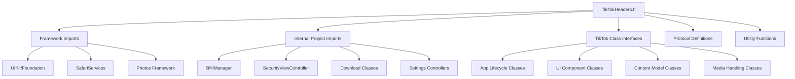
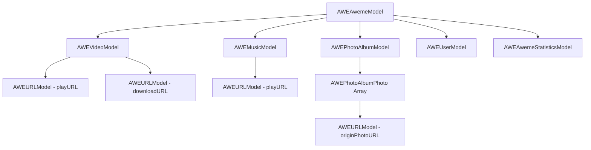

# TikTok Headers System (TikTokHeaders.h)

## Overview

[`TikTokHeaders.h`](../../TikTokHeaders.h) serves as the comprehensive interface declaration file that defines all the TikTok application classes, methods, and protocols used by the tweak. This file is essential for runtime method hooking and provides type safety for interactions with TikTok's internal APIs.

## Purpose and Functionality

The headers file serves multiple critical functions:
- **Interface Declarations**: Defines TikTok's internal class structures and method signatures
- **Protocol Definitions**: Establishes delegate protocols for download and interaction handling
- **Type Safety**: Provides compile-time type checking for hooked methods
- **Method Extensions**: Declares new methods added to existing classes via Logos
- **Utility Functions**: Defines helper functions for UI operations

## Architecture Overview



## Import Structure

### Framework Dependencies
**Location**: [Lines 1-11](../../TikTokHeaders.h#L1)

```objective-c
#import <UIKit/UIKit.h>
#import <Foundation/Foundation.h>
#import <SafariServices/SafariServices.h>
#import <Photos/Photos.h>
```

### Internal Project Dependencies
**Location**: [Lines 4-11](../../TikTokHeaders.h#L4)

```objective-c
#import "BHIManager.h"
#import "SecurityViewController.h"
#import "BHDownload.h"
#import "BHMultipleDownload.h"
#import "JGProgressHUD/JGProgressHUD.h"
#import "Settings/ViewController.h"
#import "Settings/PlaybackSpeed.h"
```

## TikTok Application Classes

### Application Lifecycle Classes

#### AppDelegate Interface
**Location**: [Lines 13-14](../../TikTokHeaders.h#L13)

```objective-c
@interface AppDelegate : NSObject <UIApplicationDelegate>
@end
```

**Purpose**: Provides interface for hooking application lifecycle methods in [`Tweak.x`](tweak.md#L11).

### UI Component Classes

#### View Controllers
**Location**: [Lines 16-252](../../TikTokHeaders.h#L16)

```objective-c
@interface TTKCommentPanelViewController: UIViewController
@end

@interface AWEFeedCellViewController: AWEAwemeBaseViewController;
@property (nonatomic, strong, readwrite) AWEAwemeModel *model;
- (NSInteger)indexPath;
@end
```

**Key View Controller Classes**:
| Class | Purpose | Key Properties/Methods |
|-------|---------|----------------------|
| [`TTKCommentPanelViewController`](../../TikTokHeaders.h#L16) | Comment panel management | For transparency effects |
| [`AWEFeedCellViewController`](../../TikTokHeaders.h#L239) | Main feed cell controller | `model`, `indexPath` |
| [`AWEAwemeDetailCellViewController`](../../TikTokHeaders.h#L244) | Detail view controller | Inherits from base controller |
| [`TTKProfileOtherViewController`](../../TikTokHeaders.h#L147) | Profile view controller | `user` property |
| [`AWENewFeedTableViewController`](../../TikTokHeaders.h#L368) | Main feed table | `currentAweme`, `scrollToNextVideo` |

#### Custom UI Elements
**Location**: [Lines 19-42](../../TikTokHeaders.h#L19)

```objective-c
@interface AWEUserNameLabel: UILabel
-(void)addVerifiedIcon:(BOOL)arg1;
@end

@interface BDImageView: UIImageView
- (void)handleLongPress:(UILongPressGestureRecognizer *)sender;
- (void)addHandleLongPress;
- (id)bd_baseImage;
@end
```

**Enhanced UI Classes**:
| Class | Purpose | Extended Methods |
|-------|---------|------------------|
| [`AWEUserNameLabel`](../../TikTokHeaders.h#L19) | Username display | `addVerifiedIcon:` for fake verification |
| [`BDImageView`](../../TikTokHeaders.h#L27) | Profile images | Long press handling for saving |
| [`TTTAttributedLabel`](../../TikTokHeaders.h#L34) | Text labels | Long press for copying text |
| [`AWEPlayInteractionAuthorView`](../../TikTokHeaders.h#L39) | Author info view | Region emoji display |

### Content Model Classes

#### Media Models
**Location**: [Lines 79-138](../../TikTokHeaders.h#L79)

```objective-c
@interface AWEURLModel : NSObject
@property(retain, nonatomic) NSArray* originURLList;
- (NSURL *)recommendUrl;
- (NSURL *)bestURLtoDownload;
- (NSString *)bestURLtoDownloadFormat;
@end

@interface AWEVideoModel : NSObject
@property(readonly, nonatomic) AWEURLModel *playURL;
@property(readonly, nonatomic) AWEURLModel *downloadURL;
@property(readonly, nonatomic) NSNumber *duration;
@end
```

**Media Model Hierarchy**:


#### Content Management Models
**Location**: [Lines 119-138](../../TikTokHeaders.h#L119)

```objective-c
@interface AWEAwemeModel : NSObject
@property(nonatomic) BOOL isAds;
@property(retain, nonatomic) AWEVideoModel *video;
@property(retain, nonatomic) id music;
@property(retain, nonatomic) AWEPhotoAlbumModel *photoAlbum;
@property(nonatomic, strong, readwrite) AWEUserModel *author;
@property(nonatomic, assign, readwrite) BOOL isUserRecommendBigCard;
@end
```

**Key Properties for Hooking**:
- `isAds` - Used for ad filtering in [`Tweak.x`](tweak.md#L670)
- `video` - Access to video URLs for downloading
- `music` - Audio content access
- `photoAlbum` - Photo collection handling
- `author` - User information access

### Settings and UI Management Classes

#### Settings System Classes
**Location**: [Lines 151-188](../../TikTokHeaders.h#L151)

```objective-c
@interface AWESettingItemModel: NSObject
@property(nonatomic, copy, readwrite) NSString *identifier;
@property(nonatomic, copy, readwrite) NSString *title;
@property(nonatomic, copy, readwrite) NSString *detail;
@property(nonatomic, strong, readwrite) UIImage *iconImage;
@property(nonatomic, assign, readwrite) NSUInteger type;
@end

@interface TTKSettingsBaseCellPlugin: NSObject
@property(nonatomic, weak, readwrite) id context;
@property(nonatomic, strong, readwrite) AWESettingItemModel *itemModel;
@end
```

**Settings Integration Classes**:
| Class | Purpose | Key Usage |
|-------|---------|-----------|
| [`AWESettingItemModel`](../../TikTokHeaders.h#L151) | Settings item data | Creating BHTikTok++ settings entry |
| [`TTKSettingsBaseCellPlugin`](../../TikTokHeaders.h#L160) | Settings cell plugin | Hooking settings display |
| [`AWESettingsNormalSectionViewModel`](../../TikTokHeaders.h#L171) | Settings section | Adding custom settings section |

## Download System Integration

### Feed Cell Extensions
**Location**: [Lines 255-305](../../TikTokHeaders.h#L255)

```objective-c
@interface AWEFeedViewTemplateCell: UITableViewCell
@property(nonatomic, strong, readwrite) UIViewController *viewController;
@property(nonatomic, assign) BOOL elementsHidden;
@property (nonatomic, strong) JGProgressHUD *hud;
@property (nonatomic, retain) NSString *fileextension;
- (void)addDownloadButton;
- (void)downloadVideo:(AWEAwemeBaseViewController *)rootVC;
- (void)downloadHDVideo:(AWEAwemeBaseViewController *)rootVC;
- (void)downloadPhotos:(TTKPhotoAlbumDetailCellController *)rootVC;
@end
```

**Extended Properties and Methods**:
- `elementsHidden` - UI element visibility state
- `hud` - Progress indicator reference  
- `fileextension` - Current download file type
- `addDownloadButton` - UI integration method
- Download methods for various media types

### Protocol Definitions
**Location**: [Lines 278-279, 304-305](../../TikTokHeaders.h#L278)

```objective-c
@interface AWEFeedViewTemplateCell () <BHDownloadDelegate, BHMultipleDownloadDelegate>
@end

@interface AWEAwemeDetailTableViewCell () <BHDownloadDelegate>
@end
```

**Purpose**: Establishes delegate relationships for download progress tracking and completion handling.

## Alert and UI Helper Classes

### Alert System
**Location**: [Lines 344-350](../../TikTokHeaders.h#L344)

```objective-c
@interface AWEUIAlertView: UIView
+ (void)showAlertWithTitle:(NSString *)title 
               description:(NSString *)description 
                     image:(UIImage *)image 
         actionButtonTitle:(NSString *)actionButtonTitle 
         cancelButtonTitle:(NSString *)cancelButtonTitle 
               actionBlock:(void (^)(void))actionBlock 
               cancelBlock:(void (^)(void))cancelBlock;
@end
```

**Usage**: Provides confirmation dialogs used throughout the tweak for user confirmations.

### Action Sheet System
**Location**: [Lines 329-342](../../TikTokHeaders.h#L329)

```objective-c
@interface TUXActionSheetAction: NSObject
@property(nonatomic) NSString *title;
@property(nonatomic) UIImage *image;
@end

@interface TUXActionSheetController: UIViewController
- (instancetype)initWithTitle:(NSString *)title;
- (void)addAction:(TUXActionSheetAction *)action;
@end
```

**Purpose**: Alternative UI presentation system for complex option selection.

## Utility Functions

### Top Controller Detection
**Location**: [Lines 392-412](../../TikTokHeaders.h#L392)

```objective-c
static UIViewController * _Nullable _topMostController(UIViewController * _Nonnull cont) {
    UIViewController *topController = cont;
    while (topController.presentedViewController) {
        topController = topController.presentedViewController;
    }
    if ([topController isKindOfClass:[UINavigationController class]]) {
        UIViewController *visible = ((UINavigationController *)topController).visibleViewController;
        if (visible) {
            topController = visible;
        }
    }
    return (topController != cont ? topController : nil);
}

static UIViewController * _Nonnull topMostController() {
    UIViewController *topController = [UIApplication sharedApplication].keyWindow.rootViewController;
    UIViewController *next = nil;
    while ((next = _topMostController(topController)) != nil) {
        topController = next;
    }
    return topController;
}
```

**Purpose**: 
- Finds the topmost visible view controller for modal presentation
- Handles navigation controller hierarchies
- Used extensively for presenting download progress HUDs and settings

### Device Detection
**Location**: [Lines 385-390](../../TikTokHeaders.h#L385)

```objective-c
static BOOL is_iPad() {
    if ([(NSString *)[UIDevice currentDevice].model hasPrefix:@"iPad"]) {
        return YES;
    }
    return NO;
}
```

**Purpose**: iPad-specific UI adaptations, particularly for share sheet popover positioning.

## Advanced Class Interfaces

### Profile Enhancement Classes
**Location**: [Lines 376-383](../../TikTokHeaders.h#L376)

```objective-c
@interface TTKProfileBaseComponentModel : NSObject
@property (nonatomic, strong) NSString *componentID;
@property (nonatomic, copy, readwrite) NSDictionary *bizData;
@property (nonatomic, copy, readwrite) NSArray *components;
- (NSString *)formattedStringFromNumber:(NSNumber *)number;
- (NSNumber *)numberFromUserDefaultsForKey:(NSString *)key;
@end
```

**Extended Methods**: 
- `formattedStringFromNumber:` - Number formatting for fake counts
- `numberFromUserDefaultsForKey:` - Settings access helper

### Media Playback Classes
**Location**: [Lines 352-355](../../TikTokHeaders.h#L352)

```objective-c
@interface AWEPlayVideoPlayerController : NSObject
@property(nonatomic) AWEAwemeBaseViewController *container;
- (void)setPlayerSeekTime:(double)arg1 completion:(id)arg2;
@end
```

**Purpose**: Video playback control for auto-play and speed modification features.

## Type Safety and Compile-Time Checking

### Method Signature Validation
The headers provide compile-time validation for:

```objective-c
// Ensures proper method signatures for hooks
%hook AWEAwemeModel
- (id)initWithDictionary:(id)arg1 error:(id *)arg2 {
    // Compiler validates this signature against header
}
%end
```

### Property Access Safety
```objective-c
// Type-safe property access
AWEAwemeModel *model = rootVC.model;
NSString *itemID = model.itemID;  // Compile-time type checking
AWEVideoModel *video = model.video;  // Property type validation
```

## Integration Patterns

### Hook Implementation Pattern
```objective-c
// Header declares interface
@interface SomeClass : NSObject
- (void)methodToHook:(id)parameter;
@end

// Tweak.x implements hook
%hook SomeClass
- (void)methodToHook:(id)parameter {
    // Implementation with type safety
    %orig;
}
%end
```

### Property Extension Pattern
```objective-c
// Header declares new properties
@interface ExistingClass
@property (nonatomic, strong) NewPropertyType *newProperty;
@end

// Tweak.x adds property via Logos
%hook ExistingClass
%property (nonatomic, strong) NewPropertyType *newProperty;
%end
```

## Documentation and Maintenance

### Header Organization Strategy
1. **Framework Imports** - Standard iOS frameworks
2. **Project Imports** - Internal component dependencies  
3. **Base Classes** - Fundamental TikTok classes
4. **UI Components** - Interface and view classes
5. **Data Models** - Content and media models
6. **Extension Interfaces** - Tweak-added functionality
7. **Utility Functions** - Helper and convenience functions

### Version Compatibility
The headers are designed to be:
- **Forward Compatible** - Basic interfaces remain stable
- **Extensible** - New properties and methods can be added
- **Defensive** - Optional protocol conformance for flexibility

## Performance Considerations

- **Compile-Time Optimization** - Static type checking reduces runtime overhead
- **Memory Efficiency** - Property declarations don't allocate memory
- **Runtime Safety** - Method signature validation prevents crashes

## Security Implications

- **Interface Isolation** - Clean separation between tweak and app internals
- **Type Safety** - Prevents memory corruption through type validation
- **Method Validation** - Ensures hook compatibility

---

**Related Documentation**:
- [Main Tweak Implementation](tweak.md) - Uses these interfaces for hooking
- [Manager System](bhi-manager.md) - Provides utility functions
- [Download System](../download/bh-download.md) - Implements declared protocols
- [Settings Interface](../settings/main-settings.md) - Uses UI class interfaces