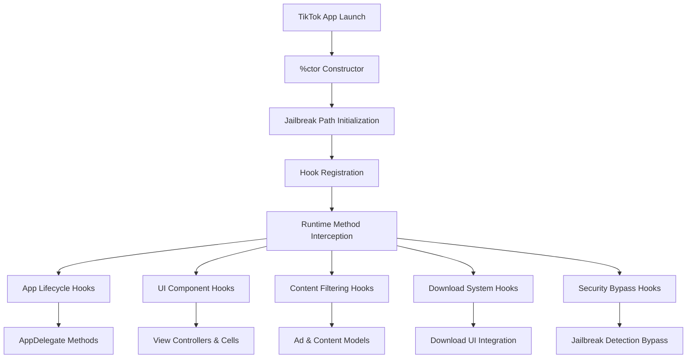
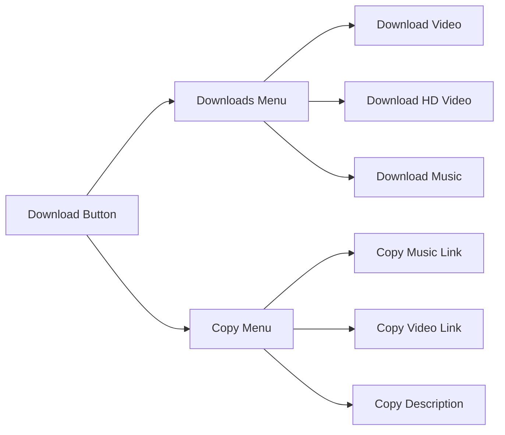

# Main Tweak Implementation (Tweak.x)

## Overview

[`Tweak.x`](../../Tweak.x) is the primary implementation file that contains all the runtime hooks and modifications for the TikTok application. This file uses Logos syntax to intercept and modify the behavior of TikTok's classes and methods.

## Purpose and Functionality

The main tweak file serves as the central hub for all TikTok modifications, implementing:
- Ad blocking and content filtering
- Download functionality integration
- UI element manipulation
- Security and privacy enhancements
- Region spoofing capabilities
- Profile customization features

## Key Dependencies

- [`TikTokHeaders.h`](tiktok-headers.md) - Interface declarations for TikTok classes
- [`BHIManager`](bhi-manager.md) - Settings and utility management
- [`BHDownload`](../download/bh-download.md) - File download handling
- [`SecurityViewController`](security.md) - Authentication system
- [`JGProgressHUD`](../libraries/jgprogresshud.md) - Progress indicators

## Architecture Overview



## Core Hook Categories

### 1. Application Lifecycle Hooks

#### AppDelegate Hook
**Location**: [Lines 11-49](../../Tweak.x#L11)

```objective-c
%hook AppDelegate
- (_Bool)application:(UIApplication *)application didFinishLaunchingWithOptions:(id)arg2 {
    %orig;
    // First-time setup and default preferences
    // FLEX debugging integration
    // Cache cleanup
    return true;
}
```

**Purpose**: 
- Initializes default settings on first run
- Enables FLEX debugging if configured
- Performs cache cleanup via [`[BHIManager cleanCache]`](bhi-manager.md#L28)

**Key Features**:
- First-run detection and setup
- Default preference initialization
- FLEX explorer integration for debugging

#### Authentication Integration
**Location**: [Lines 32-48](../../Tweak.x#L32)

```objective-c
- (void)applicationDidBecomeActive:(id)arg1 {
    %orig;
    if ([BHIManager appLock] && !isAuthenticationShowed) {
        // Present security screen
    }
}
```

**Purpose**: Integrates app lock functionality when app becomes active.

### 2. Content Filtering and Ad Blocking

#### AWEAwemeModel Hook
**Location**: [Lines 667-712](../../Tweak.x#L667)

```objective-c
%hook AWEAwemeModel
- (id)initWithDictionary:(id)arg1 error:(id *)arg2 {
    id orig = %orig;
    return [BHIManager hideAds] && self.isAds ? nil : orig;
}
```

**Purpose**: 
- Filters out advertisement content
- Controls video progress bar visibility
- Manages live streaming content display

**Features**:
- Complete ad removal when enabled
- Progress bar control via [`[BHIManager progressBar]`](bhi-manager.md#L29)
- Live stream filtering

### 3. UI Enhancement Hooks

#### Download Button Integration
**Location**: [Lines 1060-1459](../../Tweak.x#L1060)

The tweak integrates download functionality directly into TikTok's feed cells:

```objective-c
%hook AWEFeedViewTemplateCell
- (void)configWithModel:(id)model {
    %orig;
    if ([BHIManager downloadButton]) {
        [self addDownloadButton];
    }
}
```

**Download Menu Structure**:


**Key Methods**:
- [`downloadVideo:`](../../Tweak.x#L1116) - Standard video download
- [`downloadHDVideo:`](../../Tweak.x#L1103) - HD video download
- [`downloadPhotos:`](../../Tweak.x#L1147) - Photo album downloads
- [`downloadMusic:`](../../Tweak.x#L1170) - Audio extraction

#### FLEX Button Integration
**Location**: [Lines 1074-1077](../../Tweak.x#L1074)

```objective-c
- (void)configWithModel:(id)model {
    %orig;
    // ...
    if ([BHIManager flexEnabled]) {
        [self addFlexButton];
    }
}
```

**Purpose**: Adds a button to the feed cell to launch the FLEX explorer for debugging.

#### UI Element Control
**Location**: [Lines 1373-1410](../../Tweak.x#L1373)

```objective-c
- (void)hideElementButtonHandler:(UIButton *)sender {
    if (self.elementsHidden) {
        [interactionController hideAllElements:false exceptArray:nil];
    } else {
        [interactionController hideAllElements:true exceptArray:nil];
    }
}
```

**Purpose**: Provides toggle functionality to show/hide TikTok UI elements.

### 4. Profile Enhancement Hooks

#### Video Statistics Display
**Location**: [Lines 67-175](../../Tweak.x#L67)

```objective-c
%hook AWEUserWorkCollectionViewCell
- (void)configWithModel:(id)arg1 isMine:(BOOL)arg2 {
    %orig;
    if ([BHIManager videoLikeCount] || [BHIManager videoUploadDate]) {
        // Add like count and upload date labels
    }
}
```

**Features**:
- Video like count display with heart icon
- Upload date with clock icon  
- Formatted number display (K, M notation)
- Custom date formatting (dd.MM.yy)

#### Fake Profile Information
**Location**: [Lines 837-898](../../Tweak.x#L837)

```objective-c
%hook TTKProfileBaseComponentModel
- (NSDictionary *)bizData {
    if ([BHIManager fakeChangesEnabled]) {
        // Modify follower/following counts
    }
    return %orig;
}
```

**Capabilities**:
- Fake follower count display
- Fake following count display  
- Fake verification badge
- Extended bio length support

### 5. Region Spoofing System

The tweak implements comprehensive region spoofing by hooking multiple carrier and region-related classes:

#### Carrier Information Hooks
**Location**: [Lines 319-363](../../Tweak.x#L319)

```objective-c
%hook CTCarrier
- (NSString *)mobileCountryCode {
    if ([BHIManager regionChangingEnabled]) {
        NSDictionary *selectedRegion = [BHIManager selectedRegion];
        return selectedRegion[@"mcc"];
    }
    return %orig;
}
```

**Hooked Classes**:
- `CTCarrier` - Mobile carrier information
- `TTKStoreRegionService` - App Store region
- `TIKTOKRegionManager` - TikTok region management
- `TTKPassportAppStoreRegionModel`
- `ATSRegionCacheManager` - Region caching
- `TTKStoreRegionModel`
- `TTInstallIDManager` - Installation region tracking
- `BDInstallGlobalConfig`

### 6. Security and Anti-Detection

#### Jailbreak Detection Bypass
**Location**: [Lines 1729-1851](../../Tweak.x#L1729)

The tweak includes comprehensive jailbreak detection bypass:

```objective-c
%hook NSFileManager
-(BOOL)fileExistsAtPath:(id)arg1 {
    for (NSString *file in jailbreakPaths) {
        if ([arg1 isEqualToString:file]) {
            return NO;
        }
    }
    return %orig;
}
```

**Bypassed Detection Methods**:
- File system checks
- Bundle analysis
- App Store receipt validation
- Debug build detection
- Mobile provision checks

**Hooked Classes for Detection Bypass**:
- `NSFileManager`
- `BDADeviceHelper`
- `UIDevice`
- `TTInstallUtil`
- `AppsFlyerUtils`
- `PIPOIAPStoreManager`
- `IESLiveDeviceInfo`
- `PIPOStoreKitHelper`
- `BDInstallNetworkUtility`
- `TTAdSplashDeviceHelper`
- `GULAppEnvironmentUtil`
- `FBSDKAppEventsUtility`
- `AWEAPMManager`
- `NSBundle`
- `AWESecurity`
- `MSManagerOV`
- `MSConfigOV`

### 7. Confirmation System

#### User Action Confirmations
**Location**: [Lines 5-9](../../Tweak.x#L5)

```objective-c
static void showConfirmation(void (^okHandler)(void)) {
    [%c(AWEUIAlertView) showAlertWithTitle:@"BHTikTok, Hi" 
                              description:@"Are you sure?" 
                                    image:nil 
                        actionButtonTitle:@"Yes" 
                        cancelButtonTitle:@"No" 
                              actionBlock:^{
                                  okHandler();
                              } 
                              cancelBlock:nil];
}
```

**Confirmed Actions**:
- Like button taps ([Line 901](../../Tweak.x#L901))
- Follow button taps ([Line 820](../../Tweak.x#L820))
- Comment like/dislike ([Lines 910-924](../../Tweak.x#L910))

## Advanced Features

### Video Playback Control
**Location**: [Lines 758-781](../../Tweak.x#L758)

```objective-c
%hook AWEPlayVideoPlayerController
- (void)playerWillLoopPlaying:(id)arg1 {
    if ([BHIManager autoPlay]) {
        [((AWENewFeedTableViewController *)self.container.parentViewController) scrollToNextVideo];
        return;
    }
    %orig;
}
```

**Features**:
- Auto-play next video functionality
- Loop playback control
- Video speed modification

### Media URL Processing
**Location**: [Lines 1691-1727](../../Tweak.x#L1691)

```objective-c
%hook AWEURLModel
%new - (NSURL *)bestURLtoDownload {
    NSURL *bestURL;
    for (NSString *url in self.originURLList) {
        if ([url containsString:@"video_mp4"] || [url containsString:@".jpeg"] || [url containsString:@".mp3"]) {
            bestURL = [NSURL URLWithString:url];
        }
    }
    return bestURL;
}
```

**Purpose**: Intelligently selects the best quality URL for downloads based on content type.

## Configuration and Setup

### Constructor Implementation
**Location**: [Lines 1852-1884](../../Tweak.x#L1852)

```objective-c
%ctor {
    jailbreakPaths = @[
        @"/Applications/Cydia.app",
        @"/var/lib/cydia",
        @"/usr/bin/ssh",
        // ... extensive list of jailbreak indicators
    ];
    %init;
}
```

**Purpose**: Initializes the jailbreak path blacklist for detection bypass.

## Integration Points

### Settings Integration
The tweak integrates seamlessly with the settings system:

```objective-c
%hook AWESettingsNormalSectionViewModel
- (void)viewDidLoad {
    %orig;
    if ([self.sectionIdentifier isEqualToString:@"account"]) {
        // Add BHTikTok++ settings entry
    }
}
```

### Download Progress Tracking
Uses delegate patterns for download progress:

```objective-c
%new - (void)downloadProgress:(float)progress {
    self.hud.detailTextLabel.text = [BHIManager getDownloadingPersent:progress];
}
```

## Error Handling

The tweak implements robust error handling throughout:

```objective-c
%new - (void)downloadDidFailureWithError:(NSError *)error {
    if (error) {
        [self.hud dismiss];
    }
}
```

## Performance Considerations

- Minimal method swizzling impact
- Lazy loading of UI components
- Efficient memory management with proper cleanup
- Background download support

## Security Implications

- Comprehensive jailbreak detection bypass
- Safe file system access patterns
- Proper permission handling for media downloads
- Secure authentication integration

---

**Related Documentation**:
- [Manager System](bhi-manager.md) - Settings and utilities
- [Download System](../download/bh-download.md) - File download implementation  
- [Settings Interface](../settings/main-settings.md) - User configuration
- [Security System](security.md) - Authentication features