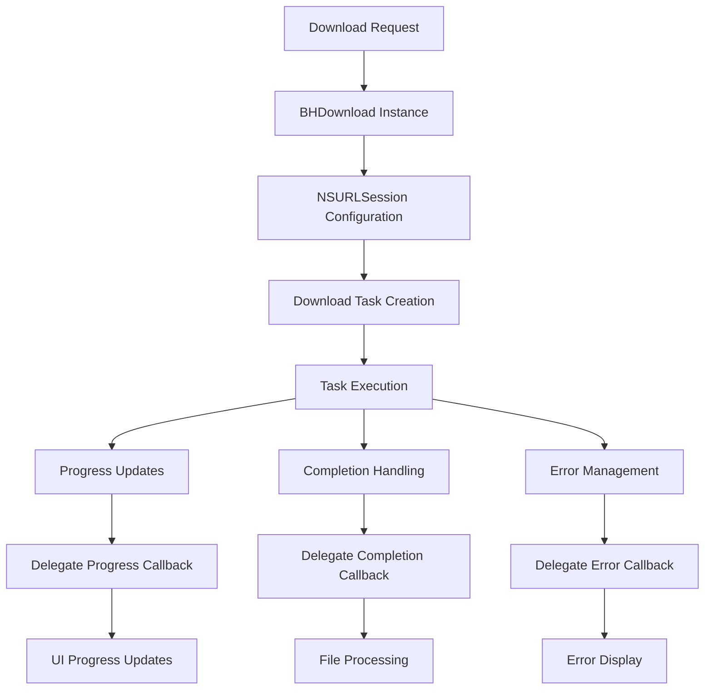
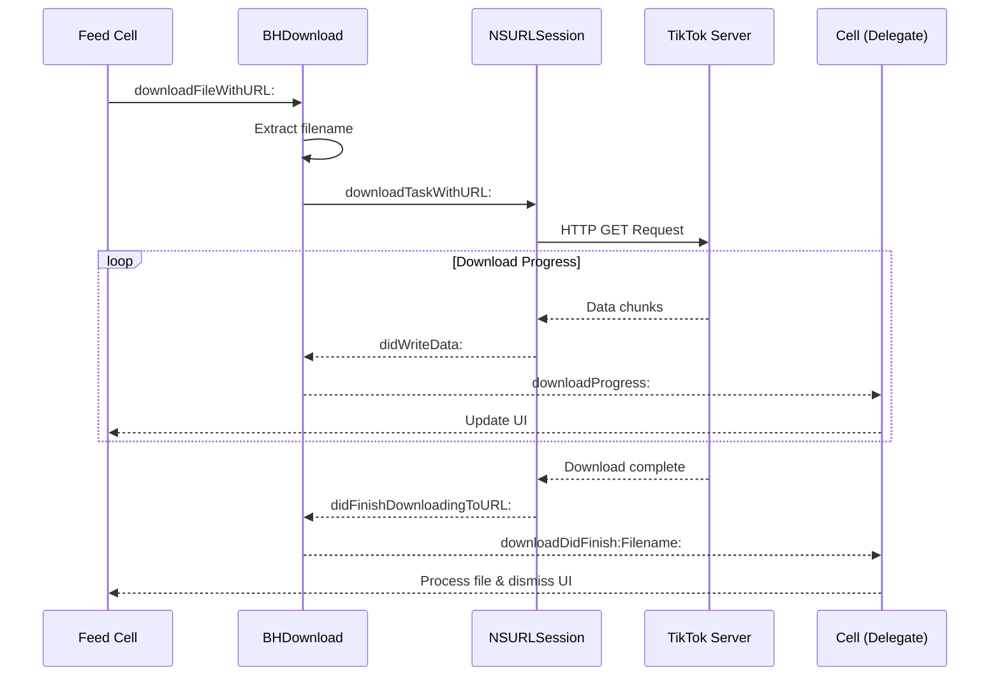

# Single File Download System (BHDownload)

## Overview

[`BHDownload`](../../BHDownload.h) provides a robust, delegate-based system for downloading individual media files from TikTok, including videos, photos, and audio content. It implements progress tracking, error handling, and completion callbacks for seamless integration with the main tweak.

## Purpose and Functionality

The BHDownload system serves as:
- **Media Download Engine**: Handles video, photo, and audio downloads
- **Progress Tracking**: Real-time download progress monitoring
- **Error Management**: Comprehensive error handling and reporting
- **Session Management**: NSURLSession-based networking with proper delegate handling

## File Structure

| File | Purpose |
|------|---------|
| [`BHDownload.h`](../../BHDownload.h) | Interface declarations and protocol definitions |
| [`BHDownload.m`](../../BHDownload.m) | Implementation of download functionality |

## Architecture Overview



## Protocol Definition

### BHDownloadDelegate Protocol
**Location**: [Lines 14-19](../../BHDownload.h#L14)

```objective-c
@protocol BHDownloadDelegate <NSObject>
@optional
- (void)downloadProgress:(float)progress;
- (void)downloadDidFinish:(NSURL *)filePath Filename:(NSString *)fileName;
- (void)downloadDidFailureWithError:(NSError *)error;
@end
```

**Delegate Methods**:

| Method | Purpose | Parameters |
|--------|---------|------------|
| [`downloadProgress:`](../../BHDownload.h#L16) | Real-time progress updates | `progress` (0.0-1.0) |
| [`downloadDidFinish:Filename:`](../../BHDownload.h#L17) | Download completion | `filePath`, `fileName` |
| [`downloadDidFailureWithError:`](../../BHDownload.h#L18) | Error handling | `error` object |

**Optional Implementation**: All delegate methods are optional, allowing flexible integration.

## Class Interface

### Public Interface
**Location**: [Lines 21-29](../../BHDownload.h#L21)

```objective-c
@interface BHDownload : NSObject
{
   id delegate;
}
- (void)setDelegate:(id)newDelegate;
- (instancetype)init;
- (void)downloadFileWithURL:(NSURL *)url;
@property (nonatomic, strong) NSString *fileName;
@end
```

**Key Components**:
- **Delegate Management**: Reference to callback receiver
- **Initialization**: Proper session configuration
- **Download Trigger**: URL-based download initiation
- **Filename Tracking**: Extracted filename storage

### Private Interface
**Location**: [Lines 31-33](../../BHDownload.h#L31)

```objective-c
@interface BHDownload () <NSURLSessionDelegate, NSURLSessionDataDelegate, NSURLSessionDownloadDelegate, NSURLSessionStreamDelegate>
@property (nonatomic, strong) NSURLSession *Session;
@end
```

**Protocol Conformance**: Implements comprehensive NSURLSession delegate protocols for full networking control.

## Implementation Details

### Initialization and Setup
**Location**: [Lines 12-18](../../BHDownload.m#L12)

```objective-c
- (instancetype)init {
    self = [super init];
    if (self) {
        self.Session = [NSURLSession sessionWithConfiguration:[NSURLSessionConfiguration defaultSessionConfiguration] 
                                                     delegate:self 
                                                delegateQueue:[NSOperationQueue mainQueue]];
    }
    return self;
}
```

**Configuration Highlights**:
- **Default Configuration**: Uses system default networking settings
- **Main Queue Delegation**: Ensures delegate callbacks on main thread
- **Self Delegation**: Implements all required delegate methods

### Download Initiation
**Location**: [Lines 20-26](../../BHDownload.m#L20)

```objective-c
- (void)downloadFileWithURL:(NSURL *)url {
    if (url) {
        self.fileName = url.absoluteString.lastPathComponent;
        NSURLSessionDownloadTask *downloadTask = [self.Session downloadTaskWithURL:url];
        [downloadTask resume];
    }
}
```

**Process Flow**:
1. **URL Validation**: Ensures valid URL provided
2. **Filename Extraction**: Derives filename from URL path
3. **Task Creation**: Creates download task from session
4. **Execution**: Starts download immediately

### Delegate Management
**Location**: [Lines 27-31](../../BHDownload.m#L27)

```objective-c
- (void)setDelegate:(id)newDelegate {
    if (newDelegate) {
        delegate = newDelegate;
    }
}
```

**Safety Features**:
- **Null Check**: Prevents setting nil delegates
- **Weak Reference Pattern**: Avoids retain cycles (delegate stored as `id`)

## NSURLSession Delegate Implementation

### Progress Tracking
**Location**: [Lines 32-35](../../BHDownload.m#L32)

```objective-c
- (void)URLSession:(NSURLSession *)session 
      downloadTask:(NSURLSessionDownloadTask *)downloadTask 
      didWriteData:(int64_t)bytesWritten 
 totalBytesWritten:(int64_t)totalBytesWritten 
totalBytesExpectedToWrite:(int64_t)totalBytesExpectedToWrite {
    
    float prog = (float)totalBytesWritten / (float)totalBytesExpectedToWrite;
    [delegate downloadProgress:prog];
}
```

**Progress Calculation**:
- **Ratio Computation**: Current bytes / total bytes
- **Float Precision**: Ensures accurate percentage calculation
- **Immediate Callback**: Real-time progress updates to delegate

### Download Completion
**Location**: [Lines 36-38](../../BHDownload.m#L36)

```objective-c
- (void)URLSession:(NSURLSession *)session 
      downloadTask:(NSURLSessionDownloadTask *)downloadTask 
didFinishDownloadingToURL:(nonnull NSURL *)location {
    
    [delegate downloadDidFinish:location Filename:self.fileName];
}
```

**Completion Handling**:
- **Temporary Location**: System provides temporary file location
- **Filename Preservation**: Uses extracted filename for identification
- **Delegate Notification**: Immediate callback with file location

### Error Management
**Location**: [Lines 39-44](../../BHDownload.m#L39)

```objective-c
- (void)URLSession:(NSURLSession *)session didBecomeInvalidWithError:(NSError *)error {
    [delegate downloadDidFailureWithError:error];
}

- (void)URLSession:(NSURLSession *)session task:(NSURLSessionTask *)task didCompleteWithError:(NSError *)error {
    [delegate downloadDidFailureWithError:error];
}
```

**Error Handling Strategy**:
- **Session Invalidation**: Handles session-level errors
- **Task Completion Errors**: Manages individual download failures
- **Consistent Callback**: Both error types use same delegate method

## Integration with Main Tweak

### Feed Cell Integration
**Location**: [`Tweak.x` Lines 1103-1115](../core/tweak.md#L1103)

```objective-c
%new - (void)downloadHDVideo:(AWEAwemeBaseViewController *)rootVC {
    NSString *as = rootVC.model.itemID;
    NSURL *downloadableURL = [NSURL URLWithString:[NSString stringWithFormat:@"https://tikwm.com/video/media/hdplay/%@.mp4", as]];
    self.fileextension = [rootVC.model.video.playURL bestURLtoDownloadFormat];
    
    if (downloadableURL) {
        BHDownload *dwManager = [[BHDownload alloc] init];
        [dwManager downloadFileWithURL:downloadableURL];
        [dwManager setDelegate:self];
        
        self.hud = [JGProgressHUD progressHUDWithStyle:JGProgressHUDStyleDark];
        self.hud.textLabel.text = @"Downloading";
        [self.hud showInView:topMostController().view];
    }
}
```

**Integration Pattern**:
1. **URL Construction**: Build download URL from video ID
2. **Instance Creation**: Create BHDownload instance
3. **Delegate Assignment**: Set feed cell as delegate
4. **Progress UI**: Show JGProgressHUD for user feedback
5. **Download Initiation**: Start download process

### Delegate Implementation in Feed Cells
**Location**: [`Tweak.x` Lines 1432-1458](../core/tweak.md#L1432)

```objective-c
%new - (void)downloadProgress:(float)progress {
    self.progressView.progress = progress;
    self.hud.detailTextLabel.text = [BHIManager getDownloadingPersent:progress];
    self.hud.tapOutsideBlock = ^(JGProgressHUD * _Nonnull HUD) {
        self.hud.textLabel.text = @"Backgrounding ✌️";
        [self.hud dismissAfterDelay:0.4];
    };
}

%new - (void)downloadDidFinish:(NSURL *)filePath Filename:(NSString *)fileName {
    NSString *DocPath = NSSearchPathForDirectoriesInDomains(NSDocumentDirectory, NSUserDomainMask, true).firstObject;
    NSFileManager *manager = [NSFileManager defaultManager];
    NSURL *newFilePath = [[NSURL fileURLWithPath:DocPath] URLByAppendingPathComponent:[NSString stringWithFormat:@"%@.%@", NSUUID.UUID.UUIDString, self.fileextension]];
    [manager moveItemAtURL:filePath toURL:newFilePath error:nil];
    [self.hud dismiss];
    
    if ([BHIManager shareSheet]) {
        [BHIManager showSaveVC:@[newFilePath]];
    } else {
        [BHIManager saveMedia:newFilePath fileExtension:self.fileextension];
    }
}

%new - (void)downloadDidFailureWithError:(NSError *)error {
    if (error) {
        [self.hud dismiss];
    }
}
```

**Delegate Implementation Features**:
- **Progress Display**: Updates both progress view and HUD text
- **Background Support**: Allows dismissing HUD while maintaining download
- **File Management**: Moves downloaded file to permanent location
- **Save Options**: Supports both share sheet and direct photo library saving
- **Error Handling**: Dismisses progress UI on failure

## Download Flow Diagram



## Usage Examples

### Basic Download Implementation
```objective-c
// Create download instance
BHDownload *downloader = [[BHDownload alloc] init];

// Set delegate
[downloader setDelegate:self];

// Start download
NSURL *videoURL = [NSURL URLWithString:@"https://example.com/video.mp4"];
[downloader downloadFileWithURL:videoURL];
```

### Delegate Implementation
```objective-c
// Progress updates
- (void)downloadProgress:(float)progress {
    NSLog(@"Download progress: %.1f%%", progress * 100);
}

// Completion handling
- (void)downloadDidFinish:(NSURL *)filePath Filename:(NSString *)fileName {
    NSLog(@"Download completed: %@", fileName);
    // Process downloaded file
}

// Error handling
- (void)downloadDidFailureWithError:(NSError *)error {
    NSLog(@"Download failed: %@", error.localizedDescription);
}
```

## Error Handling Strategies

### Common Error Scenarios
1. **Network Connectivity**: Lost internet connection during download
2. **Server Errors**: HTTP 404, 500, or other server responses
3. **Disk Space**: Insufficient storage for download
4. **URL Validation**: Invalid or malformed URLs
5. **Session Invalidation**: System-level networking issues

### Error Recovery Patterns
```objective-c
- (void)downloadDidFailureWithError:(NSError *)error {
    if (error) {
        // Dismiss progress UI
        [self.hud dismiss];
        
        // Log error for debugging
        NSLog(@"Download error: %@", error.localizedDescription);
        
        // Show user-friendly error message
        [AWEUIAlertView showAlertWithTitle:@"Download Failed" 
                               description:@"Please check your internet connection and try again." 
                                     image:nil 
                         actionButtonTitle:@"OK" 
                         cancelButtonTitle:nil 
                               actionBlock:nil 
                               cancelBlock:nil];
    }
}
```

## Performance Characteristics

### Memory Management
- **Automatic Cleanup**: NSURLSession handles memory management
- **Delegate Lifecycle**: Proper delegate cleanup prevents leaks
- **File Streaming**: Large files streamed directly to disk

### Network Efficiency
- **System Integration**: Uses iOS networking stack optimizations
- **Background Support**: Downloads continue when app backgrounds
- **Connection Reuse**: NSURLSession handles connection pooling

### Concurrency
- **Main Queue Callbacks**: Thread-safe delegate execution
- **Asynchronous Operations**: Non-blocking download execution
- **Progress Updates**: Real-time progress without blocking UI

## Security Considerations

### Network Security
- **HTTPS Support**: Secure downloads over encrypted connections
- **Certificate Validation**: System-level certificate checking
- **Privacy Protection**: No credential storage or caching

### File Security
- **Temporary Files**: System manages temporary download locations
- **Sandbox Compliance**: All file operations within app sandbox
- **Permission Handling**: Proper Photos framework permission usage

## Limitations and Considerations

### Current Limitations
1. **Single Download Only**: No concurrent download support
2. **No Resume Support**: Downloads restart if interrupted
3. **Basic Error Handling**: Limited error recovery options
4. **No Authentication**: No support for authenticated downloads

### Memory Considerations
- **Large Files**: Streams directly to disk, minimal memory usage
- **Progress Tracking**: Minimal overhead for progress calculations
- **Delegate Retention**: Weak delegate pattern prevents cycles

## Future Enhancement Opportunities

### Potential Improvements
1. **Download Queue**: Support for multiple concurrent downloads
2. **Resume Capability**: Pause and resume download functionality
3. **Retry Logic**: Automatic retry on transient failures
4. **Authentication**: Support for authenticated download sources
5. **Progress Persistence**: Save progress across app restarts
6. **Bandwidth Management**: Throttling and bandwidth control

### Integration Enhancements
1. **Better Error UI**: Enhanced error messaging and recovery options
2. **Download History**: Track successful and failed downloads
3. **File Organization**: Automatic file categorization and naming
4. **Batch Operations**: Support for downloading multiple files

---

**Related Documentation**:
- [Multiple Download System](bh-multiple-download.md) - Batch download handling
- [Main Tweak Implementation](../core/tweak.md) - Integration with TikTok hooks
- [Manager System](../core/bhi-manager.md) - Settings and file management
- [JGProgressHUD Integration](../libraries/jgprogresshud.md) - Progress indication system