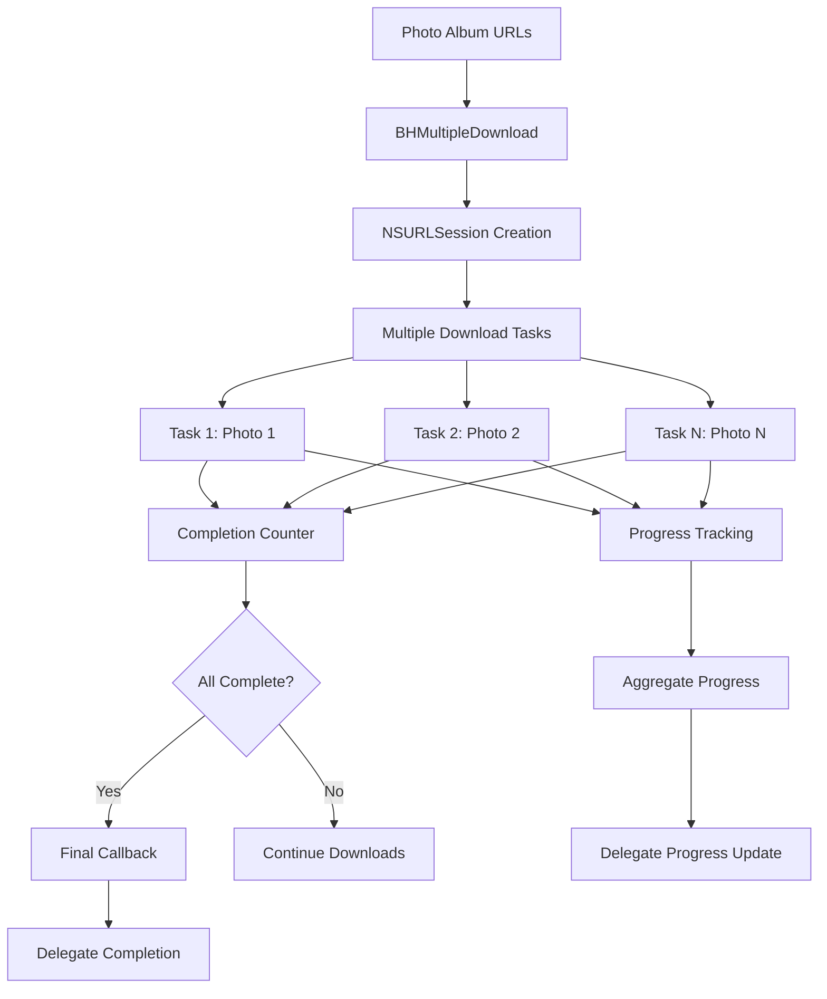
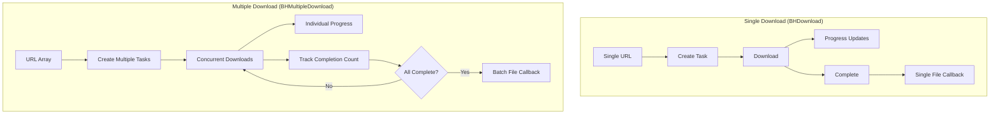

# Multiple File Download System (BHMultipleDownload)

## Overview

[`BHMultipleDownload`](../../BHMultipleDownload.h) extends the download capabilities to handle batch downloads of multiple files simultaneously, specifically designed for downloading complete photo albums from TikTok posts. It provides concurrent download management, aggregate progress tracking, and coordinated completion handling.

## Purpose and Functionality

The BHMultipleDownload system serves as:
- **Batch Download Manager**: Handles multiple simultaneous downloads
- **Photo Album Processor**: Specialized for TikTok photo collections
- **Progress Aggregation**: Combined progress tracking across all downloads
- **Completion Coordination**: Waits for all downloads to complete before final callback

## File Structure

| File | Purpose |
|------|---------|
| [`BHMultipleDownload.h`](../../BHMultipleDownload.h) | Interface and protocol declarations |
| [`BHMultipleDownload.m`](../../BHMultipleDownload.m) | Implementation of batch download logic |

## Architecture Overview



## Protocol Definition

### BHMultipleDownloadDelegate Protocol
**Location**: [Lines 3-7](../../BHMultipleDownload.h#L3)

```objective-c
@protocol BHMultipleDownloadDelegate <NSObject>
- (void)downloaderProgress:(float)progress;
- (void)downloaderDidFinishDownloadingAllFiles:(NSMutableArray<NSURL *> *)downloadedFilePaths;
- (void)downloaderDidFailureWithError:(NSError *)error;
@end
```

**Delegate Methods**:

| Method | Purpose | Parameters |
|--------|---------|------------|
| [`downloaderProgress:`](../../BHMultipleDownload.h#L4) | Aggregate progress updates | `progress` (0.0-1.0) |
| [`downloaderDidFinishDownloadingAllFiles:`](../../BHMultipleDownload.h#L5) | All downloads complete | Array of downloaded file URLs |
| [`downloaderDidFailureWithError:`](../../BHMultipleDownload.h#L6) | Error handling | `error` object |

**Key Differences from Single Download**:
- **Aggregate Progress**: Single progress value for all downloads
- **Batch Completion**: Single callback when all files complete
- **File Array**: Returns array of all downloaded file paths

## Class Interface

### Public Interface
**Location**: [Lines 9-14](../../BHMultipleDownload.h#L9)

```objective-c
@interface BHMultipleDownload : NSObject <NSURLSessionDownloadDelegate>
@property (nonatomic, strong) NSURLSession *session;
@property (nonatomic, weak) id<BHMultipleDownloadDelegate> delegate;
- (void)downloadFiles:(NSArray<NSURL *> *)fileURLs;
@end
```

**Key Components**:
- **Session Management**: Direct NSURLSession property access
- **Delegate Property**: Type-safe delegate reference
- **Batch Method**: Single method for multiple URL downloads
- **Protocol Conformance**: NSURLSessionDownloadDelegate implementation

### Private Implementation Variables
**Location**: [Lines 3-7](../../BHMultipleDownload.m#L3)

```objective-c
@implementation BHMultipleDownload {
    NSMutableArray<NSURL *> *_downloadedFilePaths;
    NSInteger _completedDownloads;
    NSInteger _totalDownloads;
}
```

**Internal State Tracking**:
- `_downloadedFilePaths` - Collection of successfully downloaded files
- `_completedDownloads` - Counter for finished downloads
- `_totalDownloads` - Total number of downloads in batch

## Implementation Details

### Initialization and Configuration
**Location**: [Lines 9-16](../../BHMultipleDownload.m#L9)

```objective-c
- (instancetype)init {
    self = [super init];
    if (self) {
        NSURLSessionConfiguration *configuration = [NSURLSessionConfiguration defaultSessionConfiguration];
        self.session = [NSURLSession sessionWithConfiguration:configuration 
                                                     delegate:self 
                                                delegateQueue:[NSOperationQueue mainQueue]];
    }
    return self;
}
```

**Configuration Features**:
- **Default Configuration**: Standard networking settings
- **Main Queue Delegation**: Thread-safe callback execution
- **Session Property**: Publicly accessible session for advanced usage

### Batch Download Initiation
**Location**: [Lines 18-31](../../BHMultipleDownload.m#L18)

```objective-c
- (void)downloadFiles:(NSArray<NSURL *> *)fileURLs {
    _downloadedFilePaths = [NSMutableArray array];
    _completedDownloads = 0;
    _totalDownloads = fileURLs.count;

    for (NSURL *fileURL in fileURLs) {
        NSURLSessionDownloadTask *downloadTask = [self.session downloadTaskWithURL:fileURL];
        [downloadTask resume];
    }

    if (fileURLs.count == 0) {
        [self URLSession:self.session didBecomeInvalidWithError:[NSError errorWithDomain:NSURLErrorDomain code:99 userInfo:nil]];
    }
}
```

**Batch Processing Logic**:
1. **State Initialization**: Reset counters and file array
2. **Task Creation**: Create download task for each URL
3. **Concurrent Execution**: Start all downloads simultaneously
4. **Edge Case Handling**: Handle empty URL arrays gracefully

### Progress Tracking Implementation
**Location**: [Lines 33-38](../../BHMultipleDownload.m#L33)

```objective-c
- (void)URLSession:(NSURLSession *)session 
      downloadTask:(NSURLSessionDownloadTask *)downloadTask 
      didWriteData:(int64_t)bytesWritten 
 totalBytesWritten:(int64_t)totalBytesWritten 
totalBytesExpectedToWrite:(int64_t)totalBytesExpectedToWrite {
    
    float prog = (float)totalBytesWritten / (float)totalBytesExpectedToWrite;
    if ([self.delegate respondsToSelector:@selector(downloaderProgress:)]) {
        [self.delegate downloaderProgress:prog];
    }
}
```

**Progress Calculation**:
- **Individual Progress**: Reports progress of individual downloads
- **Delegate Safety**: Checks if delegate implements progress method
- **Real-time Updates**: Immediate progress reporting

**Note**: Current implementation reports individual file progress rather than aggregate progress across all downloads.

### Download Completion Management
**Location**: [Lines 39-58](../../BHMultipleDownload.m#L39)

```objective-c
- (void)URLSession:(NSURLSession *)session 
      downloadTask:(NSURLSessionDownloadTask *)downloadTask
didFinishDownloadingToURL:(NSURL *)location {
    
    // Generate unique filename and move to Documents directory
    NSString *documentsPath = NSSearchPathForDirectoriesInDomains(NSDocumentDirectory, NSUserDomainMask, YES)[0];
    NSString *destinationPath = [documentsPath stringByAppendingPathComponent:
        [NSString stringWithFormat:@"%@-%@", NSUUID.UUID.UUIDString, downloadTask.response.suggestedFilename]];
    
    NSError *error;
    [[NSFileManager defaultManager] moveItemAtURL:location 
                                            toURL:[NSURL fileURLWithPath:destinationPath] 
                                            error:&error];
    
    if (error == nil) {
        [_downloadedFilePaths addObject:[NSURL fileURLWithPath:destinationPath]];
    }
    
    _completedDownloads++;
    
    // Check if all downloads are complete
    if (_completedDownloads == _totalDownloads) {
        if ([self.delegate respondsToSelector:@selector(downloaderDidFinishDownloadingAllFiles:)]) {
            [self.delegate downloaderDidFinishDownloadingAllFiles:_downloadedFilePaths];
        }
    }
}
```

**Completion Process**:
1. **File Management**: Move downloaded file to permanent location
2. **Unique Naming**: Generate UUID-based filename to prevent conflicts
3. **Success Tracking**: Add successfully moved files to results array
4. **Completion Detection**: Check if all downloads finished
5. **Final Callback**: Notify delegate when batch complete

### Error Handling
**Location**: [Lines 60-64](../../BHMultipleDownload.m#L60)

```objective-c
- (void)URLSession:(NSURLSession *)session didBecomeInvalidWithError:(NSError *)error {
    if ([self.delegate respondsToSelector:@selector(downloaderDidFailureWithError:)]) {
        [self.delegate downloaderDidFailureWithError:error];
    }
}
```

**Error Management**:
- **Session-Level Errors**: Handles session invalidation
- **Delegate Safety**: Checks delegate method availability
- **Early Termination**: Stops entire batch on session errors

## Integration with Main Tweak

### Photo Album Download Integration
**Location**: [`Tweak.x` Lines 1147-1169](../core/tweak.md#L1147)

```objective-c
%new - (void)downloadPhotos:(TTKPhotoAlbumDetailCellController *)rootVC {
    NSString *video_description = rootVC.model.music_songName;
    AWEPlayPhotoAlbumViewController *photoAlbumController = [rootVC valueForKey:@"_photoAlbumController"];

    NSArray <AWEPhotoAlbumPhoto *> *photos = rootVC.model.photoAlbum.photos;
    NSMutableArray<NSURL *> *fileURLs = [NSMutableArray array];

    for (AWEPhotoAlbumPhoto *currentPhoto in photos) {
        NSURL *downloadableURL = [currentPhoto.originPhotoURL bestURLtoDownload];
        self.fileextension = [currentPhoto.originPhotoURL bestURLtoDownloadFormat];
        if (downloadableURL) {
            [fileURLs addObject:downloadableURL];
        }
    }

    BHMultipleDownload *dwManager = [[BHMultipleDownload alloc] init];
    [dwManager setDelegate:self];
    [dwManager downloadFiles:fileURLs];
    
    self.hud = [JGProgressHUD progressHUDWithStyle:JGProgressHUDStyleDark];
    self.hud.textLabel.text = @"Downloading";
    [self.hud showInView:topMostController().view];
}
```

**Integration Features**:
1. **Album Processing**: Extract all photo URLs from album model
2. **URL Collection**: Build array of downloadable URLs
3. **Batch Initiation**: Start all downloads simultaneously
4. **Progress UI**: Show unified progress indicator

### Delegate Implementation in Feed Cells
**Location**: [`Tweak.x` Lines 1412-1430](../core/tweak.md#L1412)

```objective-c
%new - (void)downloaderProgress:(float)progress {
    self.hud.detailTextLabel.text = [BHIManager getDownloadingPersent:progress];
}

%new - (void)downloaderDidFinishDownloadingAllFiles:(NSMutableArray<NSURL *> *)downloadedFilePaths {
    [self.hud dismiss];
    if ([BHIManager shareSheet]) {
        [BHIManager showSaveVC:downloadedFilePaths];
    }
    else {
        for (NSURL *url in downloadedFilePaths) {
            [BHIManager saveMedia:url fileExtension:self.fileextension];
        }
    }
}

%new - (void)downloaderDidFailureWithError:(NSError *)error {
    if (error) {
        [self.hud dismiss];
    }
}
```

**Delegate Features**:
- **Progress Display**: Updates HUD with formatted percentage
- **Batch Completion**: Processes all downloaded files at once
- **Save Options**: Supports both share sheet and photo library saving
- **Batch Processing**: Iterates through all downloaded files for saving

## Download Flow Comparison

### Single vs. Multiple Download Flow



## Usage Examples

### Basic Multiple Download
```objective-c
// Create multiple download instance
BHMultipleDownload *multiDownloader = [[BHMultipleDownload alloc] init];

// Set delegate
multiDownloader.delegate = self;

// Prepare URL array
NSArray *photoURLs = @[
    [NSURL URLWithString:@"https://example.com/photo1.jpg"],
    [NSURL URLWithString:@"https://example.com/photo2.jpg"],
    [NSURL URLWithString:@"https://example.com/photo3.jpg"]
];

// Start batch download
[multiDownloader downloadFiles:photoURLs];
```

### Delegate Implementation Example
```objective-c
// Progress updates (individual file progress)
- (void)downloaderProgress:(float)progress {
    NSLog(@"Current file progress: %.1f%%", progress * 100);
    // Update UI with individual file progress
}

// All downloads complete
- (void)downloaderDidFinishDownloadingAllFiles:(NSMutableArray<NSURL *> *)downloadedFilePaths {
    NSLog(@"Downloaded %lu files", downloadedFilePaths.count);
    
    // Process all downloaded files
    for (NSURL *filePath in downloadedFilePaths) {
        // Save to photo library or process file
        [self processDownloadedFile:filePath];
    }
}

// Error handling
- (void)downloaderDidFailureWithError:(NSError *)error {
    NSLog(@"Batch download failed: %@", error.localizedDescription);
}
```

## Advanced Features

### File Management Strategy
```objective-c
// Unique filename generation
NSString *destinationPath = [documentsPath stringByAppendingPathComponent:
    [NSString stringWithFormat:@"%@-%@", NSUUID.UUID.UUIDString, downloadTask.response.suggestedFilename]];
```

**Benefits**:
- **Collision Prevention**: UUID prefixes prevent filename conflicts
- **Original Names**: Preserves server-suggested filenames
- **Batch Organization**: All files from same batch easily identifiable

### Concurrent Download Management
The system leverages NSURLSession's built-in concurrency:

**Concurrency Features**:
- **Parallel Downloads**: Multiple downloads execute simultaneously
- **System Optimization**: iOS manages optimal connection counts
- **Resource Sharing**: Efficient bandwidth utilization
- **Background Support**: Downloads continue when app backgrounds

## Performance Characteristics

### Memory Management
- **Streaming Downloads**: Files stream directly to disk
- **Collection Management**: Minimal memory for URL tracking
- **Completion Tracking**: Simple counter-based completion detection

### Network Efficiency
- **Connection Reuse**: NSURLSession optimizes connections
- **Parallel Processing**: Maximizes download throughput
- **System Integration**: Benefits from iOS networking optimizations

### Scalability Considerations
- **Album Size Limits**: Performance degrades with very large albums
- **Memory Usage**: Scales linearly with number of downloads
- **Bandwidth Saturation**: May saturate available bandwidth

## Error Handling and Edge Cases

### Partial Failure Scenarios
Current implementation has limitations with partial failures:

```objective-c
// Potential improvement for partial failure handling
- (void)handlePartialFailures {
    // Track individual download failures
    // Provide partial success callbacks
    // Implement retry mechanisms for failed downloads
}
```

### Empty Album Handling
```objective-c
if (fileURLs.count == 0) {
    [self URLSession:self.session didBecomeInvalidWithError:[NSError errorWithDomain:NSURLErrorDomain code:99 userInfo:nil]];
}
```

**Edge Case Management**:
- **Empty Arrays**: Graceful handling of empty URL arrays
- **Invalid URLs**: System-level URL validation
- **Network Failures**: Session-level error propagation

## Limitations and Future Enhancements

### Current Limitations
1. **Individual Progress Only**: No aggregate progress calculation
2. **All-or-Nothing**: No partial success handling
3. **No Retry Logic**: Failed downloads not automatically retried
4. **Basic Error Reporting**: Limited error detail and recovery options

### Potential Improvements

#### Aggregate Progress Tracking
```objective-c
// Enhanced progress calculation
- (void)updateAggregateProgress {
    float totalProgress = 0.0;
    for (NSURLSessionDownloadTask *task in activeTasks) {
        totalProgress += [self progressForTask:task];
    }
    float aggregateProgress = totalProgress / _totalDownloads;
    [self.delegate downloaderProgress:aggregateProgress];
}
```

#### Partial Success Support
```objective-c
// Partial completion callback
@protocol BHMultipleDownloadDelegate <NSObject>
- (void)downloaderDidFinishDownloadingFiles:(NSArray<NSURL *> *)successfulDownloads 
                               failedCount:(NSInteger)failedCount;
@end
```

#### Enhanced Error Handling
```objective-c
// Individual download error tracking
@property (nonatomic, strong) NSMutableArray<NSError *> *downloadErrors;
@property (nonatomic, strong) NSMutableArray<NSURL *> *failedURLs;
```

### Integration Enhancements
1. **Progress Aggregation**: True batch progress calculation
2. **Selective Retry**: Retry failed downloads only
3. **Priority Queuing**: Download prioritization system
4. **Bandwidth Management**: Throttling and connection limits
5. **Resume Support**: Pause and resume batch downloads

---

**Related Documentation**:
- [Single Download System](bh-download.md) - Individual file download handling
- [Main Tweak Implementation](../core/tweak.md) - Photo album integration
- [Manager System](../core/bhi-manager.md) - File management and settings
- [JGProgressHUD Integration](../libraries/jgprogresshud.md) - Progress indication system