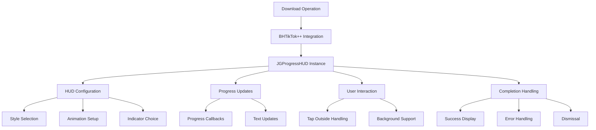

# JGProgressHUD Integration

## Overview

[`JGProgressHUD`](../../JGProgressHUD/) is a third-party iOS library integrated into BHTikTok++ to provide elegant progress indicators during download operations. The library offers customizable heads-up displays (HUDs) with various indicator styles, animations, and user interaction capabilities.

## Purpose and Functionality

JGProgressHUD serves as:
- **Download Progress Display**: Visual feedback during file downloads
- **User Interaction Blocking**: Prevents user actions during critical operations
- **Status Communication**: Clear indication of operation state (loading, success, error)
- **Background Operation Support**: Allows users to dismiss HUD while maintaining downloads

## Library Structure

The JGProgressHUD library consists of multiple specialized components:

| Component | Purpose |
|-----------|---------|
| [`JGProgressHUD.h`](../../JGProgressHUD/JGProgressHUD.h) | Main HUD interface and core functionality |
| [`JGProgressHUD-Defines.h`](../../JGProgressHUD/JGProgressHUD-Defines.h) | Enumerations and constants |
| Animation Classes | Various animation styles for show/hide transitions |
| Indicator Classes | Different progress indicator types |
| Shadow System | Drop shadow rendering for visual depth |

## Architecture Overview



## Core Components

### Main HUD Class
**Location**: [`JGProgressHUD.h`](../../JGProgressHUD/JGProgressHUD.h)

```objective-c
@interface JGProgressHUD : UIView
@property (nonatomic, assign) JGProgressHUDStyle style;
@property (nonatomic, strong, readonly, nonnull) UILabel *textLabel;
@property (nonatomic, strong, readonly, nonnull) UILabel *detailTextLabel;
@property (nonatomic, strong, nullable) JGProgressHUDIndicatorView *indicatorView;
@property (nonatomic, assign) float progress;

- (instancetype)initWithStyle:(JGProgressHUDStyle)style;
+ (instancetype)progressHUDWithStyle:(JGProgressHUDStyle)style;
- (void)showInView:(UIView *)view;
- (void)dismiss;
- (void)setProgress:(float)progress animated:(BOOL)animated;
@end
```

**Key Properties**:
- `style` - Visual appearance (light, dark, extra light)
- `textLabel` - Primary text display
- `detailTextLabel` - Secondary text (used for progress percentage)
- `indicatorView` - Progress indicator component
- `progress` - Current progress value (0.0-1.0)

### Style Definitions
**Location**: [`JGProgressHUD-Defines.h` Lines 38-45](../../JGProgressHUD/JGProgressHUD-Defines.h#L38)

```objective-c
typedef NS_ENUM(NSUInteger, JGProgressHUDStyle) {
    JGProgressHUDStyleExtraLight = 0,
    JGProgressHUDStyleLight,
    JGProgressHUDStyleDark,
};
```

**Available Styles**:
| Style | Appearance | Use Case |
|-------|------------|----------|
| `JGProgressHUDStyleExtraLight` | Very light background, dark text | Light mode interfaces |
| `JGProgressHUDStyleLight` | Light background, dark text | Standard light mode |
| `JGProgressHUDStyleDark` | Dark background, light text | Dark mode, video overlays |

### Position Options
**Location**: [`JGProgressHUD-Defines.h` Lines 14-33](../../JGProgressHUD/JGProgressHUD-Defines.h#L14)

```objective-c
typedef NS_ENUM(NSUInteger, JGProgressHUDPosition) {
    JGProgressHUDPositionCenter = 0,
    JGProgressHUDPositionTopLeft,
    JGProgressHUDPositionTopCenter,
    JGProgressHUDPositionTopRight,
    JGProgressHUDPositionCenterLeft,
    JGProgressHUDPositionCenterRight,
    JGProgressHUDPositionBottomLeft,
    JGProgressHUDPositionBottomCenter,
    JGProgressHUDPositionBottomRight
};
```

**Positioning System**: Supports nine distinct positions for flexible HUD placement.

## Integration with BHTikTok++

### Download Progress Integration
**Location**: [`Tweak.x` Lines 1111-1127](../core/tweak.md#L1111)

```objective-c
if (downloadableURL) {
    BHDownload *dwManager = [[BHDownload alloc] init];
    [dwManager downloadFileWithURL:downloadableURL];
    [dwManager setDelegate:self];
    
    self.hud = [JGProgressHUD progressHUDWithStyle:JGProgressHUDStyleDark];
    self.hud.textLabel.text = @"Downloading";
    [self.hud showInView:topMostController().view];
}
```

**Integration Features**:
- **Dark Style**: Uses dark style for video overlay compatibility
- **Top-Level Presentation**: Shows in topmost view controller
- **Primary Text**: "Downloading" label for clear user communication

### Progress Updates
**Location**: [`Tweak.x` Lines 1432-1439](../core/tweak.md#L1432)

```objective-c
%new - (void)downloadProgress:(float)progress {
    self.progressView.progress = progress;
    self.hud.detailTextLabel.text = [BHIManager getDownloadingPersent:progress];
    self.hud.tapOutsideBlock = ^(JGProgressHUD * _Nonnull HUD) {
        self.hud.textLabel.text = @"Backgrounding ✌️";
        [self.hud dismissAfterDelay:0.4];
    };
}
```

**Progress Features**:
- **Real-time Updates**: Progress percentage in detail text
- **Formatted Display**: Uses `[BHIManager getDownloadingPersent:]` for formatting
- **Background Support**: Tap outside to background while maintaining download

### Completion Handling
**Location**: [`Tweak.x` Lines 1440-1453](../core/tweak.md#L1440)

```objective-c
%new - (void)downloadDidFinish:(NSURL *)filePath Filename:(NSString *)fileName {
    // File processing logic
    [self.hud dismiss];
    
    if ([BHIManager shareSheet]) {
        [BHIManager showSaveVC:@[newFilePath]];
    } else {
        [BHIManager saveMedia:newFilePath fileExtension:self.fileextension];
    }
}
```

**Completion Actions**:
- **Immediate Dismissal**: HUD dismissed upon completion
- **Post-Processing**: File operations after HUD dismissal
- **User Options**: Share sheet or direct photo library saving

## Advanced HUD Features

### User Interaction Support
**Location**: [`JGProgressHUD.h` Lines 192-204](../../JGProgressHUD/JGProgressHUD.h#L192)

```objective-c
@property (nonatomic, copy, nullable) void (^tapOnHUDViewBlock)(JGProgressHUD *HUD);
@property (nonatomic, copy, nullable) void (^tapOutsideBlock)(JGProgressHUD *HUD);
```

**Interaction Capabilities**:
- **HUD Tap Handling**: Custom actions when HUD itself is tapped
- **Outside Tap Handling**: Actions when area outside HUD is tapped
- **Background Operation**: Allow downloads to continue in background

### Background Download Support
```objective-c
self.hud.tapOutsideBlock = ^(JGProgressHUD * _Nonnull HUD) {
    self.hud.textLabel.text = @"Backgrounding ✌️";
    [self.hud dismissAfterDelay:0.4];
};
```

**Background Features**:
- **User Feedback**: Clear indication that download continues
- **Delayed Dismissal**: Smooth transition with 0.4 second delay
- **Non-Blocking**: User can continue using TikTok while downloading

### Error Handling
**Location**: [`Tweak.x` Lines 1454-1458](../core/tweak.md#L1454)

```objective-c
%new - (void)downloadDidFailureWithError:(NSError *)error {
    if (error) {
        [self.hud dismiss];
    }
}
```

**Error Management**:
- **Immediate Dismissal**: HUD removed on error
- **Silent Failure**: No error message displayed (potential enhancement area)

## Multiple Download Integration

### Batch Download Progress
**Location**: [`Tweak.x` Lines 1412-1430](../core/tweak.md#L1412)

```objective-c
%new - (void)downloaderProgress:(float)progress {
    self.hud.detailTextLabel.text = [BHIManager getDownloadingPersent:progress];
}

%new - (void)downloaderDidFinishDownloadingAllFiles:(NSMutableArray<NSURL *> *)downloadedFilePaths {
    [self.hud dismiss];
    if ([BHIManager shareSheet]) {
        [BHIManager showSaveVC:downloadedFilePaths];
    } else {
        for (NSURL *url in downloadedFilePaths) {
            [BHIManager saveMedia:url fileExtension:self.fileextension];
        }
    }
}
```

**Batch Features**:
- **Aggregate Progress**: Single HUD for multiple downloads
- **Batch Completion**: Dismissal after all files complete
- **Bulk Processing**: Handles arrays of downloaded files

## HUD Lifecycle Management

### Creation and Configuration
```objective-c
// Standard creation pattern
self.hud = [JGProgressHUD progressHUDWithStyle:JGProgressHUDStyleDark];
self.hud.textLabel.text = @"Downloading";
```

**Configuration Options**:
- **Style Selection**: Choose appropriate visual style
- **Text Setup**: Primary and secondary text configuration
- **Positioning**: Default center positioning

### Presentation
```objective-c
[self.hud showInView:topMostController().view];
```

**Presentation Strategy**:
- **Top-Level Display**: Ensures HUD appears above all content
- **Modal Behavior**: Blocks user interaction with underlying content
- **Automatic Sizing**: HUD sizes to fit content automatically

### Progress Updates
```objective-c
self.hud.detailTextLabel.text = [BHIManager getDownloadingPersent:progress];
```

**Update Pattern**:
- **Detail Text**: Progress percentage in secondary label
- **Real-time**: Updates as download progresses
- **Formatted Display**: Percentage formatting via BHIManager

### Dismissal
```objective-c
[self.hud dismiss];
// or
[self.hud dismissAfterDelay:0.4];
```

**Dismissal Options**:
- **Immediate**: Instant removal
- **Delayed**: Smooth dismissal with timing
- **Animated**: Built-in fade animation

## Performance Considerations

### Memory Management
- **Automatic Cleanup**: HUD automatically deallocates after dismissal
- **Weak References**: Uses weak delegate patterns to prevent retain cycles
- **Efficient Rendering**: Optimized drawing for smooth animations

### Visual Performance
- **Core Animation**: Leverages Core Animation for smooth transitions
- **Blur Effects**: Efficient background blur implementation
- **Minimal Overdraw**: Optimized rendering to minimize GPU usage

### Thread Safety
- **Main Thread UI**: All UI updates on main thread
- **Background Downloads**: Progress updates safely marshaled to main thread
- **Concurrent Safety**: Thread-safe progress update handling

## Customization Examples

### Basic HUD Setup
```objective-c
// Create and configure HUD
JGProgressHUD *hud = [JGProgressHUD progressHUDWithStyle:JGProgressHUDStyleDark];
hud.textLabel.text = @"Processing...";
hud.detailTextLabel.text = @"Please wait";
[hud showInView:self.view];
```

### Progress Tracking
```objective-c
// Update progress
[hud setProgress:0.5 animated:YES];
hud.detailTextLabel.text = @"50%";
```

### Background Support
```objective-c
// Allow backgrounding
hud.tapOutsideBlock = ^(JGProgressHUD *HUD) {
    HUD.textLabel.text = @"Running in background";
    [HUD dismissAfterDelay:1.0];
};
```

## Integration Benefits

### User Experience
- **Professional Appearance**: Polished, iOS-native look and feel
- **Clear Communication**: Obvious progress indication
- **Non-Blocking Operation**: Background download capability
- **Responsive Feedback**: Real-time progress updates

### Developer Benefits
- **Simple API**: Easy integration with minimal code
- **Flexible Configuration**: Multiple styles and positions
- **Reliable Operation**: Well-tested library with consistent behavior
- **Feature Rich**: Built-in animations, interactions, and styling

### Technical Advantages
- **Performance Optimized**: Efficient rendering and animation
- **Memory Safe**: Proper memory management and cleanup
- **Thread Safe**: Safe for concurrent operations
- **iOS Compliant**: Follows iOS design guidelines and best practices

## Future Enhancement Opportunities

### Visual Improvements
1. **Custom Indicators**: Application-specific progress indicators
2. **Theme Integration**: Better integration with app themes
3. **Animation Variety**: Additional animation styles for different contexts
4. **Size Customization**: Variable HUD sizes for different use cases

### Functional Enhancements
1. **Queue Display**: Show download queue status
2. **Speed Indicators**: Display download speed in real-time
3. **Error Recovery**: Better error handling and user feedback
4. **Batch Progress**: True aggregate progress for multiple downloads

### User Experience
1. **Gesture Support**: Swipe gestures for HUD control
2. **Notification Integration**: System notification fallback
3. **Accessibility**: Enhanced VoiceOver support
4. **Haptic Feedback**: Tactile feedback for progress milestones

---

**Related Documentation**:
- [Single Download System](../download/bh-download.md) - Primary HUD integration
- [Multiple Download System](../download/bh-multiple-download.md) - Batch download HUD usage
- [Main Tweak Implementation](../core/tweak.md) - HUD integration in feed cells
- [Manager System](../core/bhi-manager.md) - Progress formatting utilities