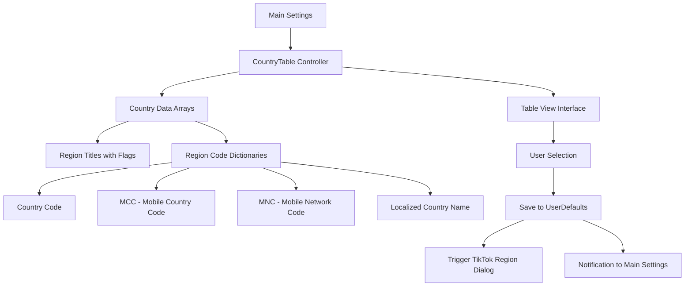
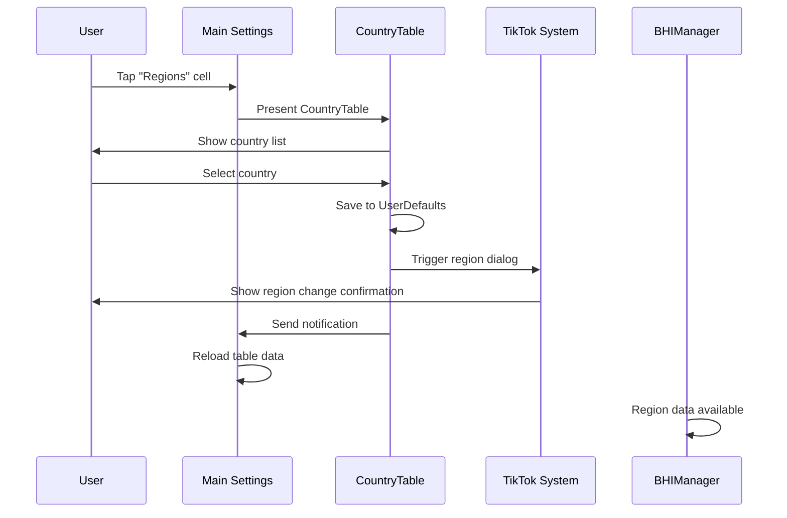

# Country/Region Selection (CountryTable)

## Overview

[`Settings/CountryTable`](../../Settings/CountryTable.h) provides a comprehensive interface for selecting regions/countries for TikTok region spoofing functionality. It includes an extensive list of supported countries with their corresponding mobile country codes (MCC) and mobile network codes (MNC) for accurate region simulation.

## Purpose and Functionality

The CountryTable serves as:
- **Region Selection Interface**: User-friendly country picker with flags
- **Carrier Code Management**: Provides MCC/MNC codes for carrier simulation
- **Regional Data Repository**: Comprehensive country database with network information
- **System Integration**: Triggers TikTok's region change dialog automatically

## File Structure

| File | Purpose |
|------|---------|
| [`Settings/CountryTable.h`](../../Settings/CountryTable.h) | Interface declaration |
| [`Settings/CountryTable.m`](../../Settings/CountryTable.m) | Implementation with country data and UI |

## Architecture Overview



## Implementation Details

### Interface and Protocol Conformance
**Location**: [Lines 3-8](../../Settings/CountryTable.m#L3)

```objective-c
@interface CountryTable () <UITableViewDelegate, UITableViewDataSource>
@property (nonatomic, strong) NSArray *regionTitles;
@property (nonatomic, strong) NSArray *regionCodes;
@property (nonatomic, strong) UITableView *tableView;
@end
```

**Key Properties**:
- `regionTitles` - Array of country names with emoji flags
- `regionCodes` - Array of dictionaries containing carrier and region data
- `tableView` - Standard table view for country selection

### AWEStoreRegionChangeManager Integration
**Location**: [Lines 10-13](../../Settings/CountryTable.m#L10)

```objective-c
@interface AWEStoreRegionChangeManager: NSObject 
- (void)p_showStoreRegionChangedDialog;
+ (id)sharedInstance;
@end
```

**Purpose**: Forward declaration of TikTok's internal region change manager for triggering native region change dialogs.

## Country Data Implementation

### Region Titles with Flags
**Location**: [Lines 18-19](../../Settings/CountryTable.m#L18)

```objective-c
self.regionTitles = @[@"Saudi Arabia 🇸🇦", @"Taiwan 🇹🇼", @"Hong Kong 🇭🇰", @"Macao 🇲🇴", @"Japan 🇯🇵", @"South Korea 🇰🇷", @"United Kingdom 🇬🇧", @"United States 🇺🇸", @"Australia 🇦🇺", @"Canada 🇨🇦", @"Argentina 🇦🇷", @"Philippines 🇵🇭", @"Laos 🇱🇦", @"Malaysia 🇲🇾", @"Thailand 🇹🇭", @"Singapore 🇸🇬", @"Indonesia 🇮🇩", @"Vietnam 🇻🇳", @"Anguilla 🇦🇮", @"Panama 🇵🇦", @"Germany 🇩🇪", @"Russia 🇷🇺", @"France 🇫🇷", @"Finland 🇫🇮", @"Italy 🇮🇹", @"Pakistan 🇵🇰", @"Denmark 🇩🇰", @"Norway 🇳🇴", @"Sudan 🇸🇩", @"Romania 🇷🇴", @"United Arab Emirates 🇦🇪", @"Egypt 🇪🇬", @"Lebanon 🇱🇧", @"Mexico 🇲🇽", @"Brazil 🇧🇷", @"Turkey 🇹🇷", @"Kuwait 🇰🇼", @"Algeria 🇩🇿"];
```

**Visual Features**:
- **Emoji Flags**: Each country includes its flag emoji for visual identification
- **Comprehensive Coverage**: 38 countries spanning multiple continents
- **Popular Regions**: Includes major TikTok markets and regions

### Detailed Region Code Data
**Location**: [Lines 21-60](../../Settings/CountryTable.m#L21)

```objective-c
self.regionCodes = @[
    @{@"area": @"Saudi Arabia 🇸🇦", @"name": @"Saudi Arabia", @"code": @"SA", @"mcc": @"420", @"mnc": @"01"},
    @{@"area": @"Taiwan 🇹🇼", @"name": @"Taiwan", @"code": @"TW", @"mcc": @"466", @"mnc": @"01"},
    @{@"area": @"Hong Kong 🇭🇰", @"name": @"Hong Kong", @"code": @"HK", @"mcc": @"454", @"mnc": @"00"},
    // ... additional countries
];
```

**Data Structure**:
Each country dictionary contains:
| Key | Purpose | Example |
|-----|---------|---------|
| `area` | Display name with flag | `"United States 🇺🇸"` |
| `name` | Official country name | `"United States"` |
| `code` | ISO 3166-1 alpha-2 code | `"US"` |
| `mcc` | Mobile Country Code | `"310"` |
| `mnc` | Mobile Network Code | `"00"` |

### Supported Countries and Carrier Information

#### Major Markets
| Country | Code | MCC | MNC | Strategic Importance |
|---------|------|-----|-----|---------------------|
| **United States** | US | 310 | 00 | Primary TikTok market |
| **United Kingdom** | GB | 234 | 30 | Major European market |
| **Japan** | JP | 440 | 00 | Key Asian market |
| **Germany** | DE | 262 | 01 | EU market leader |
| **Australia** | AU | 505 | 02 | Oceania representative |
| **Canada** | CA | 302 | 720 | North American alternative |

#### Asian Markets
| Country | Code | MCC | MNC | Regional Focus |
|---------|------|-----|-----|----------------|
| **Taiwan** | TW | 466 | 01 | Traditional Chinese content |
| **Hong Kong** | HK | 454 | 00 | International gateway |
| **South Korea** | KR | 450 | 05 | K-pop and entertainment hub |
| **Singapore** | SG | 525 | 01 | Southeast Asian hub |
| **Thailand** | TH | 520 | 18 | Regional content center |
| **Malaysia** | MY | 502 | 13 | Multicultural market |
| **Indonesia** | ID | 510 | 01 | Largest Southeast Asian market |
| **Vietnam** | VN | 452 | 01 | Growing market |
| **Philippines** | PH | 515 | 02 | Island nation market |

#### Middle Eastern Markets
| Country | Code | MCC | MNC | Regional Significance |
|---------|------|-----|-----|---------------------|
| **Saudi Arabia** | SA | 420 | 01 | Gulf region leader |
| **United Arab Emirates** | AE | 424 | 02 | Business and tourism hub |
| **Kuwait** | KW | 419 | 02 | Gulf state |
| **Lebanon** | LB | 415 | 01 | Levant region |

#### European Markets
| Country | Code | MCC | MNC | Market Position |
|---------|------|-----|-----|-----------------|
| **France** | FR | 208 | 10 | Major EU market |
| **Italy** | IT | 222 | 10 | Southern European hub |
| **Finland** | FI | 244 | 91 | Nordic representative |
| **Denmark** | DK | 238 | 01 | Scandinavian market |
| **Norway** | NO | 242 | 01 | Nordic region |
| **Romania** | RO | 226 | 01 | Eastern European market |
| **Russia** | RU | 250 | 01 | Large Eurasian market |
| **Turkey** | TR | 286 | 01 | Eurasia bridge |

#### Americas and Others
| Country | Code | MCC | MNC | Regional Role |
|---------|------|-----|-----|--------------|
| **Mexico** | MX | 334 | 030 | Latin American gateway |
| **Brazil** | BR | 724 | 06 | Largest South American market |
| **Argentina** | AR | 722 | 07 | Southern Cone representative |
| **Panama** | PA | 714 | 04 | Central American hub |

## UI Implementation

### View Controller Setup
**Location**: [Lines 16-68](../../Settings/CountryTable.m#L16)

```objective-c
- (void)viewDidLoad {
    [super viewDidLoad];
    self.title = @"Regions";
    
    // Initialize data arrays (shown above)
    
    self.tableView = [[UITableView alloc] initWithFrame:self.view.bounds style:UITableViewStylePlain];
    self.tableView.delegate = self;
    self.tableView.dataSource = self;
    [self.view addSubview:self.tableView];
}
```

**Setup Features**:
- **Simple Layout**: Full-screen table view
- **Standard Styling**: Plain table view style for clarity
- **Delegate Pattern**: Implements both delegate and data source

### Table View Data Source Implementation
**Location**: [Lines 72-87](../../Settings/CountryTable.m#L72)

```objective-c
- (NSInteger)tableView:(UITableView *)tableView numberOfRowsInSection:(NSInteger)section {
    return self.regionTitles.count;
}

- (UITableViewCell *)tableView:(UITableView *)tableView cellForRowAtIndexPath:(NSIndexPath *)indexPath {
    static NSString *cellIdentifier = @"Cell";
    UITableViewCell *cell = [tableView dequeueReusableCellWithIdentifier:cellIdentifier];
    
    if (cell == nil) {
        cell = [[UITableViewCell alloc] initWithStyle:UITableViewCellStyleSubtitle reuseIdentifier:cellIdentifier];
    }
    
    cell.textLabel.text = self.regionTitles[indexPath.row];
    
    return cell;
}
```

**Data Source Features**:
- **Cell Reuse**: Efficient cell reuse for large lists
- **Simple Display**: Shows country name with flag emoji
- **Subtitle Style**: Prepared for additional information display

## Selection and Integration

### Selection Handler
**Location**: [Lines 91-103](../../Settings/CountryTable.m#L91)

```objective-c
- (void)tableView:(UITableView *)tableView didSelectRowAtIndexPath:(NSIndexPath *)indexPath {
    [tableView deselectRowAtIndexPath:indexPath animated:YES];
    
    NSDictionary *selectedRegion = self.regionCodes[indexPath.row];
    
    NSUserDefaults *defaults = [NSUserDefaults standardUserDefaults];
    [defaults setObject:selectedRegion forKey:@"region"];
    [defaults synchronize];
    
    NSLog(@"Selected region: %@", selectedRegion);
    [[NSClassFromString(@"AWEStoreRegionChangeManager") sharedInstance] p_showStoreRegionChangedDialog];
}
```

**Selection Process**:
1. **Visual Feedback**: Deselects row with animation
2. **Data Retrieval**: Gets corresponding region dictionary
3. **Persistence**: Saves selection to NSUserDefaults
4. **System Integration**: Triggers TikTok's native region change dialog
5. **Logging**: Outputs selection for debugging

### TikTok Integration
```objective-c
[[NSClassFromString(@"AWEStoreRegionChangeManager") sharedInstance] p_showStoreRegionChangedDialog];
```

**Integration Benefits**:
- **Native Dialog**: Uses TikTok's own region change confirmation
- **User Familiarity**: Maintains consistent user experience
- **Proper Integration**: Follows TikTok's expected region change flow

## Main Tweak Integration

### Region Application in Hooks
**Location**: [`Tweak.x` Lines 319-363](../core/tweak.md#L319)

The selected region data is consumed by multiple hooks in the main tweak:

```objective-c
%hook CTCarrier
- (NSString *)mobileCountryCode {
    if ([BHIManager regionChangingEnabled]) {
        if ([BHIManager selectedRegion]) {
            NSDictionary *selectedRegion = [BHIManager selectedRegion];
            return selectedRegion[@"mcc"];
        }
        return %orig;
    }
    return %orig;
}

- (NSString *)isoCountryCode {
    if ([BHIManager regionChangingEnabled]) {
        if ([BHIManager selectedRegion]) {
            NSDictionary *selectedRegion = [BHIManager selectedRegion];
            return selectedRegion[@"code"];
        }
        return %orig;
    }
    return %orig;
}
```

**Hook Integration**:
- **Carrier Information**: MCC/MNC codes used for carrier simulation
- **Country Codes**: ISO codes used for region identification
- **Multiple Hooks**: Same data used across various TikTok classes

### Manager Integration
**Location**: [`BHIManager.m` Lines 98-100](../core/bhi-manager.md#L98)

```objective-c
+ (NSDictionary *)selectedRegion {
    return [[NSUserDefaults standardUserDefaults] dictionaryForKey:@"region"];
}
```

**Manager Access**: Provides centralized access to selected region data.

## Update Notification System

### Notification Broadcasting
The selection triggers notification updates back to the main settings:

```objective-c
// In main settings controller
[[NSNotificationCenter defaultCenter] addObserver:self
                                         selector:@selector(regionSelected:)
                                             name:@"RegionSelectedNotification"
                                           object:nil];
```

**Cross-Controller Communication**:
- **Automatic Updates**: Main settings refreshes when region changes
- **UI Consistency**: Displayed values stay current across controllers
- **Decoupled Architecture**: Controllers communicate without direct references

## Usage Flow

### Complete Selection Process



## Performance and User Experience

### Data Efficiency
- **Static Data**: Country list loaded once during initialization
- **Memory Efficient**: Arrays stored in controller memory only
- **Fast Access**: Direct array indexing for selection

### User Experience Features
- **Visual Clarity**: Flag emojis provide immediate country recognition
- **Alphabetical Ordering**: Countries presented in logical order
- **Standard Interaction**: Follows iOS table view conventions
- **Immediate Feedback**: Selection processed instantly

### Accessibility Support
- **VoiceOver Ready**: Standard UITableViewCell supports VoiceOver
- **Clear Labels**: Country names provide clear identification
- **Standard Navigation**: Works with iOS accessibility features

## Error Handling and Edge Cases

### Robust Selection Handling
```objective-c
NSDictionary *selectedRegion = self.regionCodes[indexPath.row];
if (selectedRegion) {
    // Process selection
}
```

**Safety Measures**:
- **Bounds Checking**: Array access protected by table view constraints
- **Data Validation**: Dictionary existence verified before use
- **Graceful Degradation**: Invalid selections handled silently

### System Integration Safety
```objective-c
[[NSClassFromString(@"AWEStoreRegionChangeManager") sharedInstance] p_showStoreRegionChangedDialog];
```

**Integration Safety**:
- **Dynamic Class Resolution**: Uses NSClassFromString for runtime safety
- **Optional Dialog**: Dialog failure doesn't affect selection saving
- **Fallback Behavior**: Selection still saved if dialog fails

## Future Enhancement Opportunities

### Data Management Improvements
1. **External Data Source**: Load country data from configuration files
2. **Localization Support**: Translate country names to user's language
3. **Custom Regions**: Allow users to add custom region configurations
4. **Search Functionality**: Add search bar for large country lists

### UI Enhancements
1. **Section Headers**: Group countries by continent or region
2. **Favorites System**: Quick access to frequently used regions
3. **Current Selection Indicator**: Highlight currently selected region
4. **Additional Information**: Show MCC/MNC codes in subtitle

### Integration Enhancements
1. **Region Validation**: Verify region compatibility with TikTok
2. **Automatic Testing**: Test region changes for effectiveness
3. **Rollback Support**: Quick return to previous region
4. **Region Profiles**: Save and switch between region configurations

---

**Related Documentation**:
- [Main Settings](main-settings.md) - Parent settings interface
- [Manager System](../core/bhi-manager.md) - Region data access
- [Main Tweak Implementation](../core/tweak.md) - Region spoofing hooks
- [Live Actions](live-actions.md) - Similar selection interface pattern