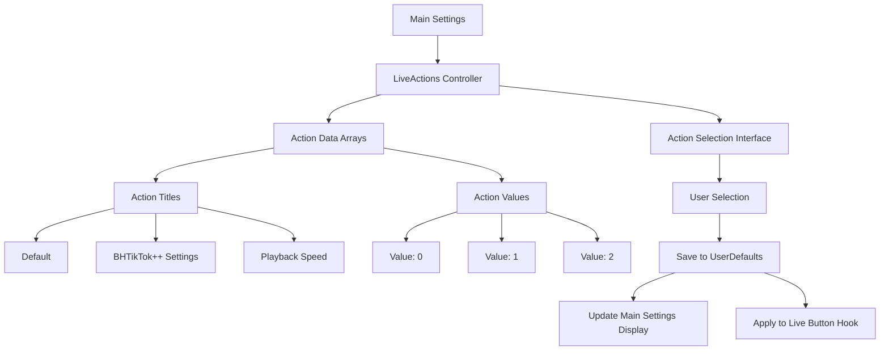
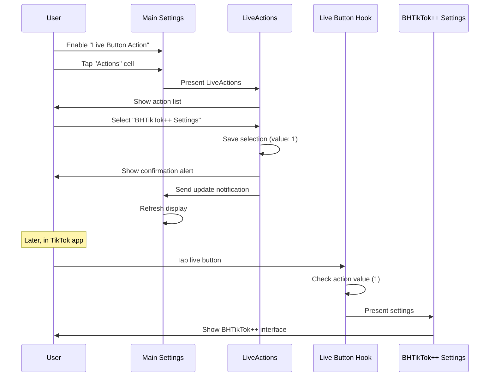

# Live Button Actions (LiveActions)

## Overview

[`Settings/LiveActions`](../../Settings/LiveActions.h) provides a configuration interface for customizing the behavior of TikTok's live button. This allows users to repurpose the live streaming button to trigger different actions, including opening BHTikTok++ settings or playback speed controls.

## Purpose and Functionality

The LiveActions controller serves as:
- **Live Button Customization**: Repurposes TikTok's live button for custom actions
- **Action Selection Interface**: Simple picker for available button actions
- **User Experience Enhancement**: Provides quick access to frequently used features
- **Settings Integration**: Seamless integration with main settings system

## File Structure

| File | Purpose |
|------|---------|
| [`Settings/LiveActions.h`](../../Settings/LiveActions.h) | Interface declaration |
| [`Settings/LiveActions.m`](../../Settings/LiveActions.m) | Implementation of action selection logic |

## Architecture Overview



## Implementation Details

### Interface and Properties
**Location**: [Lines 3-9](../../Settings/LiveActions.m#L3)

```objective-c
@interface LiveActions () <UITableViewDelegate, UITableViewDataSource>
@property (nonatomic, strong) NSArray *liveFuncValues;
@property (nonatomic, strong) UITableView *tableView;
@property (nonatomic, strong) NSArray *liveFuncTitles;
@end
```

**Key Properties**:
- `liveFuncTitles` - Human-readable action descriptions
- `liveFuncValues` - Corresponding numeric values for storage
- `tableView` - Standard selection interface

### Action Configuration
**Location**: [Lines 13-17](../../Settings/LiveActions.m#L13)

```objective-c
- (void)viewDidLoad {
    [super viewDidLoad];
    self.title = @"Live Button Actions";
    self.liveFuncTitles = @[@"Default", @"BHTikTok++ Settings", @"Playback Speed"];
    self.liveFuncValues = @[@0, @1, @2];
    // ... UI setup
}
```

**Available Actions**:
| Index | Title | Value | Functionality |
|-------|-------|-------|---------------|
| 0 | Default | 0 | Original TikTok live streaming behavior |
| 1 | BHTikTok++ Settings | 1 | Opens main tweak settings interface |
| 2 | Playback Speed | 2 | Opens playback speed selection |

## User Interface Implementation

### Table View Setup
**Location**: [Lines 17-22](../../Settings/LiveActions.m#L17)

```objective-c
self.tableView = [[UITableView alloc] initWithFrame:self.view.bounds style:UITableViewStylePlain];
self.tableView.delegate = self;
self.tableView.dataSource = self;
[self.view addSubview:self.tableView];
```

**UI Features**:
- **Full Screen**: Table view fills entire view bounds
- **Plain Style**: Simple list presentation
- **Standard Delegate Pattern**: Implements UITableView protocols

### Data Source Implementation
**Location**: [Lines 27-44](../../Settings/LiveActions.m#L27)

```objective-c
- (NSInteger)tableView:(UITableView *)tableView numberOfRowsInSection:(NSInteger)section {
    return self.liveFuncValues.count;
}

- (UITableViewCell *)tableView:(UITableView *)tableView cellForRowAtIndexPath:(NSIndexPath *)indexPath {
    static NSString *cellIdentifier = @"Cell";
    UITableViewCell *cell = [tableView dequeueReusableCellWithIdentifier:cellIdentifier];
    
    if (cell == nil) {
        cell = [[UITableViewCell alloc] initWithStyle:UITableViewCellStyleSubtitle reuseIdentifier:cellIdentifier];
    }
    
    cell.textLabel.text = self.liveFuncTitles[indexPath.row];
    
    return cell;
}
```

**Data Source Features**:
- **Dynamic Row Count**: Based on available actions array
- **Cell Reuse**: Efficient memory management
- **Simple Display**: Action titles only

## Selection and Storage Logic

### Selection Handler
**Location**: [Lines 49-68](../../Settings/LiveActions.m#L49)

```objective-c
- (void)tableView:(UITableView *)tableView didSelectRowAtIndexPath:(NSIndexPath *)indexPath {
    [tableView deselectRowAtIndexPath:indexPath animated:YES];
    
    NSNumber *selectedLiveOption = self.liveFuncTitles[indexPath.row];
    
    NSUserDefaults *defaults = [NSUserDefaults standardUserDefaults];
    [defaults setValue:self.liveFuncValues[indexPath.row] forKey:@"live_action"];
    [defaults synchronize];
    
    UIAlertController *alert = [UIAlertController alertControllerWithTitle:@"Live Option Selected" 
                                                                   message:[NSString stringWithFormat:@"You selected: %@", self.liveFuncTitles[indexPath.row]]
                                                            preferredStyle:UIAlertControllerStyleAlert];
    UIAlertAction *okAction = [UIAlertAction actionWithTitle:@"OK" style:UIAlertActionStyleDefault handler:nil];
    [alert addAction:okAction];
    [self presentViewController:alert animated:YES completion:nil];
    
    [[NSNotificationCenter defaultCenter] postNotificationName:@"RegionSelectedNotification"
                                                        object:nil
                                                      userInfo:@{@"selected action": selectedLiveOption}];
}
```

**Selection Process**:
1. **Visual Feedback**: Animated row deselection
2. **Value Storage**: Saves numeric value to UserDefaults under `"live_action"` key
3. **User Confirmation**: Shows alert confirming selection
4. **Notification**: Updates main settings display
5. **Persistence**: Immediate synchronization to disk

### Confirmation Dialog
```objective-c
UIAlertController *alert = [UIAlertController alertControllerWithTitle:@"Live Option Selected" 
                                                               message:[NSString stringWithFormat:@"You selected: %@", self.liveFuncTitles[indexPath.row]]
                                                        preferredStyle:UIAlertControllerStyleAlert];
```

**User Experience Features**:
- **Clear Confirmation**: Shows selected action name
- **Standard iOS Dialog**: Familiar alert interface
- **Immediate Feedback**: Instant confirmation of selection

## Integration with Main Tweak

### Live Button Hook Implementation
**Location**: [`Tweak.x` Lines 1044-1057](../core/tweak.md#L1044)

```objective-c
%hook AWELiveFeedEntranceView
- (void)switchStateWithTapped:(BOOL)arg1 {
    if (![BHIManager liveActionEnabled] || [BHIManager selectedLiveAction] == 0) {
        %orig;
    } else if ([BHIManager liveActionEnabled] && [[BHIManager selectedLiveAction] intValue] == 1) {
        UINavigationController *BHTikTokSettings = [[UINavigationController alloc] initWithRootViewController:[[ViewController alloc] init]];
        [topMostController() presentViewController:BHTikTokSettings animated:true completion:nil];
    } 
    else {
        %orig;
    }
}
%end
```

**Hook Logic**:
1. **Enablement Check**: Verifies live action feature is enabled
2. **Action Value Check**: Reads selected action from UserDefaults
3. **Action Execution**:
   - **Value 0**: Default TikTok behavior (`%orig`)
   - **Value 1**: Opens BHTikTok++ settings
   - **Other Values**: Default behavior (extensible for future actions)

### Manager Integration
**Location**: [`BHIManager.m` Lines 86-88](../core/bhi-manager.md#L86)

```objective-c
+ (NSNumber *)selectedLiveAction {
    return [[NSUserDefaults standardUserDefaults] objectForKey:@"live_action"];
}

+ (BOOL)liveActionEnabled {
    return [[NSUserDefaults standardUserDefaults] boolForKey:@"en_livefunc"];
}
```

**Manager Support**:
- **Value Access**: Centralized access to selected action
- **Feature Toggle**: Enable/disable live action functionality
- **Type Safety**: Returns NSNumber for numeric comparisons

## Main Settings Integration

### Settings Display
**Location**: [`Settings/ViewController.m` Lines 341-352](../settings/main-settings.md)

```objective-c
case 1: {
    NSUserDefaults *defaults = [NSUserDefaults standardUserDefaults];
    UITableViewCell *liveAction = [[UITableViewCell alloc] initWithStyle:UITableViewCellStyleSubtitle reuseIdentifier:nil];
    liveAction.textLabel.text = @"Actions";
    NSString *selectedLiveAction = [defaults valueForKey:@"live_action"];
    NSArray *liveFuncTitles = @[@"Default", @"BHTikTok++ Settings", @"Playback Speed"];
    if (selectedLiveAction != nil) {
        liveAction.detailTextLabel.text = [NSString stringWithFormat:@"%@", [liveFuncTitles objectAtIndex:[selectedLiveAction integerValue]]];
    }
    return liveAction;
}
```

**Display Features**:
- **Current Selection**: Shows currently selected action in subtitle
- **Dynamic Updates**: Refreshes when selection changes
- **Null Safety**: Handles case where no selection has been made

### Navigation Integration
**Location**: [`Settings/ViewController.m` Lines 423-426](../settings/main-settings.md)

```objective-c
else if (indexPath.section == 5 && indexPath.row == 1){
    LiveActions *liveActions = [[LiveActions alloc] init];
    UINavigationController *navController = [[UINavigationController alloc] initWithRootViewController:liveActions];
    [self presentViewController:navController animated:YES completion:nil];
}
```

**Navigation Features**:
- **Modal Presentation**: Full-screen selection interface
- **Navigation Wrapper**: Proper navigation controller embedding
- **Animated Transition**: Smooth presentation animation

## Action Implementation Details

### Action Type 1: Settings Access
When action value 1 is selected, the live button opens BHTikTok++ settings:

```objective-c
UINavigationController *BHTikTokSettings = [[UINavigationController alloc] initWithRootViewController:[[ViewController alloc] init]];
[topMostController() presentViewController:BHTikTokSettings animated:true completion:nil];
```

**Implementation Features**:
- **Direct Access**: Bypasses TikTok's native settings
- **Full Interface**: Complete settings access from live button
- **Modal Presentation**: Non-intrusive overlay presentation

### Action Type 2: Playback Speed (Future)
Currently returns to default behavior, but structured for easy extension:

```objective-c
else {
    %orig;  // Placeholder for future playback speed action
}
```

**Extension Pattern**:
```objective-c
// Potential implementation for playback speed
else if ([BHIManager liveActionEnabled] && [[BHIManager selectedLiveAction] intValue] == 2) {
    PlaybackSpeed *speedController = [[PlaybackSpeed alloc] init];
    UINavigationController *navController = [[UINavigationController alloc] initWithRootViewController:speedController];
    [topMostController() presentViewController:navController animated:true completion:nil];
}
```

## User Experience Flow

### Complete Configuration Process



## Performance and Efficiency

### Memory Management
- **Static Data**: Action arrays loaded once during initialization
- **Minimal Overhead**: Simple arrays with minimal memory footprint
- **Efficient Storage**: Single integer value stored in UserDefaults

### User Interface Performance
- **Fast Loading**: Immediate table view presentation
- **Standard Components**: Uses iOS optimized table view implementation
- **Minimal Processing**: Direct array-to-cell mapping

## Error Handling and Edge Cases

### Selection Validation
```objective-c
if (selectedLiveAction != nil) {
    liveAction.detailTextLabel.text = [NSString stringWithFormat:@"%@", [liveFuncTitles objectAtIndex:[selectedLiveAction integerValue]]];
}
```

**Safety Measures**:
- **Null Checking**: Verifies selection exists before display
- **Array Bounds**: Relies on consistent array structure
- **Default Behavior**: Graceful fallback to original functionality

### Hook Safety
```objective-c
if (![BHIManager liveActionEnabled] || [BHIManager selectedLiveAction] == 0) {
    %orig;
}
```

**Hook Protection**:
- **Feature Toggle**: Respects enable/disable setting
- **Default Fallback**: Always provides working live button
- **Value Validation**: Handles invalid or missing values

## Future Enhancement Opportunities

### Additional Actions
1. **Playback Speed**: Direct access to speed controls
2. **Download Menu**: Quick access to download options
3. **Filter Controls**: Content filtering toggles
4. **Custom Scripts**: User-defined action scripts

### User Interface Improvements
1. **Action Descriptions**: Detailed explanations for each action
2. **Custom Actions**: User-defined action creation
3. **Action Previews**: Preview action behavior before selection
4. **Quick Toggle**: Rapid switching between actions

### Integration Enhancements
1. **Context Awareness**: Different actions based on current TikTok state
2. **Gesture Support**: Multiple gesture triggers for different actions
3. **Action Chaining**: Sequence multiple actions together
4. **Conditional Logic**: Actions based on content type or user state

---

**Related Documentation**:
- [Main Settings](main-settings.md) - Parent settings interface and integration
- [Playback Speed](playback-speed.md) - Similar selection interface pattern
- [Manager System](../core/bhi-manager.md) - Action value access and feature toggles
- [Main Tweak Implementation](../core/tweak.md) - Live button hook implementation