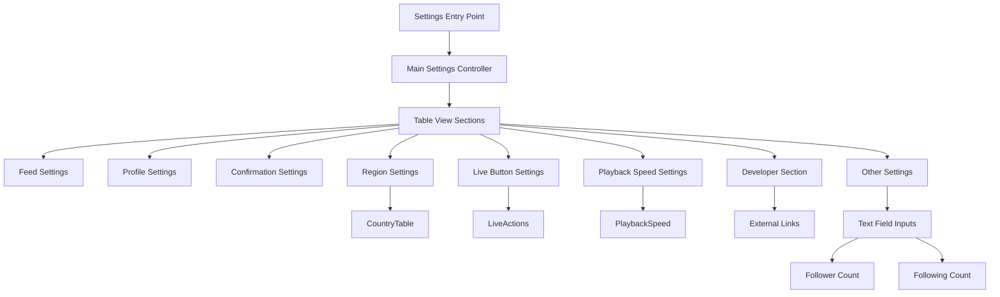

# Main Settings Controller (ViewController)

## Overview

[`Settings/ViewController`](../../Settings/ViewController.h) provides the primary user interface for configuring all BHTikTok++ features. It implements a comprehensive settings screen with organized sections, toggle switches, text inputs, and navigation to specialized setting screens.

## Purpose and Functionality

The main settings controller serves as:
- **Central Configuration Hub**: Single interface for all tweak settings
- **Feature Organization**: Logical grouping of related settings
- **Input Management**: Text field handling for custom values
- **Navigation Controller**: Links to specialized setting screens
- **Developer Information**: Credits and support links

## File Structure

| File | Purpose |
|------|---------|
| [`Settings/ViewController.h`](../../Settings/ViewController.h) | Interface declaration and protocol conformance |
| [`Settings/ViewController.m`](../../Settings/ViewController.m) | Implementation of settings UI and logic |

## Architecture Overview



## Interface Declaration

### Protocol Conformance
**Location**: [Lines 10-13](../../Settings/ViewController.h#L10)

```objective-c
@interface ViewController : UIViewController <UITableViewDelegate, UITableViewDataSource, UITextFieldDelegate>
@end
```

**Protocol Implementation**:
- `UITableViewDelegate` - Table view interaction handling
- `UITableViewDataSource` - Table view data management
- `UITextFieldDelegate` - Text input validation and processing

### Dependencies and Imports
**Location**: [Lines 8-11](../../Settings/ViewController.m#L8)

```objective-c
#import "ViewController.h"
#import "CountryTable.h"
#import "LiveActions.h"
#import "PlaybackSpeed.h"
```

**Related Controllers**:
- [`CountryTable`](country-table.md) - Region selection interface
- [`LiveActions`](live-actions.md) - Live button action configuration
- [`PlaybackSpeed`](playback-speed.md) - Video speed selection

## Implementation Details

### View Setup and Configuration
**Location**: [Lines 21-42](../../Settings/ViewController.m#L21)

```objective-c
- (void)viewDidLoad {
    [super viewDidLoad];
    self.view.backgroundColor = [UIColor systemBackgroundColor];
    
    self.title = @"BHTikTok++ Settings";
    self.staticTable = [[UITableView alloc] initWithFrame:CGRectZero];
    self.staticTable.translatesAutoresizingMaskIntoConstraints = NO;
    [self.view addSubview:self.staticTable];
    
    // Auto Layout constraints
    [NSLayoutConstraint activateConstraints:@[
        [self.staticTable.leadingAnchor constraintEqualToAnchor:self.view.leadingAnchor],
        [self.staticTable.trailingAnchor constraintEqualToAnchor:self.view.trailingAnchor],
        [self.staticTable.topAnchor constraintEqualToAnchor:self.view.safeAreaLayoutGuide.topAnchor],
        [self.staticTable.bottomAnchor constraintEqualToAnchor:self.view.safeAreaLayoutGuide.bottomAnchor]
    ]];
    
    self.staticTable.dataSource = self;
    self.staticTable.delegate = self;
    self.staticTable.tableFooterView = [[UIView alloc] initWithFrame:CGRectZero];
    
    // Notification observer for region updates
    [[NSNotificationCenter defaultCenter] addObserver:self
                                             selector:@selector(regionSelected:)
                                                 name:@"RegionSelectedNotification"
                                               object:nil];
}
```

**Setup Features**:
- **System Background**: Adapts to light/dark mode automatically
- **Auto Layout**: Proper constraint-based layout
- **Safe Area**: Respects device safe areas and notches
- **Notification System**: Listens for region selection updates

### Section Organization

#### Section Structure
**Location**: [Lines 48-98](../../Settings/ViewController.m#L48)

```objective-c
- (NSInteger)numberOfSectionsInTableView:(UITableView *)tableView {
    return 8;
}

- (NSString *)tableView:(UITableView *)tableView titleForHeaderInSection:(NSInteger)section {
    switch (section) {
        case 0: return @"Feed";
        case 1: return @"Profile";
        case 2: return @"Confirm";
        case 3: return @"Other";
        case 4: return @"Region";
        case 5: return @"Live Button Function";
        case 6: return @"Playback Speed";
        case 7: return @"Developer";
        default: return @"";
    }
}

- (NSInteger)tableView:(UITableView *)tableView numberOfRowsInSection:(NSInteger)section {
    switch (section) {
        case 0: return 15; // Feed section
        case 1: return 4;  // Profile section
        case 2: return 4;  // Confirm section
        case 3: return 10; // Other section
        case 4: return 2;  // Region section
        case 5: return 2;  // Live action section
        case 6: return 2;  // Playback speed section
        case 7: return 3;  // Developer section
        default: return 0;
    }
}
```

**Section Organization**:
| Section | Title | Row Count | Purpose |
|---------|-------|-----------|---------|
| 0 | Feed | 15 | Video feed and UI modifications |
| 1 | Profile | 4 | Profile enhancement features |
| 2 | Confirm | 4 | User action confirmations |
| 3 | Other | 10 | Miscellaneous features and fake settings |
| 4 | Region | 2 | Region spoofing configuration |
| 5 | Live Button Function | 2 | Live button action customization |
| 6 | Playback Speed | 2 | Video playback speed control |
| 7 | Developer | 3 | Developer information and support |

## Settings Implementation

### Switch Cell Creation Pattern
**Location**: [Lines 454-474](../../Settings/ViewController.m#L454)

```objective-c
- (UITableViewCell *)createSwitchCellWithTitle:(NSString *)title Detail:(NSString*)detail Key:(NSString*)key {
    UITableViewCell *cell = [[UITableViewCell alloc] initWithStyle:UITableViewCellStyleSubtitle reuseIdentifier:nil];
    
    UISwitch *switchView = [[UISwitch alloc] init];
    [cell.contentView addSubview:switchView];
    cell.accessoryView = switchView;
    
    NSUserDefaults *defaults = [NSUserDefaults standardUserDefaults];
    switchView.on = [defaults boolForKey:key];
    switchView.accessibilityLabel = key;
    [switchView addTarget:self action:@selector(switchToggled:) forControlEvents:UIControlEventValueChanged];
    
    cell.textLabel.text = title;
    cell.detailTextLabel.numberOfLines = 0;
    cell.detailTextLabel.text = detail;
    cell.detailTextLabel.textColor = [UIColor grayColor];
    
    return cell;
}
```

**Switch Cell Features**:
- **Automatic State Restoration**: Reads current value from NSUserDefaults
- **Accessibility Support**: Sets accessibility label for VoiceOver
- **Multi-line Descriptions**: Supports detailed explanations
- **Consistent Styling**: Standard subtitle cell style

### Switch Toggle Handler
**Location**: [Lines 477-484](../../Settings/ViewController.m#L477)

```objective-c
- (void)switchToggled:(UISwitch *)sender {
    NSString *key = sender.accessibilityLabel;
    NSUserDefaults *defaults = [NSUserDefaults standardUserDefaults];
    [defaults setBool:sender.isOn forKey:key];
    [defaults synchronize];
}
```

**State Management**:
- Uses accessibility label to store preference key
- Immediate synchronization to disk
- Thread-safe NSUserDefaults operations

## Feed Settings Section

### Video and UI Controls
**Location**: [Lines 101-165](../../Settings/ViewController.m#L101)

```objective-c
case 0:
    return [self createSwitchCellWithTitle:@"Hide Ads"
                                    Detail:@"Hide all ads from the app"
                                       Key:@"hide_ads"];
case 1:
    return [self createSwitchCellWithTitle:@"Download Button"
                                    Detail:@"Enable download button for videos"
                                       Key:@"download_button"];
// ... additional feed settings
```

**Feed Settings Available**:
| Setting | Key | Purpose |
|---------|-----|---------|
| Hide Ads | `hide_ads` | Remove advertisements from feed |
| Download Button | `download_button` | Show download button on videos |
| Share Sheet | `share_sheet` | Enable sharing options |
| Remove Watermark | `remove_watermark` | Remove TikTok watermarks |
| Show/Hide UI Button | `remove_elements_button` | Toggle UI elements |
| Stop Playback | `stop_play` | Disable video looping |
| Auto Play Next Video | `auto_play` | Automatically advance videos |
| Show Progress Bar | `show_porgress_bar` | Display video progress |
| Transparent Comments | `transparent_commnet` | Make comments translucent |
| Show Usernames | `show_username` | Display usernames vs display names |
| Disable Sensitive Content | `disable_unsensitive` | Bypass sensitivity warnings |
| Disable Warnings | `disable_warnings` | Hide TikTok warnings |
| Disable Live Streaming | `disable_live` | Filter out live content |
| Skip Recommendations | `skip_recommnedations` | Auto-skip recommendation cards |
| Upload Region | `upload_region` | Show country flags on videos |

## Profile Settings Section

### Profile Enhancement Features
**Location**: [Lines 166-186](../../Settings/ViewController.m#L166)

```objective-c
case 0:
    return [self createSwitchCellWithTitle:@"Profile Save"
                                    Detail:@"Save profile details to clipboard"
                                       Key:@"save_profile"];
case 1:
    return [self createSwitchCellWithTitle:@"Profile Copy"
                                    Detail:@"Copy profile information"
                                       Key:@"copy_profile_information"];
```

**Profile Settings**:
| Setting | Key | Purpose |
|---------|-----|---------|
| Profile Save | `save_profile` | Enable profile image saving |
| Profile Copy | `copy_profile_information` | Copy profile bio and info |
| Video Like Count | `video_like_count` | Show like counts on videos |
| Video Upload Date | `video_upload_date` | Display upload timestamps |

## Advanced Settings: Other Section

### Text Field Integration
**Location**: [Lines 218-290](../../Settings/ViewController.m#L218)

```objective-c
case 2: {
    UITableViewCell *cell = [[UITableViewCell alloc] initWithStyle:UITableViewCellStyleDefault reuseIdentifier:nil];
    
    UILabel *followerLabel = [[UILabel alloc] init];
    followerLabel.text = @"Follower:";
    followerLabel.font = [UIFont systemFontOfSize:16];
    followerLabel.translatesAutoresizingMaskIntoConstraints = NO;
    [cell.contentView addSubview:followerLabel];
    
    UITextField *textField = [[UITextField alloc] init];
    textField.placeholder = @"Enter follower count";
    textField.borderStyle = UITextBorderStyleRoundedRect;
    textField.delegate = self;
    textField.tag = 2;
    textField.returnKeyType = UIReturnKeyDone;
    textField.translatesAutoresizingMaskIntoConstraints = NO;
    [cell.contentView addSubview:textField];
    
    // Auto Layout constraints for label and text field
    [NSLayoutConstraint activateConstraints:@[
        [followerLabel.leadingAnchor constraintEqualToAnchor:cell.contentView.leadingAnchor constant:15],
        [followerLabel.centerYAnchor constraintEqualToAnchor:cell.contentView.centerYAnchor],
        [followerLabel.widthAnchor constraintEqualToConstant:100],
        
        [textField.leadingAnchor constraintEqualToAnchor:followerLabel.trailingAnchor constant:10],
        [textField.trailingAnchor constraintEqualToAnchor:cell.contentView.trailingAnchor constant:-15],
        [textField.centerYAnchor constraintEqualToAnchor:cell.contentView.centerYAnchor],
        [textField.heightAnchor constraintEqualToConstant:30]
    ]];
    
    // Restore saved value
    NSUserDefaults *defaults = [NSUserDefaults standardUserDefaults];
    NSString *savedText = [defaults stringForKey:@"follower_count"];
    if (savedText) {
        textField.text = savedText;
    }
    
    return cell;
}
```

**Text Field Features**:
- **Custom Layout**: Manual cell creation with Auto Layout
- **Tag-based Identification**: Uses tags to identify different text fields
- **State Restoration**: Automatically restores saved values
- **Input Validation**: Delegate-based input handling

### Text Field Delegate Implementation
**Location**: [Lines 485-501](../../Settings/ViewController.m#L485)

```objective-c
- (void)textFieldDidEndEditing:(UITextField *)textField {
    if (textField.tag == 1){
        NSUserDefaults *defaults = [NSUserDefaults standardUserDefaults];
        [defaults setObject:textField.text forKey:@"following_count"];
        [defaults synchronize];
    } else if (textField.tag == 2){
        NSUserDefaults *defaults = [NSUserDefaults standardUserDefaults];
        [defaults setObject:textField.text forKey:@"follower_count"];
        [defaults synchronize];
    }
}

- (BOOL)textFieldShouldReturn:(UITextField *)textField {
    [textField resignFirstResponder];
    return YES;
}
```

**Text Field Management**:
- **Tag-based Routing**: Different handling for different text fields
- **Immediate Saving**: Values saved when editing ends
- **Keyboard Dismissal**: Return key dismisses keyboard

## Specialized Settings Navigation

### Region Selection Integration
**Location**: [Lines 318-331](../../Settings/ViewController.m#L318)

```objective-c
case 1: {
    NSUserDefaults *defaults = [NSUserDefaults standardUserDefaults];
    UITableViewCell *regions = [[UITableViewCell alloc] initWithStyle:UITableViewCellStyleSubtitle reuseIdentifier:nil];
    regions.textLabel.text = @"Regions";
    NSDictionary *selectedRegion = [defaults dictionaryForKey:@"region"];
    regions.detailTextLabel.text = [NSString stringWithFormat:@"%@", selectedRegion[@"area"]];
    return regions;
}
```

**Dynamic Display**: Shows currently selected region in subtitle.

### Navigation Handler
**Location**: [Lines 415-452](../../Settings/ViewController.m#L415)

```objective-c
- (void)tableView:(UITableView *)tableView didSelectRowAtIndexPath:(NSIndexPath *)indexPath {
    if (indexPath.section == 4 && indexPath.row == 1){
        CountryTable *countryTable = [[CountryTable alloc] init];
        UINavigationController *navController = [[UINavigationController alloc] initWithRootViewController:countryTable];
        [self presentViewController:navController animated:YES completion:nil];
    }
    else if (indexPath.section == 5 && indexPath.row == 1){
        LiveActions *liveActions = [[LiveActions alloc] init];
        UINavigationController *navController = [[UINavigationController alloc] initWithRootViewController:liveActions];
        [self presentViewController:navController animated:YES completion:nil];
    }
    else if (indexPath.section == 6 && indexPath.row == 1) {
        PlaybackSpeed *playbackSpeed = [[PlaybackSpeed alloc] init];
        UINavigationController *navController = [[UINavigationController alloc] initWithRootViewController:playbackSpeed];
        [self presentViewController:navController animated:YES completion:nil];
    }
    // ... developer link handling
}
```

**Navigation Features**:
- **Modal Presentation**: Specialized controllers presented modally
- **Navigation Wrapping**: Each controller wrapped in navigation controller
- **External Links**: Developer section opens external URLs

## Developer Section Implementation

### Developer Information and Links
**Location**: [Lines 377-411](../../Settings/ViewController.m#L377)

```objective-c
case 0: {
    UITableViewCell *cell = [[UITableViewCell alloc] initWithStyle:UITableViewCellStyleSubtitle reuseIdentifier:nil];
    cell.textLabel.text = @"Raul Saeed";
    cell.textLabel.textColor = [UIColor systemBlueColor];
    cell.detailTextLabel.text = @"Github Page";
    cell.imageView.image = [UIImage systemImageNamed:@"link"];
    cell.detailTextLabel.textColor = [UIColor systemGrayColor];
    return cell;
}
case 1: {
    UITableViewCell *cell = [[UITableViewCell alloc] initWithStyle:UITableViewCellStyleSubtitle reuseIdentifier:nil];
    cell.textLabel.text = @"Raul Saeed";
    cell.textLabel.textColor = [UIColor systemBlueColor];
    cell.detailTextLabel.text = @"X Page";
    cell.imageView.image = [UIImage systemImageNamed:@"link"];
    cell.detailTextLabel.textColor = [UIColor systemGrayColor];
    return cell;
}
case 2: {
    UITableViewCell *cell = [[UITableViewCell alloc] initWithStyle:UITableViewCellStyleSubtitle reuseIdentifier:nil];
    cell.textLabel.text = @"Buy Me A Coffe";
    cell.textLabel.textColor = [UIColor systemBlueColor];
    cell.detailTextLabel.text = @"To keep me Motivated and the Tweak Updated.";
    cell.imageView.tintColor = [UIColor orangeColor];
    cell.detailTextLabel.textColor = [UIColor systemGrayColor];
    cell.imageView.image = [UIImage systemImageNamed:@"mug.fill"];
    return cell;
}
```

**Developer Links**:
| Link | URL | Purpose |
|------|-----|---------|
| Github Page | `https://github.com/raulsaeed` | Source code and development |
| X Page | `https://x.com/Ashad__Saeed` | Social media contact |
| Buy Me A Coffee | `https://buymeacoffee.com/raulsaeed79` | Support and donations |

### External Link Handling
**Location**: [Lines 432-451](../../Settings/ViewController.m#L432)

```objective-c
else if (indexPath.section == 7 && indexPath.row == 0){
    NSURL *url = [NSURL URLWithString:@"https://github.com/raulsaeed"];
    if ([[UIApplication sharedApplication] canOpenURL:url]) {
        [[UIApplication sharedApplication] openURL:url options:@{} completionHandler:nil];
    }
}
```

**URL Opening Features**:
- **Availability Check**: Verifies URL can be opened before attempting
- **System Integration**: Uses standard iOS URL opening mechanism
- **Graceful Fallback**: No action if URL cannot be opened

## Notification System

### Region Update Handling
**Location**: [Lines 43-45](../../Settings/ViewController.m#L43)

```objective-c
- (void)regionSelected:(NSNotification *)notification {
    [self.staticTable reloadData];
}
```

**Update Mechanism**:
- **Automatic Refresh**: Table reloads when region selection changes
- **Cross-Controller Communication**: Uses notification center for updates
- **UI Consistency**: Ensures displayed values stay current

## Integration with Main Tweak

### Settings Access Point
**Location**: [`Tweak.x` Lines 256-265](../core/tweak.md#L256)

```objective-c
%hook TTKSettingsBaseCellPlugin
- (void)didSelectItemAtIndex:(NSInteger)index {
    if ([self.itemModel.identifier isEqualToString:@"bhtiktok_settings"]) {
        UINavigationController *BHTikTokSettings = [[UINavigationController alloc] initWithRootViewController:[[ViewController alloc] init]];
        [topMostController() presentViewController:BHTikTokSettings animated:true completion:nil];
    } else {
        return %orig;
    }
}
%end
```

**Integration Features**:
- **Native Integration**: Appears in TikTok's native settings
- **Modal Presentation**: Full-screen settings interface
- **Navigation Support**: Proper navigation controller wrapper

### Settings Entry Creation
**Location**: [`Tweak.x` Lines 267-283](../core/tweak.md#L267)

```objective-c
%hook AWESettingsNormalSectionViewModel
- (void)viewDidLoad {
    %orig;
    if ([self.sectionIdentifier isEqualToString:@"account"]) {
        TTKSettingsBaseCellPlugin *BHTikTokSettingsPluginCell = [[%c(TTKSettingsBaseCellPlugin) alloc] initWithPluginContext:self.context];

        AWESettingItemModel *BHTikTokSettingsItemModel = [[%c(AWESettingItemModel) alloc] initWithIdentifier:@"bhtiktok_settings"];
        [BHTikTokSettingsItemModel setTitle:@"BHTikTok++ settings"];
        [BHTikTokSettingsItemModel setDetail:@"BHTikTok++ settings"];
        [BHTikTokSettingsItemModel setIconImage:[UIImage systemImageNamed:@"gear"]];
        [BHTikTokSettingsItemModel setType:99];

        [BHTikTokSettingsPluginCell setItemModel:BHTikTokSettingsItemModel];
        [self insertModel:BHTikTokSettingsPluginCell atIndex:0 animated:true];
    }
}
%end
```

**Entry Point Features**:
- **Account Section Integration**: Appears in TikTok's account settings
- **Custom Icon**: Gear icon for easy identification
- **Top Position**: Inserted at index 0 for prominence

## Performance and User Experience

### Efficient Cell Creation
```objective-c
// Reusable cell creation pattern
UITableViewCell *cell = [[UITableViewCell alloc] initWithStyle:UITableViewCellStyleSubtitle reuseIdentifier:nil];
```

**Performance Considerations**:
- **No Cell Reuse**: Static table with fixed content doesn't require reuse
- **Minimal Memory**: Small number of cells doesn't impact memory significantly
- **Immediate Response**: All settings changes applied immediately

### User Experience Features
- **Immediate Feedback**: Settings applied instantly without restart
- **Visual Hierarchy**: Clear section organization and descriptions
- **Accessibility**: Proper VoiceOver support through system components
- **Consistent Styling**: Follows iOS design guidelines

## Error Handling and Validation

### Input Validation
```objective-c
- (BOOL)textFieldShouldReturn:(UITextField *)textField {
    [textField resignFirstResponder];
    return YES;
}
```

**Validation Features**:
- **Keyboard Management**: Proper keyboard dismissal
- **Input Sanitization**: Stores text input directly (no validation currently)
- **State Preservation**: Automatic saving on editing completion

### Settings Persistence
```objective-c
[defaults setBool:sender.isOn forKey:key];
[defaults synchronize];
```

**Persistence Strategy**:
- **Immediate Synchronization**: Settings saved immediately to disk
- **Atomic Operations**: Each setting change is independent
- **System Integration**: Uses standard NSUserDefaults mechanism

---

**Related Documentation**:
- [Country Selection](country-table.md) - Region picker interface
- [Live Actions](live-actions.md) - Live button customization
- [Playback Speed](playback-speed.md) - Video speed control
- [Manager System](../core/bhi-manager.md) - Settings value access
- [Main Tweak Implementation](../core/tweak.md) - Settings integration