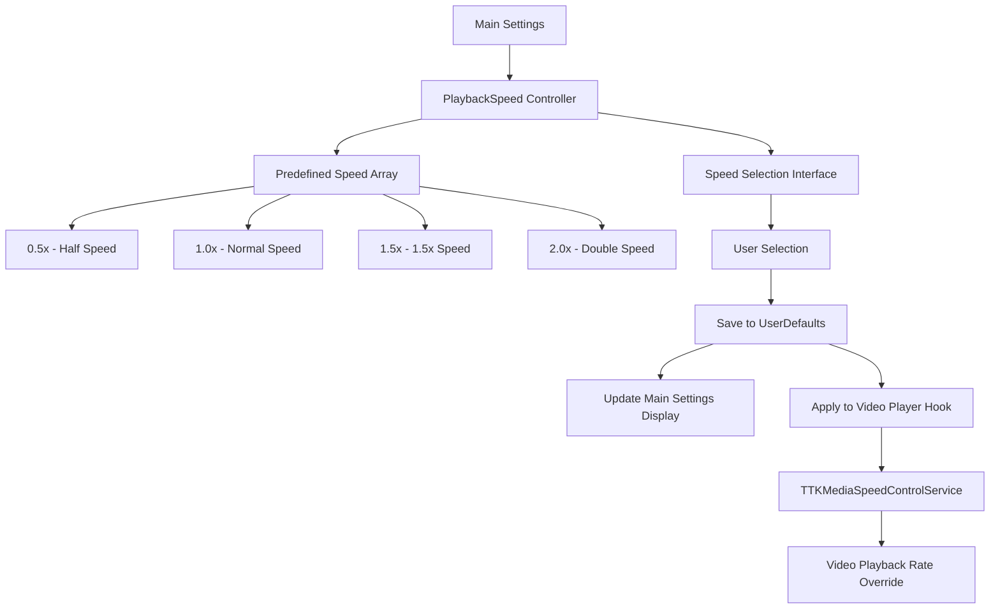
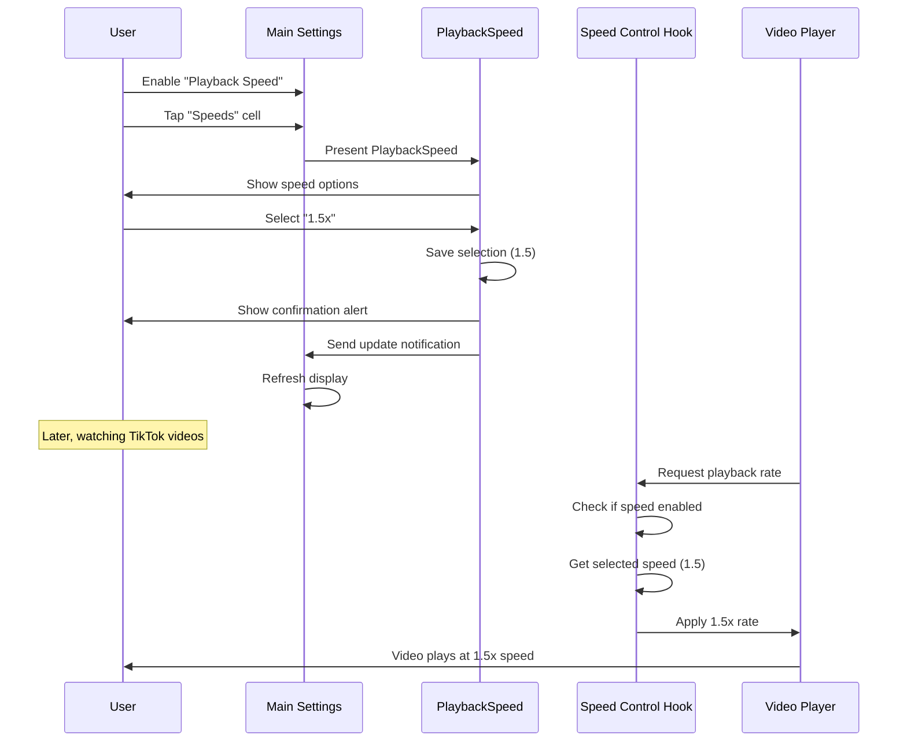

# Playback Speed Control (PlaybackSpeed)

## Overview

[`Settings/PlaybackSpeed`](../../Settings/PlaybackSpeed.h) provides a dedicated interface for selecting video playback speed multipliers in TikTok. This controller allows users to set persistent playback speeds that override TikTok's default video playback rate.

## Purpose and Functionality

The PlaybackSpeed controller serves as:
- **Speed Selection Interface**: Simple picker for video playback rates
- **Persistent Speed Control**: Maintains selected speed across app sessions
- **User Experience Enhancement**: Quick access to preferred playback speeds
- **Media Control Integration**: Direct integration with TikTok's video player

## File Structure

| File | Purpose |
|------|---------|
| [`Settings/PlaybackSpeed.h`](../../Settings/PlaybackSpeed.h) | Interface declaration with protocol conformance |
| [`Settings/PlaybackSpeed.m`](../../Settings/PlaybackSpeed.m) | Implementation of speed selection and storage |

## Architecture Overview



## Implementation Details

### Interface Declaration
**Location**: [`Settings/PlaybackSpeed.h`](../../Settings/PlaybackSpeed.h)

```objective-c
@interface PlaybackSpeed : UIViewController <UITableViewDelegate, UITableViewDataSource>
@end
```

**Protocol Conformance**:
- `UITableViewDelegate` - Handles user selection events
- `UITableViewDataSource` - Provides speed options data

### Properties and Setup
**Location**: [Lines 10-13](../../Settings/PlaybackSpeed.m#L10)

```objective-c
@interface PlaybackSpeed ()
@property (nonatomic, strong) UITableView *staticTable;
@property (nonatomic, strong) NSArray <NSNumber *> *speeds;
@end
```

**Key Properties**:
- `staticTable` - Table view for speed selection
- `speeds` - Array of available speed multipliers as NSNumber objects

### View Controller Initialization
**Location**: [Lines 17-35](../../Settings/PlaybackSpeed.m#L17)

```objective-c
- (void)viewDidLoad {
    [super viewDidLoad];
    self.view.backgroundColor = [UIColor systemBackgroundColor];
    self.speeds = @[@0.5, @1.0, @1.5, @2.0];
    self.title = @"Select Speed";
    
    self.staticTable = [[UITableView alloc] initWithFrame:CGRectZero];
    self.staticTable.translatesAutoresizingMaskIntoConstraints = NO;
    [self.staticTable registerClass:[UITableViewCell class] forCellReuseIdentifier:@"CellIdentifier"];

    [self.view addSubview:self.staticTable];
    [NSLayoutConstraint activateConstraints:@[
        [self.staticTable.leadingAnchor constraintEqualToAnchor:self.view.leadingAnchor],
        [self.staticTable.trailingAnchor constraintEqualToAnchor:self.view.trailingAnchor],
        [self.staticTable.topAnchor constraintEqualToAnchor:self.view.safeAreaLayoutGuide.topAnchor],
        [self.staticTable.bottomAnchor constraintEqualToAnchor:self.view.safeAreaLayoutGuide.bottomAnchor]
    ]];
    
    self.staticTable.dataSource = self;
    self.staticTable.delegate = self;
}
```

**Setup Features**:
- **Predefined Speeds**: Four common playback speeds (0.5x, 1.0x, 1.5x, 2.0x)
- **Auto Layout**: Constraint-based layout for all device sizes
- **Cell Registration**: Pre-registered cell class for efficiency
- **System Styling**: Adapts to light/dark mode automatically

## Speed Configuration

### Available Playback Speeds
**Location**: [Line 20](../../Settings/PlaybackSpeed.m#L20)

```objective-c
self.speeds = @[@0.5, @1.0, @1.5, @2.0];
```

**Speed Options**:
| Index | Speed | Description | Use Case |
|-------|-------|-------------|----------|
| 0 | 0.5x | Half speed | Detailed viewing, learning content |
| 1 | 1.0x | Normal speed | Default TikTok playback |
| 2 | 1.5x | 1.5x speed | Slightly faster consumption |
| 3 | 2.0x | Double speed | Rapid content browsing |

**Speed Selection Rationale**:
- **0.5x**: Ideal for educational content or detailed analysis
- **1.0x**: Standard TikTok experience (default)
- **1.5x**: Optimal for most content acceleration without losing comprehension
- **2.0x**: Maximum practical speed for content skimming

## Table View Implementation

### Data Source Methods
**Location**: [Lines 38-49](../../Settings/PlaybackSpeed.m#L38)

```objective-c
- (nonnull UITableViewCell *)tableView:(nonnull UITableView *)tableView cellForRowAtIndexPath:(nonnull NSIndexPath *)indexPath {
    UITableViewCell *cell = [tableView dequeueReusableCellWithIdentifier:@"CellIdentifier"];
    cell.textLabel.text = [NSString stringWithFormat:@"%@ x", self.speeds[indexPath.row]];
    cell.tag = [self.speeds[indexPath.row] floatValue];
    return cell;
}

- (NSInteger)tableView:(nonnull UITableView *)tableView numberOfRowsInSection:(NSInteger)section {
    return 4;
}
```

**Data Source Features**:
- **Dynamic Labeling**: Speed values formatted with "x" suffix
- **Cell Tagging**: Float values stored in cell tags for identification
- **Fixed Count**: Four speed options (hardcoded for simplicity)
- **Cell Reuse**: Efficient memory management with dequeue pattern

## Selection and Storage Logic

### Selection Handler
**Location**: [Lines 50-65](../../Settings/PlaybackSpeed.m#L50)

```objective-c
- (void)tableView:(UITableView *)tableView didSelectRowAtIndexPath:(NSIndexPath *)indexPath {
    [tableView deselectRowAtIndexPath:indexPath animated:YES];
    NSNumber *selectedSpeed = self.speeds[indexPath.row];
    
    NSUserDefaults *defaults = [NSUserDefaults standardUserDefaults];
    [defaults setValue:selectedSpeed forKey:@"playback_speed"];
    [defaults synchronize];
    
    UIAlertController *alert = [UIAlertController alertControllerWithTitle:@"Live Option Selected" 
                                                                   message:[NSString stringWithFormat:@"You selected: %@", selectedSpeed]
                                                            preferredStyle:UIAlertControllerStyleAlert];
    UIAlertAction *okAction = [UIAlertAction actionWithTitle:@"OK" style:UIAlertActionStyleDefault handler:nil];
    [alert addAction:okAction];
    [self presentViewController:alert animated:YES completion:nil];
    
    [[NSNotificationCenter defaultCenter] postNotificationName:@"RegionSelectedNotification"
                                                        object:nil
                                                      userInfo:@{@"selected Speed": selectedSpeed}];
}
```

**Selection Process**:
1. **Visual Feedback**: Animated row deselection
2. **Value Extraction**: Gets NSNumber from speeds array
3. **Persistence**: Saves to UserDefaults under `"playback_speed"` key
4. **User Confirmation**: Shows alert with selected speed
5. **Notification**: Updates main settings display
6. **Synchronization**: Immediate write to disk

### Confirmation Dialog
```objective-c
UIAlertController *alert = [UIAlertController alertControllerWithTitle:@"Live Option Selected" 
                                                               message:[NSString stringWithFormat:@"You selected: %@", selectedSpeed]
                                                        preferredStyle:UIAlertControllerStyleAlert];
```

**User Feedback Features**:
- **Clear Confirmation**: Shows exact speed value selected
- **Standard Interface**: Uses iOS standard alert controller
- **Immediate Response**: Instant feedback on selection

## Integration with Main Tweak

### Video Speed Hook Implementation
**Location**: [`Tweak.x` Lines 51-65](../core/tweak.md#L51)

```objective-c
%hook TTKMediaSpeedControlService
- (void)setPlaybackRate:(CGFloat)arg1 {
    NSNumber *speed = [BHIManager selectedSpeed];
    if (![BHIManager speedEnabled] || [speed isEqualToNumber:@1]) {
        return %orig;
    }
    if ([BHIManager speedEnabled]) {
        if ([BHIManager selectedSpeed]) {
            return %orig([speed floatValue]);
        }
    } else {
        return %orig;
    }
}
%end
```

**Hook Logic**:
1. **Feature Check**: Verifies speed control is enabled
2. **Speed Retrieval**: Gets selected speed from UserDefaults
3. **Default Bypass**: Allows normal operation for 1.0x speed
4. **Speed Override**: Applies selected speed instead of requested rate
5. **Fallback**: Maintains original behavior when disabled

### Manager Integration
**Location**: [`BHIManager.m` Lines 80-91](../core/bhi-manager.md#L80)

```objective-c
+ (BOOL)speedEnabled {
    return [[NSUserDefaults standardUserDefaults] boolForKey:@"playback_en"];
}

+ (NSNumber *)selectedSpeed {
    return [[NSUserDefaults standardUserDefaults] objectForKey:@"playback_speed"];
}
```

**Manager Support**:
- **Feature Toggle**: Enable/disable playback speed override
- **Speed Access**: Centralized access to selected speed value
- **Type Safety**: Returns NSNumber for floating-point comparisons

## Main Settings Integration

### Settings Display
**Location**: [`Settings/ViewController.m` Lines 364-374](../settings/main-settings.md)

```objective-c
case 1: {
    UITableViewCell *cell = [[UITableViewCell alloc] initWithStyle:UITableViewCellStyleSubtitle reuseIdentifier:nil];
    cell.textLabel.text = @"Speeds";
    
    NSUserDefaults *defaults = [NSUserDefaults standardUserDefaults];
    NSString *selectedSpeed = [defaults valueForKey:@"playback_speed"];
    if (selectedSpeed != nil) {
        cell.detailTextLabel.text = [NSString stringWithFormat:@"%@ x", selectedSpeed];
    }
    return cell;
}
```

**Display Features**:
- **Current Selection**: Shows selected speed in subtitle
- **Dynamic Updates**: Refreshes when speed changes
- **Formatted Display**: Includes "x" suffix for clarity

### Navigation Integration
**Location**: [`Settings/ViewController.m` Lines 427-430](../settings/main-settings.md)

```objective-c
else if (indexPath.section == 6 && indexPath.row == 1) {
    PlaybackSpeed *playbackSpeed = [[PlaybackSpeed alloc] init];
    UINavigationController *navController = [[UINavigationController alloc] initWithRootViewController:playbackSpeed];
    [self presentViewController:navController animated:YES completion:nil];
}
```

**Navigation Features**:
- **Modal Presentation**: Full-screen speed selection
- **Navigation Wrapper**: Proper navigation controller embedding
- **Smooth Animation**: Animated presentation transition

## Playback Speed Effects

### Video Playback Behavior
When speed override is active:

```objective-c
return %orig([speed floatValue]);
```

**Speed Effects**:
- **0.5x Speed**: 
  - Video plays at half normal rate
  - Audio pitch maintained (system behavior)
  - Ideal for learning or detailed viewing
  
- **1.5x Speed**:
  - 50% faster playback
  - Maintains audio clarity
  - Good balance of speed and comprehension
  
- **2.0x Speed**:
  - Double-speed playback
  - Rapid content consumption
  - May affect audio clarity on some devices

### System Integration
The hook integrates with TikTok's native speed control system:

**Integration Benefits**:
- **Native Compatibility**: Works with TikTok's existing player
- **Audio Synchronization**: Maintains audio-video sync
- **Performance**: Leverages iOS media framework optimizations
- **Consistency**: Consistent behavior across all videos

## User Experience Flow

### Complete Speed Configuration Process



## Performance and Technical Considerations

### Memory Efficiency
- **Static Array**: Speed options loaded once during initialization
- **Minimal Storage**: Single NSNumber stored in UserDefaults
- **Fast Access**: Direct array indexing for selection

### Video Playback Performance
- **Native Integration**: Uses iOS media framework capabilities
- **Hardware Acceleration**: Benefits from device-specific optimizations
- **Battery Impact**: Minimal additional battery usage
- **Audio Quality**: System maintains audio quality at different speeds

### Real-time Application
```objective-c
- (void)setPlaybackRate:(CGFloat)arg1 {
    return %orig([speed floatValue]);
}
```

**Real-time Features**:
- **Immediate Effect**: Speed changes apply instantly
- **No Restart Required**: Works on currently playing videos
- **Seamless Transition**: Smooth speed changes without interruption

## Error Handling and Edge Cases

### Speed Validation
```objective-c
if (![BHIManager speedEnabled] || [speed isEqualToNumber:@1]) {
    return %orig;
}
```

**Safety Measures**:
- **Feature Toggle**: Respects enable/disable setting
- **Default Fallback**: Maintains normal behavior when disabled
- **Null Handling**: Graceful fallback if speed value missing

### Playback Compatibility
- **All Video Types**: Works with all TikTok video content
- **Live Streams**: Automatically bypasses live content (maintains real-time)
- **Audio Content**: Applies to audio-only posts appropriately

## Future Enhancement Opportunities

### Extended Speed Options
1. **Custom Speeds**: Allow user-defined speed values
2. **Fine-Grained Control**: 0.25x increments for precise control
3. **Per-Content Speeds**: Different speeds for different content types
4. **Gesture Controls**: Swipe gestures for quick speed changes

### Advanced Features
1. **Speed Presets**: Multiple saved speed configurations
2. **Content-Aware Speed**: Automatic speed based on video length
3. **Learning Mode**: Gradual speed increase for adaptation
4. **Accessibility Integration**: Integration with iOS accessibility features

### User Interface Improvements
1. **Speed Preview**: Preview speed before applying
2. **Visual Indicators**: Show current speed in video player
3. **Quick Toggle**: Rapid switching between normal and selected speed
4. **Speed History**: Recently used speeds for quick access

---

**Related Documentation**:
- [Main Settings](main-settings.md) - Parent settings interface and speed toggle
- [Live Actions](live-actions.md) - Similar selection interface pattern
- [Manager System](../core/bhi-manager.md) - Speed value access and feature control
- [Main Tweak Implementation](../core/tweak.md) - Video player speed hook implementation