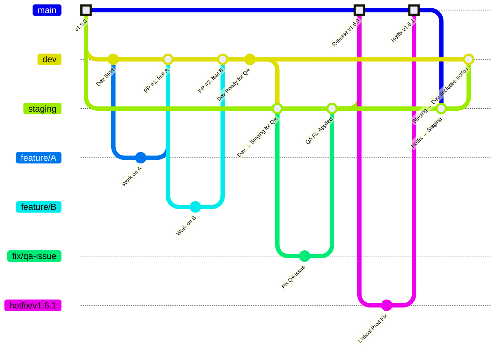
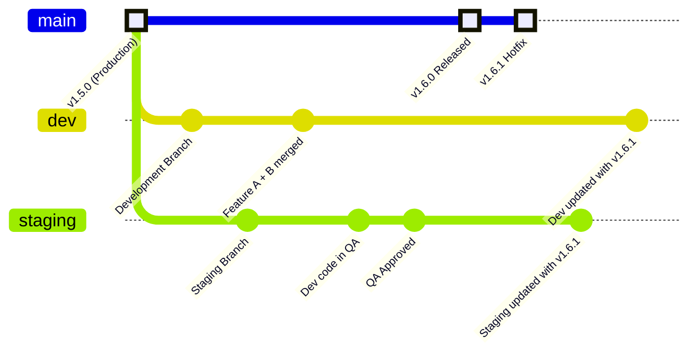

# Standard Git Flow Implementation

## Correct Git Flow Hierarchy

The standard Git Flow follows this hierarchy:
- **Features** → **Dev** → **Staging** → **Main**
- **Hotfixes** branch from **Main** and merge back to **Main**, then cascade down

## Branch Purposes

1. **Main Branch**
   - Production-ready code only
   - Only accepts merges from:
     - Staging (after QA approval)
     - Hotfix branches (emergency fixes)
   - Never accepts direct feature work

2. **Staging Branch**
   - QA/Testing environment
   - Created from Main
   - Accepts merges from Dev
   - Once tested, merges to Main

3. **Dev Branch**
   - Integration branch for all features
   - Created from Main
   - Accepts merges from feature branches
   - Once ready, merges to Staging for QA

4. **Feature Branches**
   - Individual feature development
   - Branch from Dev
   - Merge back to Dev via PRs

5. **Hotfix Branches**
   - Emergency production fixes
   - Branch from Main
   - Merge to Main first
   - Then cascade to Staging and Dev

## Corrected GitGraph Following Standard Git Flow



## Alternative: Cleaner Visualization

If you want to see the flow without the merge connection lines:



## Key Workflow Rules

1. **Feature Development**
   - Create feature branch from `dev`
   - Complete work
   - PR back to `dev`
   - Delete feature branch

2. **QA Process**
   - When `dev` has enough features, merge to `staging`
   - QA tests on `staging`
   - Any fixes are done on `staging` or sent back to `dev`

3. **Release Process**
   - Once `staging` passes QA, merge to `main`
   - Tag the release on `main`
   - This becomes production

4. **Hotfix Process**
   - Branch from `main`
   - Fix the issue
   - Merge to `main` (deploy to production)
   - Immediately cascade to `staging` then `dev`

## Common Mistakes to Avoid

1. ❌ Creating staging from dev (should be from main)
2. ❌ Merging features directly to staging or main
3. ❌ Forgetting to cascade hotfixes down
4. ❌ Working directly on long-lived branches
5. ❌ Merging untested code to main

## Example Commands

```bash
# Start a feature
git checkout dev
git pull origin dev
git checkout -b feature/new-feature

# Complete a feature
git checkout dev
git merge feature/new-feature
git push origin dev

# Promote to staging
git checkout staging
git merge dev
git push origin staging

# Release to production
git checkout main
git merge staging
git tag -a v1.6.0 -m "Release version 1.6.0"
git push origin main --tags

# Hotfix
git checkout main
git checkout -b hotfix/critical-fix
# ... make fixes ...
git checkout main
git merge hotfix/critical-fix
git checkout staging
git merge main
git checkout dev
git merge staging